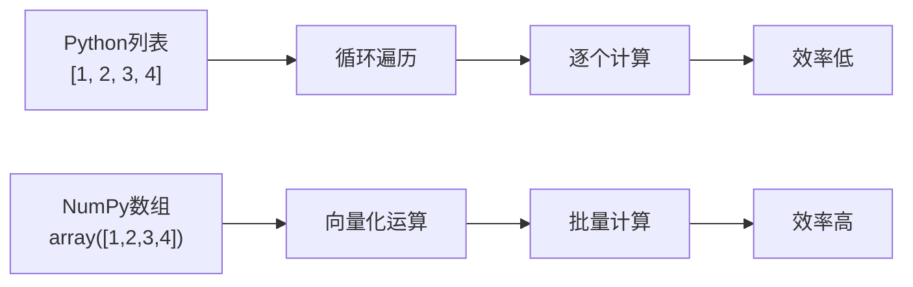
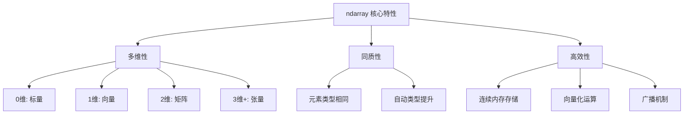
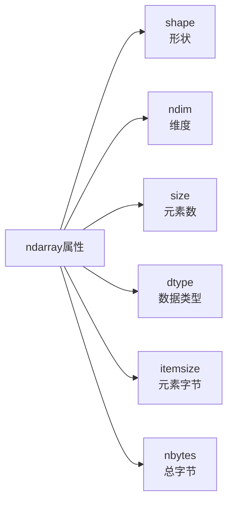
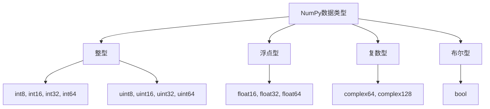
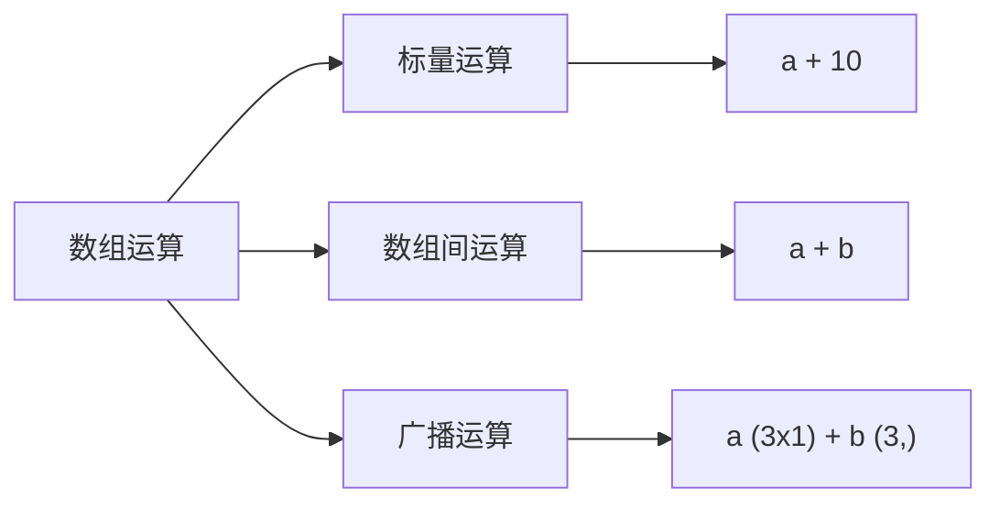
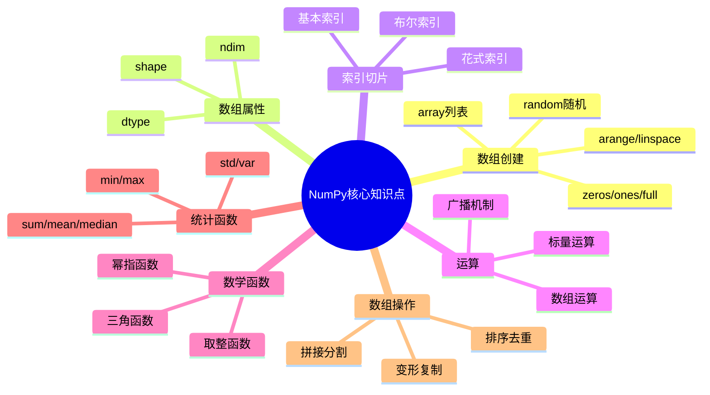

# NumPy科学计算

## 1.1 NumPy简介

NumPy是Python科学计算的基础库，提供了高性能的多维数组对象以及用于处理这些数组的各种工具。在数据分析领域，NumPy扮演着至关重要的角色，它不仅是Pandas等高级库的基础，而且其核心设计理念——向量化运算——使得大规模数值计算变得高效而简洁。

### 为什么要使用NumPy

Python原生列表在进行数值运算时需要使用循环语句，这不仅代码冗长，而且执行效率较低。NumPy通过提供预编译的C代码执行计算，将原本的循环操作转化为高效的向量化运算。根据实际测试，对于包含百万级元素的数组，NumPy的运算速度通常比纯Python循环快50到100倍。

> **核心优势**：NumPy的核心设计是数组元素存储在连续的内存块中，CPU可以一次性加载多个元素并进行并行计算，而无需像处理列表那样逐个解析指针。

### NumPy与Python列表的对比



假设我们需要计算一万个随机数的平方和。使用Python原生列表，需要编写循环语句逐个计算后求和。而使用NumPy，一行代码`np.sum(arr**2)`即可完成，底层会利用SIMD指令进行优化计算。

```python
import numpy as np
import time

# 生成测试数据
data = np.random.rand(1000000)

# NumPy向量化计算
start = time.time()
result = np.sum(data ** 2)
numpy_time = time.time() - start

print(f"结果: {result:.2f}")
print(f"NumPy耗时: {numpy_time:.4f}秒")
```

## 1.2 ndarray对象

ndarray是NumPy的核心数据结构，全称为N-dimensional Array，即N维数组。它是一个具有相同类型元素的多维序列，支持多种数据维度，从标量（0维）到高维数组都能表示。

### ndarray的核心特性



**多维性**是ndarray的第一个显著特征：
- 0维数组：标量，如`np.array(5)`
- 1维数组：向量，如`np.array([1, 2, 3])`
- 2维数组：矩阵，如`np.array([[1,2],[3,4]])`
- 3维数组：立方体数据（如RGB图像）

**同质性**是ndarray的第二个重要特征。数组中的所有元素必须是相同的数据类型，这一设计使得内存布局更加紧凑，运算更加高效。当数组中混合了整数和浮点数时，NumPy会自动将整数提升为浮点数以保持精度。

**高效性**源于ndarray的连续内存存储设计。在大多数计算机系统中，从内存中连续读取数据比跳跃式读取快得多。

### 创建ndarray数组

```python
import numpy as np

# 从Python列表创建
arr1 = np.array([1, 2, 3, 4, 5])           # 1维数组
arr2 = np.array([[1, 2, 3], [4, 5, 6]])   # 2维数组（矩阵）

# 使用预定义函数创建
zeros_arr = np.zeros((2, 3))              # 2行3列的全零数组
ones_arr = np.ones((3, 2), dtype=int)      # 3行2列的全一数组
full_arr = np.full((2, 3), 5)             # 2行3列，值为5

# 数值范围数组
arrange_arr = np.arange(0, 11, 2)          # [0, 2, 4, 6, 8, 10]
linspace_arr = np.linspace(0, 1, 5)        # [0, 0.25, 0.5, 0.75, 1]

# 特殊矩阵
eye_arr = np.eye(3)                        # 3x3单位矩阵
diag_arr = np.diag([5, 1, 2, 3])           # 对角矩阵
```

NumPy提供了多种预定义形状的数组创建函数，适用于不同的应用场景：

| 函数 | 说明 | 示例 |
|------|------|------|
| `np.zeros()` | 创建全零数组 | `np.zeros((2,3))` |
| `np.ones()` | 创建全一数组 | `np.ones((3,2))` |
| `np.full()` | 创建自定义值数组 | `np.full((2,3), 5)` |
| `np.eye()` | 创建单位矩阵 | `np.eye(3)` |
| `np.diag()` | 创建对角矩阵 | `np.diag([1,2,3])` |
| `np.arange()` | 等差数列 | `np.arange(0,10,2)` |
| `np.linspace()` | 等间隔数组 | `np.linspace(0,1,5)` |

### 随机数组生成

随机数组在模拟实验、初始化权重、抽样分析等场景中不可或缺。

```python
# 均匀分布 [0, 1)
rand_arr = np.random.rand(2, 3)

# 指定范围均匀分布 [3, 6)
uniform_arr = np.random.uniform(3, 6, (2, 3))

# 标准正态分布（均值0, 标准差1）
normal_arr = np.random.randn(3, 4)

# 随机整数 [1, 10)
int_arr = np.random.randint(1, 10, (2, 3))

# 设置随机种子（保证结果可复现）
np.random.seed(42)
reproducible = np.random.rand(5)
```

## 1.3 ndarray的属性

理解ndarray的属性对于掌握数组操作至关重要。



```python
arr = np.array([[1, 2, 3], [4, 5, 6]], dtype=np.float64)

print(f"shape: {arr.shape}")      # (2, 3) - 行数和列数
print(f"ndim: {arr.ndim}")        # 2 - 维度数量
print(f"size: {arr.size}")        # 6 - 总元素个数
print(f"dtype: {arr.dtype}")      # float64 - 元素数据类型
print(f"itemsize: {arr.itemsize}") # 8 - 单个元素占用的字节
print(f"nbytes: {arr.nbytes}")    # 48 - 整个数组占用的字节

# 转置
print(f"转置形状: {arr.T.shape}") # (3, 2)
```

## 1.4 数据类型

NumPy提供了一套完整的数据类型系统，比Python原生的类型系统更加丰富和细致。

### 常用数据类型



**整型**包括有符号整型（int8到int64）和无符号整型（uint8到uint64）。数字表示该类型占用的位数，例如int8占用8位即1字节，取值范围是-128到127。

**浮点型**包括float16（半精度）、float32（单精度）、float64（双精度）。默认使用的是float64。

```python
# 布尔类型
bool_arr = np.array([True, False, True])
print(bool_arr.dtype)  # bool

# 整数类型
int_arr = np.array([1, 2, 127], dtype=np.int8)
print(int_arr)  # [1, 2, 127]

# 无符号整数
uint_arr = np.array([255, 128], dtype=np.uint8)
print(uint_arr)  # [255, 128]

# 类型转换
float_arr = np.array([1.5, 2.7, 3.9])
int_arr = float_arr.astype(np.int32)
print(int_arr)  # [1, 2, 3]
```

## 1.5 索引与切片

NumPy数组提供了强大而灵活的索引和切片功能。

```python
# 一维数组索引
arr = np.arange(10)  # [0, 1, 2, 3, 4, 5, 6, 7, 8, 9]
print(arr[2])        # 2
print(arr[2:5])      # [2, 3, 4]  左闭右开
print(arr[::2])      # [0, 2, 4, 6, 8]  步长2
print(arr[::-1])     # [9, 8, 7, 6, 5, 4, 3, 2, 1, 0]  反转
```

### 二维数组索引

```python
arr = np.arange(12).reshape(3, 4)
# [[ 0  1  2  3]
#  [ 4  5  6  7]
#  [ 8  9 10 11]]

print(arr[1, 2])     # 6 - 第2行第3列
print(arr[0, :])     # [0, 1, 2, 3] - 第1行
print(arr[:, 1])     # [1, 5, 9] - 第2列
print(arr[0:2, 1:3]) # [[1, 2], [5, 6]] - 前2行，2-3列
```

### 布尔索引

布尔索引是NumPy最强大的索引方式之一：

```python
arr = np.arange(1, 10)  # [1, 2, 3, 4, 5, 6, 7, 8, 9]

# 筛选大于5的元素
mask = arr > 5
print(arr[mask])      # [6, 7, 8, 9]

# 组合条件
print(arr[(arr > 3) & (arr < 8)])  # [4, 5, 6, 7]
```

### 花式索引

```python
arr = np.arange(10, 20)  # [10, 11, 12, ..., 19]

# 按指定索引选取
print(arr[[2, 5, 8]])    # [12, 15, 18]

# 负索引
print(arr[[-1, -2]])     # [19, 18]
```

### 切片与视图

**重要**：数组切片返回的是视图，而非副本。视图与原数组共享内存。

```python
arr = np.arange(10)
slice_arr = arr[2:5]
slice_arr[0] = 100
print(arr)  # arr[2]变成了100
```

## 1.6 基本运算与广播机制

NumPy最强大的特性之一是能够对整个数组执行批量运算，无需编写显式循环。



### 数组与标量运算

```python
arr = np.array([1, 2, 3])
print(arr + 10)  # [11, 12, 13]
print(arr * 2)   # [2, 4, 6]
print(arr ** 2)  # [1, 4, 9]
```

### 数组与数组运算

```python
a = np.array([1, 2, 3])
b = np.array([4, 5, 6])
print(a + b)   # [5, 7, 9]
print(a * b)   # [4, 10, 18]
print(a / b)   # [0.25, 0.4, 0.5]
```

### 广播机制

当两个数组形状不完全相同但满足特定条件时，NumPy会自动将较小的数组扩展。

```python
# 一维数组与二维数组相加
a = np.array([[1], [2], [3]])  # shape (3, 1)
b = np.array([10, 20, 30])     # shape (3,)
# b被广播为一行的[[10, 20, 30]]，然后复制到每行
result = a + b
# [[11, 21, 31]
#  [12, 22, 32]
#  [13, 23, 33]]
```

```python
# 标量与数组
a = np.array([1, 2, 3])
print(a + 5)  # [6, 7, 8]

# 形状不兼容时报错
try:
    a = np.array([1, 2, 3])
    b = np.array([4, 5])
    print(a + b)
except ValueError as e:
    print(f"错误: {e}")
# ValueError: operands could not be broadcast together with shapes (3,) (2,)
```

### 矩阵乘法

```python
a = np.array([[1, 2], [3, 4]])
b = np.array([[5, 6], [7, 8]])

# @ 运算符
print(a @ b)
# [[19, 22]
#  [43, 50]]

# np.dot 函数
print(np.dot(a, b))
# [[19, 22]
#  [43, 50]]
```

## 1.7 常用数学函数

NumPy提供了丰富的数学函数，这些函数大多数可以直接应用于数组。

```python
arr = np.array([1, 4, 9, 16])

# 基本数学函数
print(np.sqrt(arr))   # [1, 2, 3, 4] 平方根
print(np.exp([0, 1, 2]))  # [1, 2.718, 7.389] e^x
print(np.log([1, np.e, np.e**2]))  # [0, 1, 2] 自然对数
print(np.abs([-1, -2.5, 3]))  # [1, 2.5, 3] 绝对值
print(np.power(2, [3, 4, 5]))  # [8, 16, 32] 2^x

# 三角函数
arr = np.array([0, np.pi/6, np.pi/2, np.pi])
print(np.sin(arr))  # [0, 0.5, 1, ~0]
print(np.cos(arr))  # [1, ~0.87, ~0, -1]

# 取整函数
arr = np.array([1.2, 2.5, 3.7, -1.3])
print(np.ceil(arr))   # [2, 3, 4, -1] 向上取整
print(np.floor(arr))  # [1, 2, 3, -2] 向下取整
print(np.round(arr))  # [1, 2, 4, -1] 四舍五入
```

## 1.8 统计函数

统计函数是数据分析的核心工具。

```python
arr = np.array([1, 5, 3, 2, 4, 8, 6, 7])

# 基本统计
print(np.sum(arr))      # 36 - 总和
print(np.mean(arr))     # 4.5 - 平均值
print(np.median(arr))   # 4.5 - 中位数
print(np.std(arr))      # 2.29 - 标准差
print(np.var(arr))      # 5.25 - 方差
print(np.min(arr))      # 1 - 最小值
print(np.max(arr))      # 8 - 最大值
print(np.argmin(arr))   # 0 - 最小值索引
print(np.argmax(arr))   # 5 - 最大值索引
```

```python
# 分位数
arr = np.array([1, 2, 3, 4, 5, 6, 7, 8, 9, 10])
print(np.percentile(arr, 25))   # 3.25 - 25%分位数
print(np.percentile(arr, 50))  # 5.5 - 50%分位数
print(np.percentile(arr, 75))  # 7.75 - 75%分位数

# 累积函数
arr = np.array([1, 2, 3, 4, 5])
print(np.cumsum(arr))   # [1, 3, 6, 10, 15] 累积和
print(np.cumprod(arr))  # [1, 2, 6, 24, 120] 累积积
```

```python
# 多维数组按轴计算
arr = np.array([[1, 2, 3], [4, 5, 6]])
print(np.sum(arr, axis=0))  # [5, 7, 9] 按列求和
print(np.sum(arr, axis=1))  # [6, 15] 按行求和
print(np.mean(arr, axis=0)) # [2.5, 3.5, 4.5] 按列均值
```

## 1.9 比较函数与逻辑函数

```python
a = np.array([1, 2, 3])
b = np.array([3, 2, 1])

# 比较函数
print(np.greater(a, b))   # [False, False, True]
print(np.less(a, b))      # [True, False, False]
print(np.equal(a, b))     # [False, True, False]

# 逻辑函数
a = np.array([True, False, True])
b = np.array([True, True, False])
print(np.logical_and(a, b))  # [True, False, False]
print(np.logical_or(a, b))   # [True, True, True]
print(np.logical_not(a))     # [False, True, False]

# np.where 条件选择
a = np.array([1, 2, 3, 4, 5])
print(np.where(a > 3, '大', '小'))  # ['小', '小', '小', '大', '大']
print(np.where(a > 3, a * 2, a))     # [1, 2, 3, 8, 10]
```

## 1.10 排序与去重

```python
arr = np.array([3, 1, 2, 5, 4])

# 排序
print(np.sort(arr))  # [1, 2, 3, 4, 5] 返回副本
arr_copy = arr.copy()
arr_copy.sort()  # 原地排序

# 返回排序后的索引
print(np.argsort(arr))  # [1, 2, 0, 4, 3]

# 去重
arr = np.array([1, 2, 2, 3, 3, 3, 4])
print(np.unique(arr))  # [1, 2, 3, 4]

# 返回出现次数
unique, counts = np.unique(arr, return_counts=True)
print(f"唯一值: {unique}")     # [1, 2, 3, 4]
print(f"出现次数: {counts}")   # [1, 2, 3, 1]
```

## 1.11 数组操作

```python
# 拼接
a = np.array([1, 2, 3])
b = np.array([4, 5, 6])
print(np.concatenate((a, b)))  # [1, 2, 3, 4, 5, 6]

a = np.array([[1, 2], [3, 4]])
b = np.array([[5, 6]])
print(np.vstack((a, b)))
# [[1, 2]
#  [3, 4]
#  [5, 6]]

# 分割
arr = np.array([1, 2, 3, 4, 5, 6])
print(np.split(arr, 3))  # [array([1,2]), array([3,4]), array([5,6])]
print(np.split(arr, [2, 4]))  # [array([1,2]), array([3,4]), array([5,6])]

# reshape 变形
arr = np.arange(12)
print(arr.reshape(3, 4))
# [[ 0  1  2  3]
#  [ 4  5  6  7]
#  [ 8  9 10 11]]

# -1自动计算
print(arr.reshape(3, -1))  # 自动计算列数为4

# 复制
arr = np.array([1, 2, 3])
arr_copy = arr.copy()  # 深拷贝
arr_copy[0] = 100
print(arr)      # [1, 2, 3] 原数组不变
print(arr_copy) # [100, 2, 3]
```

## 1.12 缺失值处理

NumPy使用`np.nan`表示缺失值。

```python
arr = np.array([1, np.nan, 3, np.nan, 5])

print(np.isnan(arr))           # [False, True, False, True, False]
print(np.sum(~np.isnan(arr)))  # 3 非缺失值数量

# 替换缺失值
arr[np.isnan(arr)] = 0
print(arr)  # [1, 0, 3, 0, 5]
```

## 1.13 综合练习

### 练习1：温度分析

```python
temps = np.array([28, 30, 29, 31, 32, 30, 29])

print(f"平均气温: {np.mean(temps).round(2)}℃")
print(f"最高气温: {np.max(temps)}℃")
print(f"最低气温: {np.min(temps)}℃")
print(f"气温超过30℃的天数: {np.sum(temps > 30)}")
print(f"超过30℃的日期: {np.where(temps > 30)[0] + 1}日")
```

### 练习2：学生成绩统计

```python
scores = np.array([85, 90, 78, 92, 88])

print(f"平均分: {np.mean(scores).round(2)}")
print(f"中位数: {np.median(scores)}")
print(f"标准差: {np.std(scores).round(2)}")
print(f"最高分: {np.max(scores)}")
print(f"最低分: {np.min(scores)}")
```

### 练习3：矩阵运算

```python
A = np.array([[1, 2], [3, 4]])
B = np.array([[5, 6], [7, 8]])

print("A + B (对应元素相加):")
print(A + B)
# [[ 6, 8]
#  [10, 12]]

print("A * B (对应元素相乘):")
print(A * B)
# [[ 5, 12]
#  [21, 32]]

print("A @ B (矩阵乘法):")
print(A @ B)
# [[19, 22]
#  [43, 50]]
```

### 练习4：布尔索引应用

```python
np.random.seed(42)
arr = np.random.randint(0, 50, 20)

print(f"随机数组: {arr}")
print(f"大于30的元素: {arr[arr > 30]}")
print(f"在10到25之间的元素: {arr[(arr >= 10) & (arr <= 25)]}")

# 替换满足条件的元素
arr[(arr > 40)] = 0
print(f"将大于40的替换为0: {arr}")
```

## 1.14 小结



本教程涵盖了NumPy的核心知识点。NumPy是Python科学计算的基础，掌握好数组的创建、索引、运算和统计函数，将为后续学习Pandas和数据处理打下坚实基础。