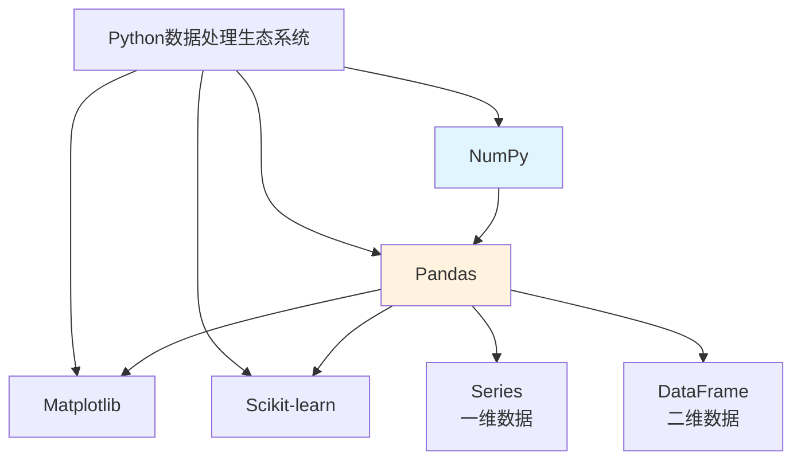
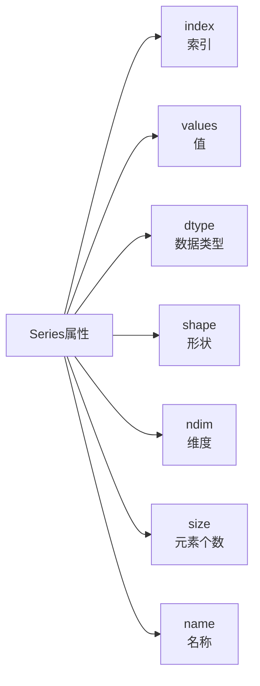
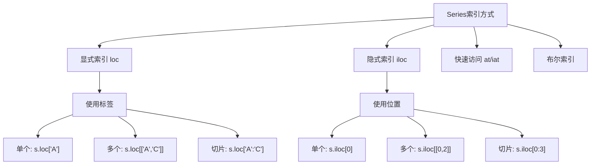
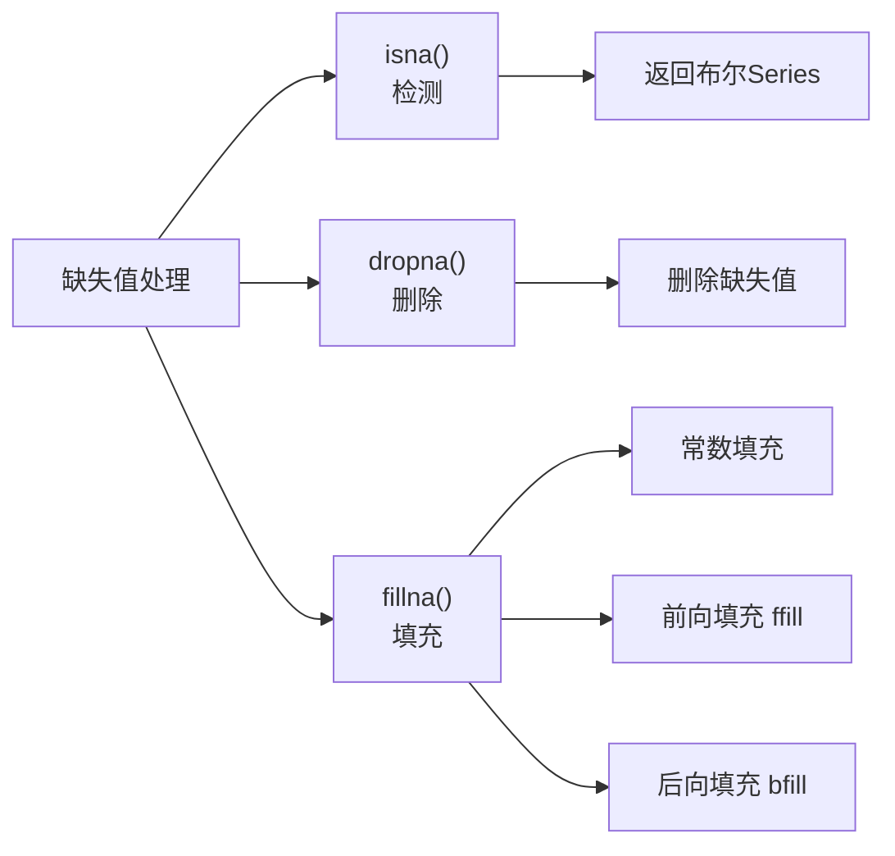
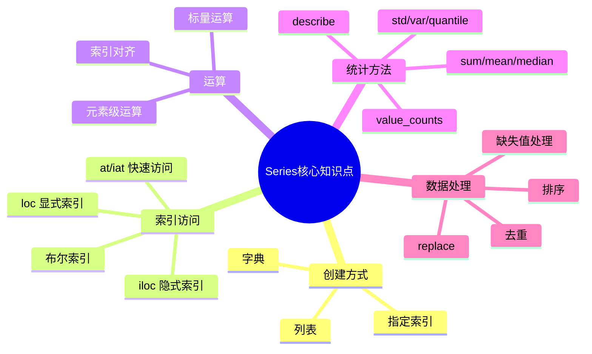

# Pandas Series 入门教程

## 2.1 Pandas简介

Pandas是Python数据分析领域最核心的库之一，它提供了高效的数据结构和数据分析工具。在正式开始学习Series之前，我们先来了解一下Pandas在数据处理生态系统中的位置。



**Series是Pandas中最基本的数据结构，它可以看作是一维数组**，类似于带索引的NumPy一维数组。每个Series对象都有两个核心组件：索引（index）和数据值（values）。

### Pandas与Excel的对比

| 特性 | Excel | Pandas |
|------|-------|--------|
| 数据量 | 通常小于1万行 | 可处理百万级数据 |
| 可复现性 | 手工操作难复现 | 代码可版本控制 |
| 自动化 | 手动操作 | 可编程自动化 |
| 高级分析 | 困难 | 强大支持 |

## 2.2 Series的创建

### 从列表创建

```python
import pandas as pd
import numpy as np

# 从列表创建Series
s = pd.Series([10, 20, 30, 40, 50])

print("基本Series:")
print(s)
print("\n索引:", s.index.tolist())
print("值:", s.values)
```

**输出：**
```
0    10
1    20
2    30
3    40
4    50
dtype: int64

索引: [0, 1, 2, 3, 4]
值: [10 20 30 40 50]
```

### 自定义索引

```python
# 使用自定义索引
s = pd.Series([10, 20, 30, 40, 50],
               index=["A", "B", "C", "D", "E"])

print("带自定义索引的Series:")
print(s)
print("\n索引:", s.index.tolist())
```

**输出：**
```
A    10
B    20
C    30
D    40
E    50
dtype: int64
```

### 从字典创建

```python
# 从字典创建Series
data = {"苹果": 3, "香蕉": 2, "橙子": 5, "葡萄": 4}
s = pd.Series(data)

print("从字典创建的Series:")
print(s)
```

**输出：**
```
苹果    3
香蕉    2
橙子    5
葡萄    4
dtype: int64
```

> 字典的键会成为Series的索引，字典的值会成为Series的值。

### 指定name属性

```python
# 创建带name的Series
s = pd.Series([10, 20, 30, 40, 50],
               index=["A", "B", "C", "D", "E"],
               name="月份销量")

print("带名称的Series:")
print(s)
print("\nSeries名称:", s.name)
```

## 2.3 Series的属性



```python
s = pd.Series([10, 20, 30, 40, 50],
               index=["A", "B", "C", "D", "E"],
               name="示例数据")

print("=== Series 属性 ===")
print(f"索引 (index): {s.index.tolist()}")
print(f"值 (values): {s.values}")
print(f"数据类型 (dtype): {s.dtype}")
print(f"形状 (shape): {s.shape}")
print(f"维度 (ndim): {s.ndim}")
print(f"元素个数 (size): {s.size}")
print(f"名称 (name): {s.name}")
```

## 2.4 Series的索引

Series提供了多种索引方式，可以分为显式索引和隐式索引两大类。



### 显式索引（loc）

```python
s = pd.Series([10, 20, 30, 40, 50],
               index=["A", "B", "C", "D", "E"])

# 使用 loc 进行显式索引访问
print('使用 loc["C"]:', s.loc["C"])       # 单个元素 -> 30
print('使用 loc[["A", "C"]]:', s.loc[["A", "C"]])  # 多个元素
print('使用 loc["A":"C"]:', s.loc["A":"C"])      # 切片（包含两端）
```

### 隐式索引（iloc）

```python
# 使用 iloc 进行隐式索引访问
print('使用 iloc[0]:', s.iloc[0])        # 单个元素 -> 10
print('使用 iloc[[0, 2]]:', s.iloc[[0, 2]])  # 多个元素
print('使用 iloc[0:3]:', s.iloc[0:3])     # 切片（不包含结束位置）
```

### 单元素快速访问（at / iat）

```python
# 使用 at 和 iat 快速访问单个元素
print('使用 at["B"]:', s.at["B"])   # 显式索引 -> 20
print('使用 iat[1]:', s.iat[1])    # 隐式索引 -> 20
```

### 布尔索引

```python
# 布尔索引示例
s = pd.Series([10, 25, 30, 45, 50, 65, 70])

# 筛选大于30的元素
print("大于 30 的元素:")
print(s[s > 30])

# 筛选在20到50之间的元素
print("\n在 20 到 50 之间的元素:")
print(s[(s >= 20) & (s <= 50)])
```

## 2.5 Series的运算

### 标量运算

```python
s = pd.Series([10, 20, 30, 40, 50])

print("原Series:")
print(s)
print("\n加法 s + 5:")
print(s + 5)
print("\n乘法 s * 2:")
print(s * 2)
print("\n幂运算 s ** 2:")
print(s ** 2)
```

### 元素级运算

```python
s1 = pd.Series([10, 20, 30])
s2 = pd.Series([1, 2, 3])

print("s1:", s1.values)
print("s2:", s2.values)
print("\ns1 + s2:", (s1 + s2).values)
print("s1 * s2:", (s1 * s2).values)
```

### 索引对齐

```python
s1 = pd.Series([10, 20, 30], index=["A", "B", "C"])
s2 = pd.Series([1, 2, 3], index=["B", "C", "D"])

print("s1:", s1.to_dict())
print("s2:", s2.to_dict())
print("\ns1 + s2 (索引对齐后):")
print(s1 + s2)
```

**输出：**
```
s1: {'A': 10, 'B': 20, 'C': 30}
s2: {'B': 1, 'C': 2, 'D': 3}

s1 + s2 (索引对齐后):
A     NaN
B    21.0
C    32.0
D     NaN
dtype: float64
```

> 当两个Series进行运算时，如果某个索引只存在于一个Series中，结果中对应的位置会是NaN。

## 2.6 描述性统计方法

```python
s = pd.Series([10, 20, 30, 40, 50])

print("=== 描述性统计 ===")
print(f"sum()   - 求和: {s.sum()}")
print(f"mean()  - 平均值: {s.mean()}")
print(f"median()- 中位数: {s.median()}")
print(f"std()   - 标准差: {s.std():.2f}")
print(f"var()   - 方差: {s.var()}")
print(f"min()   - 最小值: {s.min()}")
print(f"max()   - 最大值: {s.max()}")
```

### describe方法

```python
# describe 方法一次性获取所有描述性统计信息
s = pd.Series([10, 20, 30, 40, 50])
print("describe() 输出:")
print(s.describe())
```

### value_counts和分位数

```python
# 创建包含重复值的Series
s = pd.Series([1, 2, 2, 3, 3, 3, 4, 4, 4, 4])

print("=== 其他统计方法 ===")
print(f"value_counts() - 计数:\n{s.value_counts()}")

print(f"\nquantile(0.25) - 25%分位数: {s.quantile(0.25)}")
print(f"quantile(0.5)  - 50%分位数: {s.quantile(0.5)}")
print(f"quantile(0.75) - 75%分位数: {s.quantile(0.75)}")
print(f"\nmode() - 众数: {s.mode().tolist()}")
```

## 2.7 缺失值处理



```python
# 创建包含缺失值的Series
s = pd.Series([10, np.nan, 30, None, 50])

print("包含缺失值的Series:")
print(s)

print("\nisna() - 检测每个元素是否为缺失值:")
print(s.isna())

print("\nnotna() - 检测每个元素是否不是缺失值:")
print(s.notna())
```

### 处理缺失值的方法

```python
s = pd.Series([10, np.nan, 30, None, 50])

print("原Series:")
print(s)

print("\ndropna() - 删除缺失值:")
print(s.dropna())

print("\nfillna(0) - 用0填充缺失值:")
print(s.fillna(0))

print("\nffill() - 用前向值填充:")
print(s.ffill())

print("\nbfill() - 用后向值填充:")
print(s.bfill())
```

## 2.8 排序方法

```python
s = pd.Series([30, 10, 50, 20, 40], index=["C", "A", "E", "B", "D"])

print("原Series:")
print(s)

print("\nsort_values() - 按值升序排序:")
print(s.sort_values())

print("\nsort_values(ascending=False) - 按值降序排序:")
print(s.sort_values(ascending=False))

print("\nsort_index() - 按索引排序:")
print(s.sort_index())
```

## 2.9 唯一值和去重

```python
s = pd.Series([1, 2, 2, 3, 3, 3, 4, 4, 4, 4])

print("原Series:")
print(s)

print("\nunique() - 获取唯一值:")
print(s.unique())

print(f"\nnunique() - 唯一值个数: {s.nunique()}")

print("\nvalue_counts() - 计数（按值降序）:")
print(s.value_counts())
```

## 2.10 替换操作

```python
s = pd.Series([10, 20, 30, 40, 50])

print("原Series:")
print(s)

print("\n替换单个值 (20 -> 200):")
print(s.replace(20, 200))

print("\n替换多个值 ({20: 200, 30: 300}):")
print(s.replace({20: 200, 30: 300}))
```

## 2.11 成员资格判断

```python
s = pd.Series([10, 20, 30, 40, 50])

print("原Series:")
print(s)

print("\nisin([20, 40, 60]) - 检查元素是否在指定集合中:")
print(s.isin([20, 40, 60]))

print("\n筛选出在集合中的元素:")
print(s[s.isin([20, 40, 60])])
```

## 2.12 头部和尾部

```python
s = pd.Series(range(1, 101))

print("head(5) - 前5个元素:")
print(s.head(5))

print("\ntail(5) - 后5个元素:")
print(s.tail(5))
```

## 2.13 应用函数

```python
s = pd.Series([1, 2, 3, 4, 5])

print("原Series:")
print(s)

print("\napply(lambda x: x ** 2) - 每个元素平方:")
print(s.apply(lambda x: x ** 2))

# 更复杂的例子：将数值转换为分类
def grade(score):
    if score >= 90:
        return "A"
    elif score >= 80:
        return "B"
    elif score >= 70:
        return "C"
    else:
        return "D"

scores = pd.Series([85, 92, 78, 65, 88])
print("成绩:", scores.tolist())
print("等级:", scores.apply(grade).tolist())
```

## 2.14 累计计算

```python
s = pd.Series([10, 20, 30, 40, 50])

print("原Series:")
print(s)

print("\ncumsum() - 累计和:")
print(s.cumsum())

print("\ncumprod() - 累计积:")
print(s.cumprod())

print("\ncummin() - 累计最小值:")
print(s.cummin())

print("\ncummax() - 累计最大值:")
print(s.cummax())
```

## 2.15 变化率计算

```python
prices = pd.Series([100, 105, 102, 110, 115])

print("价格Series:")
print(prices)

print("\npct_change() - 价格变化率:")
print(prices.pct_change())

print("\n解释: 第二天的变化率 = (105-100)/100 = 0.05 = 5%")
```

## 2.16 实战示例

### 示例1：学生成绩分析

```python
import pandas as pd
import numpy as np

np.random.seed(42)

# 生成10名学生的成绩
values = np.random.randint(50, 101, 10)
indexes = [f"学生{i}" for i in range(1, 11)]
scores = pd.Series(values, indexes, name="数学成绩")

print("=== 学生成绩分析 ===")
print("\n成绩单:")
print(scores)

print(f"\n平均分: {scores.mean():.2f}")
print(f"最高分: {scores.max()}")
print(f"最低分: {scores.min()}")
print(f"中位数: {scores.median()}")
print(f"标准差: {scores.std():.2f}")

# 找出高于平均分的学生
mean_score = scores.mean()
above_avg = scores[scores > mean_score]
print(f"\n高于平均分({mean_score:.2f})的学生:")
print(above_avg)
```

### 示例2：温度数据统计

```python
import pandas as pd

# 创建温度数据
temperatures = pd.Series(
    [28, 31, 29, 32, 30, 27, 33],
    index=["周一", "周二", "周三", "周四", "周五", "周六", "周日"]
)

print("=== 温度数据统计 ===")
print("\n一周温度:")
print(temperatures)

# 找出温度超过30度的天数
hot_days = temperatures[temperatures > 30]
print(f"\n超过30度的天数: {len(hot_days)}")
print("这些天是:", hot_days.index.tolist())

print(f"\n平均温度: {temperatures.mean():.2f}°C")

# 将温度从高到低排序
sorted_temps = temperatures.sort_values(ascending=False)
print("\n温度从高到低排序:")
print(sorted_temps)
```

### 示例3：股票价格分析

```python
import pandas as pd
import numpy as np

# 创建股票价格数据
prices = pd.Series(
    [102.3, 103.5, 105.1, 104.8, 106.2, 107.0, 106.5, 108.1, 109.3, 110.2],
    index=pd.date_range("2023-01-01", periods=10)
)

print("=== 股票价格分析 ===")
print("\n每日收盘价:")
print(prices)

# 计算每日收益率
returns = prices.pct_change()
print("\n每日收益率:")
print(returns)

print(f"\n收益率最高的日期: {returns.idxmax().date()}")
print(f"收益率最低的日期: {returns.idxmin().date()}")

# 计算波动率（收益率的标准差）
volatility = returns.std()
print(f"\n波动率（收益率标准差）: {volatility:.6f}")
```

### 示例4：销售数据分析

```python
import pandas as pd
import numpy as np

# 创建月度销售数据
sales = pd.Series(
    [120, 135, 145, 160, 155, 170, 180, 175, 190, 200, 210, 220],
    index=pd.date_range("2022-01-01", periods=12, freq="MS")
)

print("=== 销售数据分析 ===")
print("\n月度销售数据:")
print(sales)

# 计算季度平均销量（按季度重采样）
quarterly_avg = sales.resample("QS").mean()
print("\n季度平均销量:")
print(quarterly_avg)

# 找出销量最高的月份
print(f"\n销量最高的月份: {sales.idxmax().strftime('%Y年%m月')}")
print(f"最高销量: {sales.max()}")

# 计算月环比增长率
growth_rate = sales.pct_change()
print("\n月环比增长率:")
for date, rate in growth_rate.items():
    if pd.notna(rate):
        print(f"{date.strftime('%Y年%m月')}: {rate*100:.2f}%")
```

## 2.17 小结



**核心要点回顾：**

- Series是一种带索引的一维数组，可以通过列表、字典或标量值创建
- 索引分为显式索引（使用loc）和隐式索引（使用iloc）
- 布尔索引是数据筛选的强大工具
- 运算时会自动按索引对齐数据
- 丰富的内置方法支持描述性统计、缺失值处理、排序、去重等操作

建议多加练习，将这些概念应用到实际数据分析中，逐步熟练掌握Series的使用。