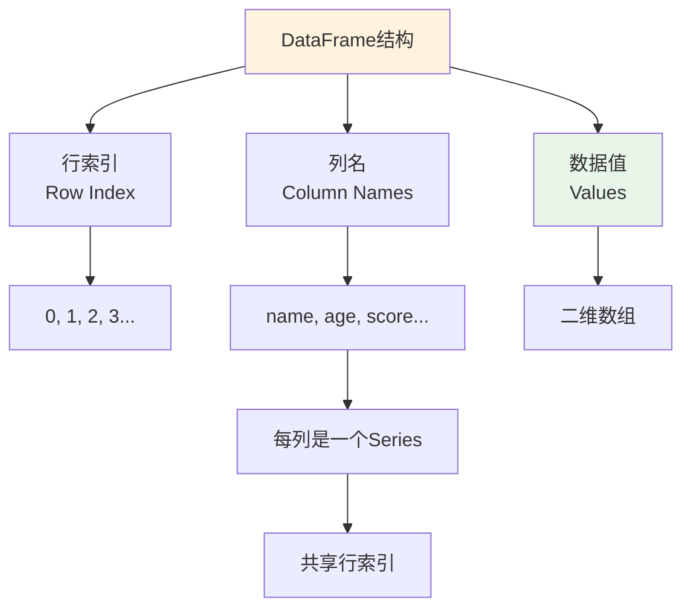
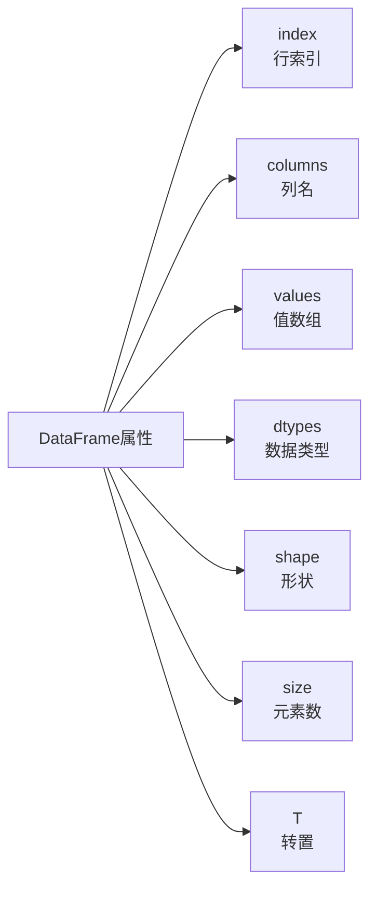
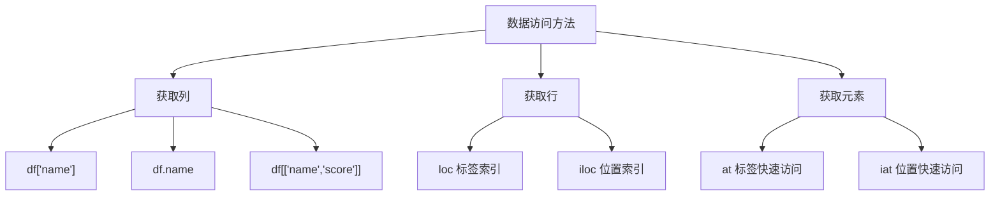
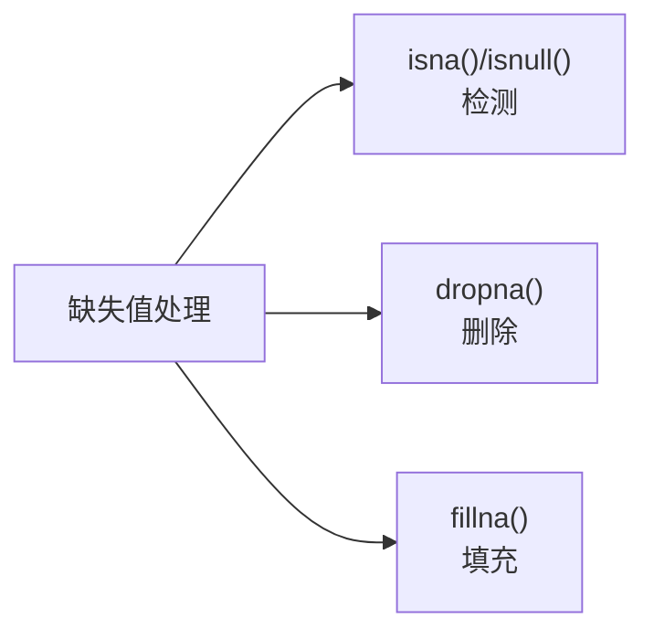
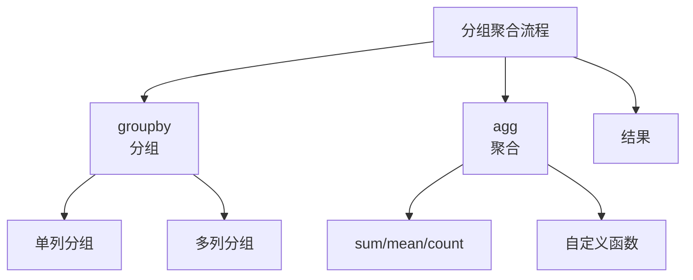
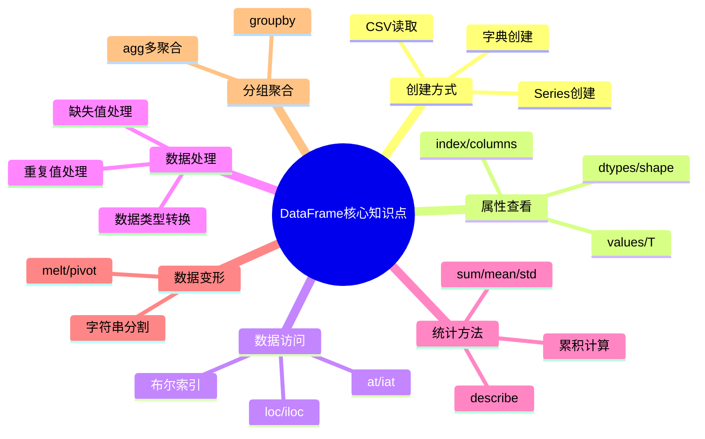

# Pandas DataFrame 完全指南

## 3.1 DataFrame核心概念

DataFrame是Pandas中最核心的数据结构，它是一个二维标记表格数据结构，类似于Excel表格或SQL表。



### DataFrame与Series的关系

```python
import pandas as pd

# DataFrame可以理解为由多个Series组成
s1 = pd.Series([1, 2, 3, 4, 5])
s2 = pd.Series([6, 7, 8, 9, 10])
df = pd.DataFrame({"第1列": s1, "第2列": s2})
print(df)
```

**输出：**
```
   第1列  第2列
0      1      6
1      2      7
2      3      8
3      4      9
4      5     10
```

> **核心区别**：ndarray所有元素必须是相同类型，而DataFrame各列可以是不同类型（数值、字符串、布尔等）。

## 3.2 DataFrame的创建

### 从字典创建

```python
import pandas as pd
import numpy as np

# 通过字典创建DataFrame（最常用的方式）
df = pd.DataFrame({
    "name": ["tom", "jack", "alice", "bob", "allen"],
    "age": [15, 17, 20, 26, 30],
    "score": [60.5, 80, 30.6, 70, 83.5]
}, index=[1, 2, 3, 4, 5])

print(df)
```

**输出：**
```
    name  score  age
1    tom   60.5   15
2   jack   80.0   17
3  alice   30.6   20
4    bob   70.0   26
5  allen   83.5   30
```

### 指定列顺序

```python
# 通过columns参数指定列的顺序
df = pd.DataFrame({
    "name": ["tom", "jack", "alice"],
    "age": [15, 17, 20],
    "score": [60.5, 80, 30.6]
}, columns=["name", "score", "age"])

print(df)
```

## 3.3 DataFrame的属性



```python
df = pd.DataFrame({
    "name": ["tom", "jack", "alice"],
    "age": [15, 17, 20],
    "score": [60.5, 80, 30.6]
})

print("行索引:", df.index.tolist())      # [0, 1, 2]
print("列标签:", df.columns.tolist())     # ['name', 'age', 'score']
print("值:\n", df.values)
print("形状:", df.shape)                  # (3, 3)
print("数据类型:\n", df.dtypes)
```

**输出：**
```
行索引: [0, 1, 2]
列标签: ['name', 'age', 'score']
值:
 [['tom' 15 60.5]
 ['jack' 17 80.0]
 ['alice' 20 30.6]]
形状: (3, 3)
数据类型:
 name      object
 age        int64
 score    float64
dtype: object
```

## 3.4 DataFrame数据访问



### 获取列

```python
# 获取单列
print(df['name'])        # Series
print(df.name)           # Series（等效写法）

# 获取多列（必须用双括号）
print(df[['name', 'score']])  # DataFrame
```

### 获取行

```python
df = pd.DataFrame({
    "name": ["tom", "jack", "alice", "bob", "allen"],
    "age": [15, 17, 20, 26, 30],
    "score": [60.5, 80, 30.6, 70, 83.5]
}, index=[1, 2, 3, 4, 5])

# 获取某一行
print(df.loc[4])    # 行索引为4的行
print(df.iloc[3])   # 第4行（位置3）

# 获取多行
print(df.loc[2:4])   # 行索引2到4
print(df.iloc[1:3])  # 位置1到2
```

### 快速访问单个元素

```python
print(df.at[3, 'score'])  # at（标签访问）
print(df.iat[2, 1])       # iat（位置访问）
print(df.loc[3, 'score']) # loc
print(df.iloc[2, 1])      # iloc
```

### head/tail/sample

```python
print(df.head(2))    # 前2行
print(df.tail(3))   # 后3行
print(df.sample(3)) # 随机3行
```

## 3.5 布尔索引与数据筛选

```python
# 单条件筛选：分数大于70分的学生
print(df[df.score > 70])

# 多条件筛选：分数大于70分且年龄小于20岁
print(df[(df['score'] > 70) & (df.age < 20)])

# 使用isin检查元素是否包含在指定集合中
print(df.isin(['jack', 20]))
```

## 3.6 缺失值处理



```python
# 创建包含缺失值的DataFrame
df_with_na = pd.DataFrame({
    "name": ["tom", "jack", None, "bob", "allen"],
    "age": [15, 17, 20, None, 30],
    "score": [60.5, None, 30.6, 70, 83.5]
}, index=[1, 2, 3, 4, 5])

print(df_with_na)
```

**输出：**
```
    name   age  score
1    tom  15.0   60.5
2   jack  17.0    NaN
3    NaN  20.0   30.6
4    bob   NaN   70.0
5  allen  30.0   83.5
```

### 检测缺失值

```python
print(df_with_na.isna())
print(df_with_na.isnull())  # 与isna()等效
```

### 删除缺失值

```python
# 删除包含缺失值的行
print(df_with_na.dropna())

# 删除特定列中的缺失值所在行
print(df_with_na.dropna(subset=['name']))
```

### 填充缺失值

```python
# 用指定值填充
print(df_with_na.fillna(0))

# 用均值填充
print(df_with_na['score'].fillna(df_with_na['score'].mean()))

# 前向填充（用前一个值填充）
print(df_with_na.ffill())

# 后向填充（用后一个值填充）
print(df_with_na.bfill())
```

## 3.7 重复值处理

```python
# 创建包含重复行的DataFrame
df_dup = pd.DataFrame({
    "name": ["tom", "tom", "jack", "alice", "bob", "allen"],
    "age": [15, 15, 15, 20, 26, 30],
    "score": [60.5, 60.5, 80, 30.6, 70, 83.5]
}, index=[1, 2, 3, 4, 5, 6], columns=["name", "score", "age"])

print(df_dup)
```

**输出：**
```
    name  score  age
1    tom   60.5   15
2    tom   60.5   15
3   jack   80.0   15
4  alice   30.6   20
5    bob   70.0   26
6  allen   83.5   30
```

### 检测重复行

```python
# 检测所有列的重复情况
print(df_dup.duplicated())

# 仅检测特定列的重复情况
print(df_dup.duplicated(subset=['name']))
```

### 删除重复行

```python
# 删除重复行（保留第一行）
print(df_dup.drop_duplicates())

# 删除重复行（保留最后一行）
print(df_dup.drop_duplicates(keep='last'))

# 基于特定列去重
print(df_dup.drop_duplicates(subset=['name']))
```

## 3.8 数值替换

```python
# 将所有15替换为30
print(df_dup.replace(15, 30))

# 字典方式多对一替换
print(df_dup.replace({15: 30, 60.5: 70}))
```

## 3.9 统计方法

### 基础统计量

```python
df = pd.DataFrame({
    "name": ["tom", "tom", "jack", "alice", "bob", "allen"],
    "age": [15, 15, 15, 20, 26, 30],
    "score": [60.5, 60.5, 80, 30.6, 70, 83.5]
}, index=[1, 2, 3, 4, 5, 6], columns=["name", "score", "age"])

print("分数列的总和:", df['score'].sum())
print("分数列的最大值:", df.score.max())
print("年龄列的最小值:", df.age.min())
print("分数列的平均值:", df.score.mean())
print("分数列的中位数:", df.score.median())
print("年龄列的众数:", df.age.mode()[0])
```

### 其他统计量

```python
print("分数列的标准差:", df.score.std())
print("分数列的方差:", df.score.var())
print("分数列的25%分位数:", df.score.quantile(0.25))
print("分数列的50%分位数:", df.score.quantile(0.5))
print("分数列的75%分位数:", df.score.quantile(0.75))

# 一次性获取所有描述性统计
print(df.describe())

# 统计每列非缺失值的个数
print(df.count())

# 统计每行每组合计出现的次数
print(df.value_counts())
```

### 累积计算

```python
# 累积求和
print("累积求和:")
print(df['score'].cumsum())

# 累积最小值
print("累积最小值:")
print(df['score'].cummin())

# 累积最大值
print("累积最大值:")
print(df['score'].cummax())
```

## 3.10 数据排序

```python
# 按索引排序（降序）
print(df.sort_index(ascending=False))

# 按单列值排序
print(df.sort_values(by='score'))

# 按多列值排序
df_sort = pd.DataFrame({
    "name": ["tom", "tom", "jack", "alice", "bob", "allen"],
    "age": [15, 15, 15, 20, 26, 30],
    "score": [60.5, 60.5, 80, 30.6, 70, 80]
}, index=[1, 2, 3, 4, 5, 6], columns=["name", "score", "age"])

print(df_sort.sort_values(by=['score', 'age'], ascending=[True, False]))

# 获取分数最高的2条记录
print(df_sort.nlargest(2, ['score', 'age']))

# 获取分数最低的2条记录
print(df_sort.nsmallest(2, ['score', 'age']))
```

## 3.11 数据类型转换

```python
# 转换为浮点型
print(df['age'].astype(float))

# 常见类型转换
# df['age'] = df['age'].astype('int16')
# df['gender'] = df['gender'].astype('category')
```

## 3.12 数据变形

### 宽表转长表（melt）

```python
data = {
    'ID': [1, 2],
    'name': ['张三', '李四'],
    'Math': [90, 85],
    'English': [88, 92],
    'Science': [95, 89]
}
df_wide = pd.DataFrame(data)

# 使用melt转为长表
df_long = pd.melt(
    df_wide,
    id_vars=['ID', 'name'],  # 保留的标识列
    var_name='科目',
    value_name='分数'
)
print(df_long.sort_values(by=['name', '科目']))
```

**输出：**
```
   ID name   科目  分数
0   1  张三  English  88
2   1  张三     Math  90
4   1  张三  Science  95
1   2  李四  English  92
3   2  李四     Math  85
5   2  李四  Science  89
```

### 长表转宽表（pivot）

```python
# 将长表转回宽表
df_pivot = pd.pivot(
    df_long,
    index=['ID', 'name'],
    columns='科目',
    values='分数'
)
print(df_pivot.reset_index())
```

### 字符串分割

```python
data = {
    'ID': [1, 2],
    'name': ['alice smith', 'bob jack'],
    'Math': [90, 85]
}
df_split = pd.DataFrame(data)

# 将name列按空格分割为两列
df_split[['first_name', 'last_name']] = df_split['name'].str.split(' ', expand=True)
print(df_split)
```

## 3.13 分组聚合



```python
# 创建示例数据
df_group = pd.DataFrame({
    '部门': ['销售部', '销售部', '技术部', '技术部', '人事部'],
    '姓名': ['张三', '李四', '王五', '赵六', '钱七'],
    '薪资': [8000, 9000, 12000, 11000, 7000],
    '年龄': [25, 30, 28, 32, 26]
})

# 按部门分组，计算薪资总和
print(df_group.groupby('部门')['薪资'].sum())
```

### 单列分组

```python
df = pd.read_csv('data/employees.csv')
df = df.dropna(subset=['department_id'])
df['department_id'] = df['department_id'].astype('int64')

# 按部门计算平均薪资
dept_stats = df.groupby('department_id')[['salary']].mean()
print(dept_stats)
```

### 多列分组

```python
# 按部门和岗位分组计算平均薪资
job_stats = df.groupby(['department_id', 'job_id'])[['salary']].mean()
print(job_stats)
```

### 聚合函数agg

```python
# 对薪资应用多个聚合函数
print(df.groupby('department_id')['salary'].agg(['mean', 'max', 'min', 'std']))

# 对不同列应用不同函数
print(df.groupby('department_id').agg({
    'salary': 'mean',
    'employee_id': 'count'
}))
```

## 3.14 案例实战

### 案例1：学生成绩分析

```python
import pandas as pd

data = {
    '姓名': ['张三', '李四', '王五', '赵六', '钱七'],
    '数学': [85, 92, 78, 88, 95],
    '英语': [90, 88, 85, 92, 80],
    '物理': [75, 80, 88, 85, 90]
}
scores = pd.DataFrame(data)

# 计算每位学生的总分和平均分
scores['总分'] = scores[['数学', '英语', '物理']].sum(axis=1)
scores['平均分'] = scores['总分'] / 3

# 筛选优秀学生
excellent = scores[(scores['数学'] > 90) | (scores['英语'] > 85)]

# 按总分排序
top3 = scores.nlargest(3, columns=['总分'])

print("成绩表:\n", scores)
print("\n优秀学生:\n", excellent)
print("\n总分前三:\n", top3)
```

### 案例2：销售数据分析

```python
import pandas as pd

data = {
    '产品名称': ['A', 'B', 'C', 'D'],
    '单价': [100, 150, 200, 120],
    '销量': [50, 30, 20, 40]
}
sales = pd.DataFrame(data)

# 计算每种产品的总销售额
sales['总销售额'] = sales['单价'] * sales['销量']

# 找出最高销售额产品
top_product = sales.nlargest(1, columns=['总销售额'])

# 按销售额排序
ranked = sales.sort_values('总销售额', ascending=False)

print("销售数据:\n", sales)
print("\n最佳产品:\n", top_product)
print("\n排名:\n", ranked)
```

### 案例3：电商用户行为分析

```python
import pandas as pd

data = {
    '用户ID': [101, 102, 103, 104, 105],
    '用户名': ['Alice', 'Bob', 'Charlie', 'David', 'Eve'],
    '商品类别': ['电子产品', '服饰', '电子产品', '家居', '服饰'],
    '商品单价': [1200, 300, 800, 150, 200],
    '购买数量': [1, 3, 2, 5, 4]
}
df_user = pd.DataFrame(data)

# 计算每位用户的总消费金额
df_user['总消费金额'] = df_user['商品单价'] * df_user['购买数量']

# 找出消费金额最高的用户
print(df_user.nlargest(1, '总消费金额'))

# 计算所有用户的平均消费金额
avg_amount = df_user['总消费金额'].mean()
print(f"\n所有用户的平均消费金额: {avg_amount:.2f}")

# 统计电子产品的总购买数量
electronics_qty = df_user[df_user['商品类别'] == '电子产品']['购买数量'].sum()
print(f"电子产品的总购买数量: {electronics_qty}")
```

## 3.15 字符串处理

```python
# 创建示例数据
df_str = pd.DataFrame({
    'name': ['alice', 'bob', 'charlie', 'david'],
    'email': ['alice@163.com', 'bob@gmail.com', 'charlie@qq.com', 'david@hotmail.com']
})

# 将名字首字母大写
df_str['name'] = df_str['name'].str.capitalize()
print(df_str['name'])

# 提取邮箱域名
df_str['email_domain'] = df_str['email'].str.extract(r'@(.+)')
print(df_str[['email', 'email_domain']])
```

## 3.16 小结



掌握这些技能将帮助你高效地完成数据分析任务。