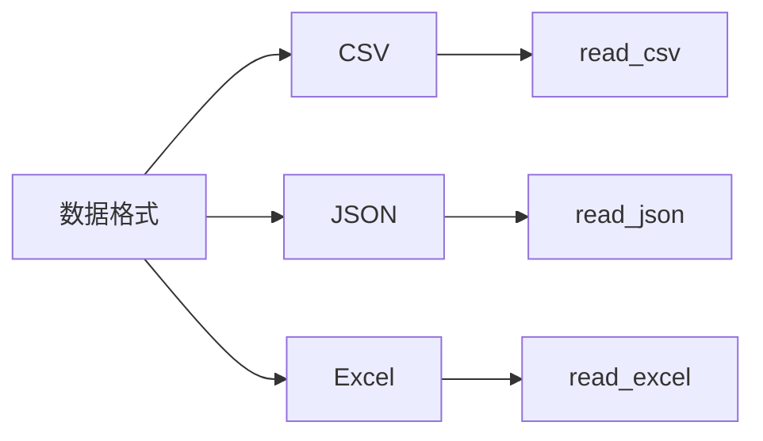
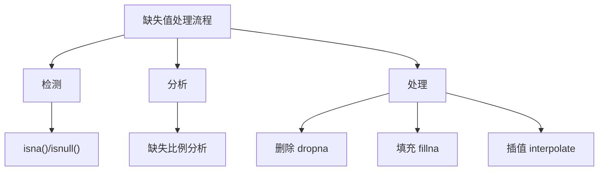
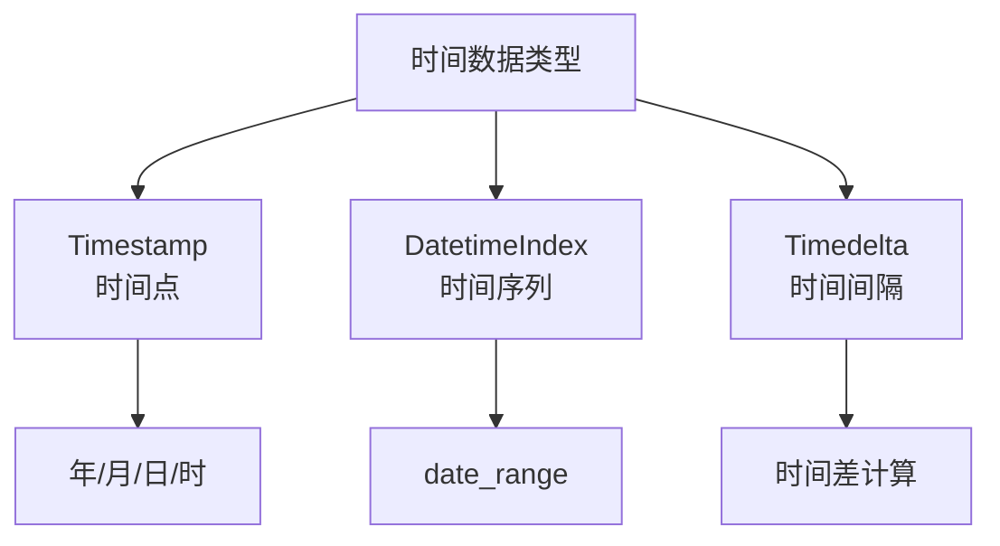
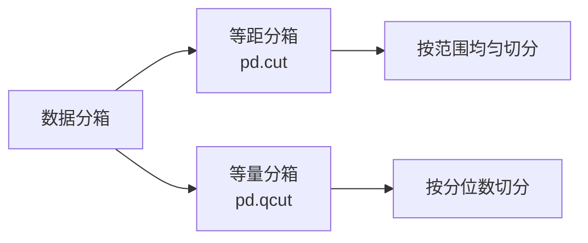
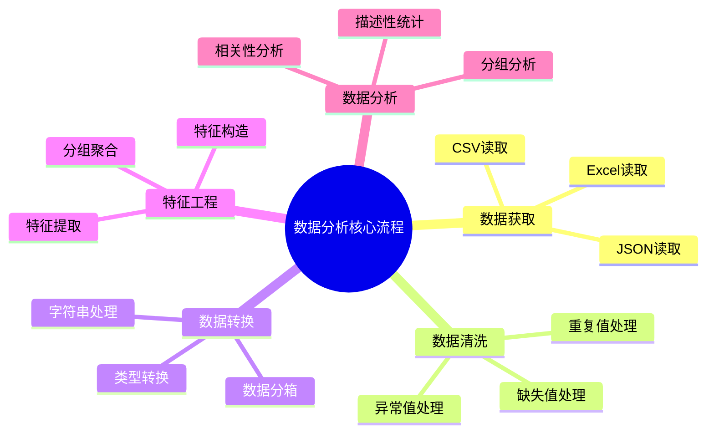

# Pandas 数据分析实战

## 4.1 数据导入导出

Pandas提供了强大的数据读写功能，支持多种文件格式的导入导出。



### CSV文件

```python
import pandas as pd

# 读取CSV
df = pd.read_csv('data/employees.csv')
print(df.head())

# 导出CSV
df_sample = df.tail()
df_sample.to_csv('data/new.csv')
```

**常用参数：**
- `parse_dates`：将指定列解析为日期类型
- `usecols`：指定只读取哪些列
- `dtype`：指定各列的数据类型
- `na_values`：指定哪些值被识别为缺失值

### JSON文件

```python
import pandas as pd
import json

# 读取简单JSON
df = pd.read_json('data/data1.json')

# 读取嵌套JSON结构
with open('data/test.json') as f:
    data = json.load(f)

df = pd.DataFrame(data['users'])
print(df)
```

### Excel文件

```python
# 读取Excel
df = pd.read_excel('data.xlsx', sheet_name='Sheet1')

# 导出Excel
df.to_excel('output.xlsx', sheet_name='Result')
```

## 4.2 缺失值处理

真实数据中缺失值是不可避免的，可能由数据采集不完整、数据源本身不存在某些信息等原因造成。



### 检测缺失值

```python
import pandas as pd
import numpy as np

# 创建包含缺失值的数据
s = pd.Series([12, 25, np.nan, None, pd.NA])
df = pd.DataFrame({
    '第1列': [1, np.nan, 2],
    '第2列': [2, 3, 5],
    '第3列': [None, 4, 6]
})

# 检测缺失值
print(s.isna())
print(df.isnull())
print(df.isna().sum())  # 每列缺失值数量
```

### 删除缺失值

```python
# 删除包含缺失值的行
print(df.dropna())

# 只删除全为缺失值的行
print(df.dropna(how='all'))

# 至少有2个非缺失值才保留
print(df.dropna(thresh=2))

# 删除包含缺失值的列
print(df.dropna(axis=1))

# 删除特定列中的缺失值所在行
print(df.dropna(subset=['第1列']))
```

### 填充缺失值

```python
# 用固定值填充
print(df.fillna(0))

# 用字典为不同列指定不同填充值
print(df.fillna({'第1列': 10, '第2列': 20}))

# 用均值填充
print(df.fillna(df[['第1列', '第2列']].mean()))

# 前向填充（用前面的值填充）
print(df.ffill())

# 后向填充（用后面的值填充）
print(df.bfill()))
```

## 4.3 时间数据处理

时间数据是数据分析中的重要类型，Pandas提供了强大的时间处理功能。



### 创建时间戳

```python
import pandas as pd

# 从字符串创建时间戳
d = pd.Timestamp('2015-02-28 10:22')
print(d)

# 访问年月日等属性
print("年:", d.year)
print("月:", d.month)
print("日:", d.day)
print("时:", d.hour)
print("星期:", d.day_name())
```

### 字符串转日期

```python
# 单个字符串转换
date = pd.to_datetime('20150228')
print(date.day_name())

# DataFrame日期列转换
df = pd.DataFrame({
    'sales': [100, 200, 300],
    'date': ['20250601', '20250602', '20250603']
})
df['datetime'] = pd.to_datetime(df['date'])
df['week'] = df['datetime'].dt.day_name()
```

### dt访问器

```python
df = pd.read_csv('data/weather.csv', parse_dates=['date'])
df['year'] = df['date'].dt.year
df['month'] = df['date'].dt.month
df['weekday'] = df['date'].dt.day_name()
```

### 时间范围

```python
# 生成每日时间序列
days = pd.date_range('2025-01-01', '2025-01-31', freq='D')

# 生成每周时间序列
weeks = pd.date_range('2025-01-01', periods=10, freq='W')

# 生成每月末时间序列
months = pd.date_range('2025-01-01', periods=12, freq='ME')

# 生成每季度时间序列
quarters = pd.date_range('2025-01-01', '2026-12-31', freq='QE')
```

### 时间重采样

```python
df = pd.read_csv('data/weather.csv', parse_dates=['date'])
df.set_index('date', inplace=True)

# 按月聚合
monthly = df[['temp_max', 'temp_min']].resample('ME').mean()
print(monthly)

# 按年聚合
yearly = df[['temp_max', 'temp_min']].resample('YE').mean()
print(yearly)
```

## 4.4 数据类型转换

```python
df = pd.read_csv('data/sleep.csv')
print(df.dtypes)

# 转换为整数
df['age'] = df['age'].astype('int16')

# 转换为分类
df['gender'] = df['gender'].astype('category')
```

> **category类型**是Pandas为分类数据优化的类型，与字符串类型相比，category类型在存储和计算上都更高效，特别适合取值范围有限的列。

### map映射转换

```python
df['is_male'] = df['gender'].map({'Female': True, 'Male': False})
```

## 4.5 数据分箱

数据分箱是将连续变量转换为离散分类变量的技术，常用于将数值划分为不同区间或等级。



### 等距分箱

```python
import pandas as pd

df = pd.read_csv('data/employees.csv')
df_salary = df[['employee_id', 'salary']].head(10)

# 分成3等份
print(pd.cut(df_salary['salary'], bins=3))

# 按指定边界分箱
df_salary['收入范围'] = pd.cut(
    df_salary['salary'],
    bins=[0, 10000, 20000, 30000],
    labels=['低', '中', '高']
)
print(df_salary)
```

### 等量分箱

```python
# 按分位数分箱，每组约25%的数据
df_salary['分位区间'] = pd.qcut(df_salary['salary'], q=4)
```

## 4.6 字符串处理

Pandas提供了强大的字符串处理功能，通过str属性访问字符串方法。

### 分割与提取

```python
df = pd.read_csv('data/sleep.csv')
df = df[['person_id', 'blood_pressure']]

# 按分隔符分割
df[['high', 'low']] = df['blood_pressure'].str.split('/', expand=True)

# 使用正则表达式提取
df['first_name'] = df['name'].str.extract(r'^(\w+)')
```

### 其他字符串操作

```python
# 首字母大写
df['name'] = df['name'].str.capitalize()

# 检查是否包含
mask = df['name'].str.contains('alice')

# 替换
df['name'] = df['name'].str.replace('old', 'new')

# 常用方法汇总
# str.upper() / str.lower() - 大小写转换
# str.strip() - 去除前后空白
# str.contains() - 检查是否包含子串
# str.replace() - 替换字符串
# str.split() - 分割字符串
# str.extract() - 正则提取
```

## 4.7 重复值处理

```python
# 检测重复行
print(df.duplicated())

# 删除重复行
print(df.drop_duplicates())

# 基于特定列去重
print(df.drop_duplicates(subset=['name']))
```

## 4.8 数据清洗综合案例

```python
import pandas as pd
import numpy as np

# 读取数据
df = pd.read_csv('data/weather_withna.csv')

# 1. 查看缺失值情况
print("缺失值统计:")
print(df.isna().sum())

# 2. 用均值填充数值列缺失值
df['temp_max'] = df['temp_max'].fillna(df['temp_max'].mean())
df['temp_min'] = df['temp_min'].fillna(df['temp_min'].mean())
df['wind'] = df['wind'].fillna(df['wind'].mean())

# 3. 用前向填充处理其他缺失值
df = df.ffill()

# 4. 转换日期列
df['date'] = pd.to_datetime(df['date'])

# 5. 添加日期特征
df['year'] = df['date'].dt.year
df['month'] = df['date'].dt.month
df['weekday'] = df['date'].dt.day_name()

print("\n清洗后数据:")
print(df.head())
```

## 4.9 特征工程

特征工程是数据分析中最关键的步骤之一，通过从原始数据中创建新的、有意义的特征。

```python
# 重命名与索引操作
df = pd.DataFrame({
    'name': ['jack', 'alice', 'tom', 'bob'],
    'age': [20, 30, 40, 50],
    'gender': ['female', 'male', 'female', 'male']
})

# 设置索引
df.set_index('name', inplace=True)

# 重命名列
df_renamed = df.rename(columns={'age': '年龄'})

# 分组聚合
df = pd.read_csv('data/employees.csv')
df = df.dropna(subset=['department_id'])
df['department_id'] = df['department_id'].astype('int64')

# 按部门计算平均薪资
dept_stats = df.groupby('department_id')[['salary']].mean()
print(dept_stats)
```

## 4.10 综合案例：企鹅数据分析

```python
import pandas as pd
import numpy as np

# 1. 导入数据
df = pd.read_csv('data/penguins.csv')
print("数据集前5行:")
print(df.head())

# 2. 数据清洗 - 缺失值处理
print("各列缺失值数量:")
print(df.isna().sum())

# 删除含缺失值的行
df.dropna(inplace=True)
print("\n删除缺失值后的数据量:", len(df))

# 3. 特征构造
# 将性别转换为类别型
df['sex'] = df['sex'].astype('category')

# 构造新特征：喙长与喙深的比值
df['bill_ratio'] = df['bill_length_mm'] / df['bill_depth_mm']

print("添加新特征后的数据:")
print(df.head())

# 4. 数据分析

# 体重分箱：分为低、中、高三个等级
labels = ['低', '中', '高']
df['mass_level'] = pd.cut(df['body_mass_g'], bins=3, labels=labels)
print("体重等级分布:")
print(df['mass_level'].value_counts())

# 按性别和岛屿分组分析
print("\n按性别和岛屿分组统计:")
result = df.groupby(['sex', 'island']).agg({
    'body_mass_g': ['mean', 'count']
})
print(result)
```

## 4.11 综合案例：睡眠质量分析

```python
import pandas as pd
import numpy as np

# 1. 导入数据
df = pd.read_csv('data/sleep.csv')
print("睡眠数据前5行:")
print(df.head())

# 2. 数据清洗
print("缺失值统计:")
print(df.isna().sum())

# 删除不需要的列
df.drop(columns='sleep_disorder', inplace=True)

# 3. 特征工程
# 类别型转换
df['gender'] = df['gender'].astype('category')
df['occupation'] = df['occupation'].astype('category')
df['bmi_category'] = df['bmi_category'].astype('category')

# 从血压字段提取高压和低压
df[['high', 'low']] = df['blood_pressure'].str.split('/', expand=True)

# 睡眠质量分箱
quality_labels = ['差', '中', '优']
df['quality_level'] = pd.cut(df['sleep_quality'], bins=3, labels=quality_labels)

# 年龄分箱
age_labels = ['青少年', '中年', '老年']
df['age_level'] = pd.cut(df['age'], bins=3, labels=age_labels)

# 4. 数据统计分析
# BMI类别分布
print("BMI类别分布:")
print(df['bmi_category'].value_counts())

# 按年龄段和BMI分组统计
result = df.groupby(['age_level', 'bmi_category']).agg({
    'sleep_duration': 'mean',
    'sleep_quality': 'mean',
    'stress_level': 'mean'
})
print("不同年龄段和BMI的睡眠指标:")
print(result)
```

## 4.12 小结



掌握这些技能后，你将能够独立完成大部分数据分析任务，为进一步的机器学习和深度学习打下坚实基础。