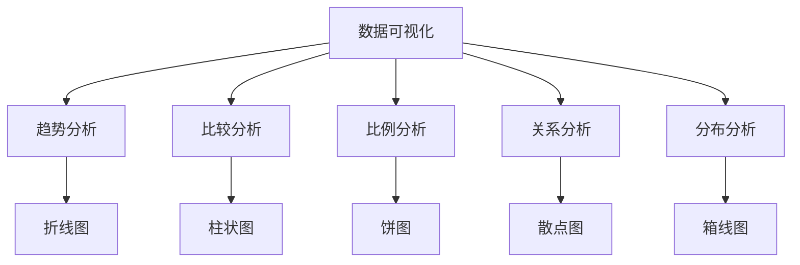
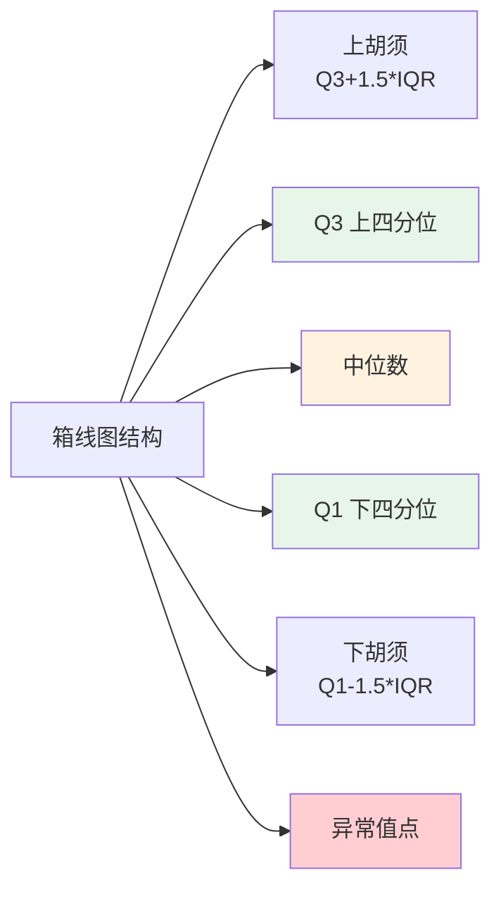
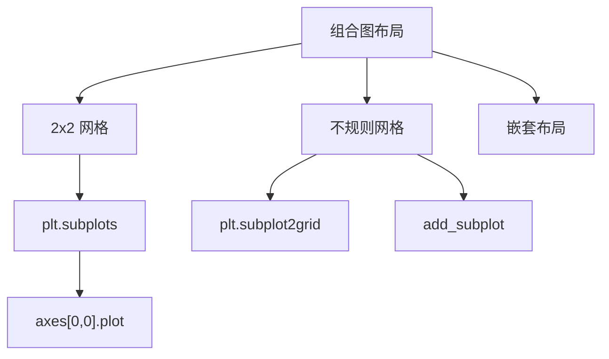
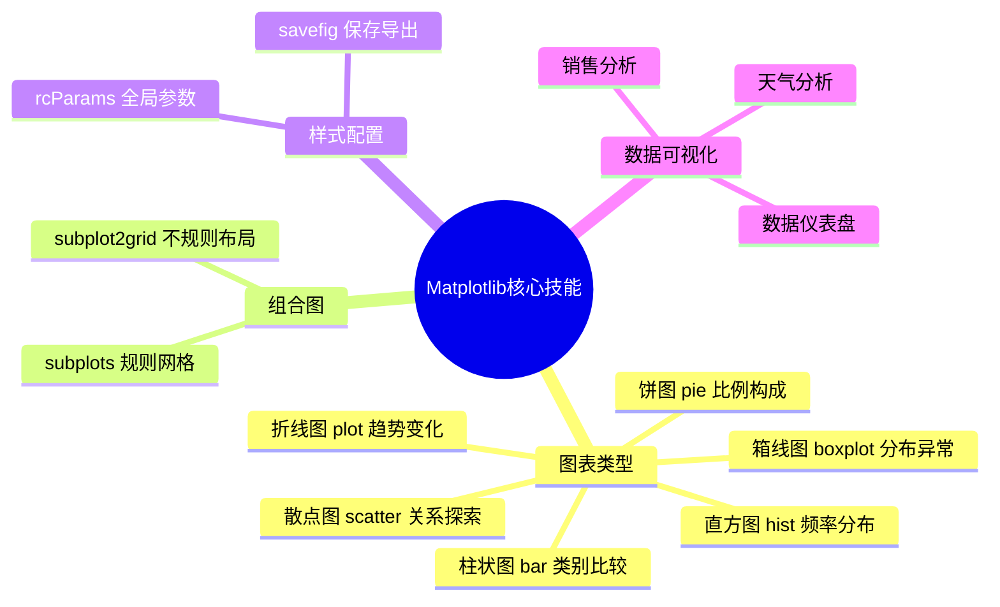

# Matplotlib 数据可视化

Matplotlib是Python最基础的可视化库，构成了Python可视化生态系统的基石。它能够创建各种类型的图表，包括折线图、柱状图、散点图、饼图等，能够满足大多数数据可视化需求。

本教程将系统介绍Matplotlib的基本用法和常见图表绘制方法。

## 5.1 图表类型选择指南

选择正确的图表类型是有效可视化的第一步：



| 图表类型 | 适用场景 |
|---------|---------|
| 折线图 | 展示数据随时间变化的趋势 |
| 柱状图 | 比较不同类别的数值大小 |
| 饼图 | 展示各部分在整体中的比例 |
| 散点图 | 探索两个变量之间的关系 |
| 箱线图 | 展示数据分布和异常值 |

## 5.2 核心工具介绍

### matplotlib.pyplot模块

matplotlib.pyplot是Matplotlib的面向对象API的函数式接口，提供了大量的绘图函数，是最常用的绘图工具。

```python
import matplotlib.pyplot as plt
import numpy as np
```

**常用导入：**
- `import matplotlib.pyplot as plt` - 导入pyplot模块，约定别名为plt
- `import numpy as np` - 导入NumPy，用于生成数值数据

### 全局配置参数rcParams

rcParams是Matplotlib的全局配置字典，用于设置图表的默认样式参数。

```python
# 设置中文字体（解决中文显示问题）
plt.rcParams['font.sans-serif'] = 'SimHei'  # Windows系统使用SimHei
plt.rcParams['font.sans-serif'] = 'STHeiti'  # Mac系统使用STHeiti
plt.rcParams['font.sans-serif'] = ['WenQuanYi Micro Hei', 'Noto Sans CJK SC']  # Linux系统

# 解决负号显示为方块的问题
plt.rcParams['axes.unicode_minus'] = False

# 其他常用配置
plt.rcParams['figure.figsize'] = (10, 6)      # 默认图形大小（英寸）
plt.rcParams['figure.dpi'] = 100              # 分辨率
plt.rcParams['axes.titlesize'] = 16           # 标题字号
plt.rcParams['axes.labelsize'] = 12           # 坐标轴标签字号
```

## 5.3 折线图

折线图用于展示数据随时间或其他连续变量的变化趋势。

### figure()函数 - 创建画布

```python
plt.figure(figsize=(10, 5), dpi=100, facecolor='white', edgecolor='black')
```

**参数说明：**

| 参数 | 类型 | 默认值 | 说明 |
|------|------|--------|------|
| figsize | tuple | (10, 6) | 画布尺寸（宽, 高），单位英寸 |
| dpi | int | 100 | 分辨率，每英寸点数 |
| facecolor | str | 'white' | 画布背景颜色 |
| edgecolor | str | 'black' | 画布边框颜色 |

### plot()函数 - 绑制折线图

```python
plt.plot(x, y, format_string, **kwargs)
```

**参数说明：**

| 参数 | 类型 | 说明 |
|------|------|------|
| x | 数组 | x轴数据，可为列表或NumPy数组 |
| y | 数组 | y轴数据，可为列表或NumPy数组 |
| format_string | str | 格式字符串，格式：'color marker linestyle'，如'o-'表示圆点连线 |

**format_string格式：**

| 颜色 | 说明 | 标记 | 说明 | 线型 | 说明 |
|------|------|------|------|------|------|
| b | 蓝色 | o | 圆圈 | - | 实线 |
| g | 绿色 | s | 方块 | -- | 虚线 |
| r | 红色 | ^ | 三角形 | -. | 点划线 |
| c | 青色 | D | 菱形 | : | 点线 |
| m | 洋红 | + | 加号 | | |
| y | 黄色 | x | 叉号 | | |
| k | 黑色 | * | 星号 | | |
| w | 白色 | . | 点 | | |

**常用kwargs参数：**

| 参数 | 类型 | 说明 |
|------|------|------|
| color 或 c | str | 线条颜色 |
| linewidth 或 lw | float | 线宽 |
| linestyle 或 ls | str | 线型：'solid', 'dashed', 'dashdot', 'dotted' |
| marker | str | 标记样式 |
| markersize 或 ms | float | 标记大小 |
| label | str | 图例标签 |
| alpha | float | 透明度，0-1之间 |
| markerfacecolor | str | 标记填充颜色 |
| markeredgecolor | str | 标记边缘颜色 |

**示例：**

```python
# 基本折线图
month = ['1月', '2月', '3月', '4月', '5月']
sales = [100, 150, 80, 130, 170]

plt.figure(figsize=(10, 5))
plt.plot(month, sales, marker='o', linewidth=2, color='steelblue')
plt.title('2025年销售趋势', fontsize=16)
plt.xlabel('月份')
plt.ylabel('销售额（万元）')
plt.grid(True, alpha=0.3)
plt.tight_layout()
plt.show()
```

### 多系列折线图

```python
# 多系列折线图
month = ['1月', '2月', '3月', '4月', '5月', '6月']
sales_a = [100, 150, 80, 130, 170, 160]
sales_b = [90, 120, 100, 110, 140, 150]

plt.figure(figsize=(10, 5))
plt.plot(month, sales_a, marker='o', linewidth=2, label='产品A', color='steelblue')
plt.plot(month, sales_b, marker='s', linewidth=2, label='产品B', color='orange')
plt.title('多产品销售趋势对比', fontsize=16)
plt.xlabel('月份')
plt.ylabel('销售额（万元）')
plt.legend(loc='upper left')  # loc参数：图例位置
plt.grid(True, alpha=0.3)
plt.tight_layout()
plt.show()
```

### 带面积填充的折线图

```python
plt.fill_between(x, y1, y2, where=None, alpha=0.2, color='steelblue')
```

**参数说明：**

| 参数 | 类型 | 说明 |
|------|------|------|
| x | 数组 | x轴数据 |
| y1 | 数组 | 第一条曲线y值 |
| y2 | 数组 | 第二条曲线y值（默认0） |
| where | 数组 | 条件数组，指定填充区域 |
| alpha | float | 透明度 |
| color | str | 填充颜色 |

```python
# 带面积填充的折线图
x = np.linspace(0, 10, 100)
y1 = np.sin(x)
y2 = np.cos(x)

plt.figure(figsize=(10, 5))
plt.plot(x, y1, label='sin(x)', color='steelblue')
plt.plot(x, y2, label='cos(x)', color='orange')
plt.fill_between(x, y1, alpha=0.2, color='steelblue')
plt.fill_between(x, y2, alpha=0.2, color='orange')
plt.title('三角函数图像', fontsize=16)
plt.xlabel('x')
plt.ylabel('y')
plt.legend()
plt.grid(True, alpha=0.3)
plt.tight_layout()
plt.show()
```

## 5.4 柱状图

柱状图用于比较不同类别的数值大小，是最直观的对比图表。

### bar()函数 - 绑制柱状图

```python
plt.bar(x, height, width=0.8, bottom=None, color=None, edgecolor=None, **kwargs)
```

**参数说明：**

| 参数 | 类型 | 默认值 | 说明 |
|------|------|--------|------|
| x | 数组 | 必填 | x轴位置 |
| height | 数组 | 必填 | 柱子的高度 |
| width | float | 0.8 | 柱子宽度 |
| bottom | 数组 | 0 | 柱子底部y坐标 |
| color | str或数组 | None | 柱子颜色 |
| edgecolor | str | 'black' | 柱子边框颜色 |
| tick_label | 数组 | None | x轴刻度标签 |
| label | str | None | 图例标签 |
| align | str | 'center' | 对齐方式：'center', 'edge' |

**常用kwargs：**

| 参数 | 类型 | 说明 |
|------|------|------|
| alpha | float | 透明度 |
| hatch | str | 填充图案 |
| linewidth | float | 边框宽度 |

```python
# 基本柱状图
subjects = ['语文', '数学', '英语', '科学']
scores = [85, 92, 78, 88]

plt.figure(figsize=(10, 5))
plt.bar(subjects, scores, color='steelblue', width=0.6)
plt.title('2025年成绩分布', fontsize=16)
plt.xlabel('科目')
plt.ylabel('分数')
plt.ylim(0, 100)

# 添加数值标签
for x, y in zip(subjects, scores):
    plt.text(x, y+1, str(y), ha='center', va='bottom', fontsize=10)

plt.grid(axis='y', alpha=0.3)
plt.tight_layout()
plt.show()
```

### 分组柱状图

```python
# 分组柱状图
categories = ['A', 'B', 'C', 'D']
values1 = [100, 120, 90, 110]
values2 = [90, 110, 100, 95]

x = np.arange(len(categories))
width = 0.35

plt.figure(figsize=(10, 5))
plt.bar(x - width/2, values1, width, label='2024年', color='steelblue')
plt.bar(x + width/2, values2, width, label='2025年', color='orange')
plt.title('年度数据对比', fontsize=16)
plt.xlabel('类别')
plt.ylabel('数值')
plt.xticks(x, categories)  # 设置x轴刻度
plt.legend()
plt.grid(axis='y', alpha=0.3)
plt.tight_layout()
plt.show()
```

### barh()函数 - 水平条形图

```python
plt.barh(y, width, height=0.8, left=None, color=None, **kwargs)
```

**参数说明：**

| 参数 | 类型 | 默认值 | 说明 |
|------|------|--------|------|
| y | 数组 | 必填 | y轴位置 |
| width | 数组 | 必填 | 条形的宽度 |
| height | float | 0.8 | 条形高度 |
| left | 数组 | 0 | 条形左侧x坐标 |
| color | str | None | 条形颜色 |

```python
# 水平条形图
countries = ['美国', '中国', '日本', '德国', '印度']
gdp = [92, 78, 43, 22, 8]

plt.figure(figsize=(10, 5))
plt.barh(countries, gdp, color='steelblue')
plt.title('2025年GDP排名', fontsize=16)
plt.xlabel('GDP（万亿美元）')
plt.ylabel('国家')
plt.tight_layout()
plt.show()
```

## 5.5 饼图

饼图用于展示各部分在整体中的比例，适合类别较少时使用。

### pie()函数 - 绑制饼图

```python
plt.pie(x, explode=None, labels=None, colors=None, autopct=None, 
        pctdistance=0.6, shadow=False, startangle=0, 
        wedgeprops=None, center=(0, 0), **kwargs)
```

**参数说明：**

| 参数 | 类型 | 默认值 | 说明 |
|------|------|--------|------|
| x | 数组 | 必填 | 数据值 |
| explode | 数组 | None | 各部分偏离圆心的距离 |
| labels | 列表 | None | 各部分标签 |
| colors | 列表 | None | 各部分颜色 |
| autopct | str | None | 百分比格式，如'%.1f%%' |
| pctdistance | float | 0.6 | 百分比文字距中心距离 |
| shadow | bool | False | 是否显示阴影 |
| startangle | float | 0 | 起始角度（度） |
| wedgeprops | dict | None | 饼块属性，如wedgeprops={'width':0.6}创建环形图 |
| center | tuple | (0,0) | 饼图中心坐标 |

**wedgeprops常用属性：**

| 属性 | 说明 |
|------|------|
| width | 环形宽度（相对于半径） |
| edgecolor | 边框颜色 |
| linewidth | 边框宽度 |

```python
# 基本饼图
things = ['学习', '娱乐', '运动', '睡觉', '其他']
times = [6, 4, 1, 8, 5]
colors = ['#66b3ff', '#99ff99', '#ffcc99', '#ff9999', '#ff4499']

plt.figure(figsize=(8, 8))
plt.pie(times, labels=things, autopct='%.1f%%', startangle=90, colors=colors)
plt.title('一天的时间分布', fontsize=16)
plt.tight_layout()
plt.show()
```

### 环形图

```python
# 环形图
plt.figure(figsize=(8, 8))
plt.pie(times, labels=things, autopct='%.1f%%', startangle=90, colors=colors,
        wedgeprops={'width': 0.6}, pctdistance=0.75)
plt.text(0, 0, '总计\n100%', ha='center', va='center', fontsize=12)
plt.title('一天的时间分布（环形）', fontsize=16)
plt.tight_layout()
plt.show()
```

### 爆炸式饼图

```python
# 爆炸式饼图
explode = [0.1, 0, 0, 0, 0]  # 第一个元素偏离0.1半径距离

plt.figure(figsize=(8, 8))
plt.pie(times, labels=things, autopct='%.1f%%', startangle=0, colors=colors,
        explode=explode, shadow=True)
plt.title('一天的时间分布（爆炸式）', fontsize=16)
plt.tight_layout()
plt.show()
```

## 5.6 散点图

散点图用于展示两个变量之间的关系，适合探索数据的相关性。

### scatter()函数 - 绑制散点图

```python
plt.scatter(x, y, s=None, c=None, marker='o', cmap=None, 
            norm=None, vmin=None, vmax=None, alpha=None, 
            edgecolors=None, linewidths=None, **kwargs)
```

**参数说明：**

| 参数 | 类型 | 默认值 | 说明 |
|------|------|--------|------|
| x | 数组 | 必填 | x轴数据 |
| y | 数组 | 必填 | y轴数据 |
| s | 数组或float | None | 点的大小 |
| c | 数组或str | None | 点的颜色 |
| marker | str | 'o' | 标记样式 |
| cmap | str | None | 颜色映射 |
| norm | Normalize | None | 数据标准化 |
| vmin, vmax | float | None | 颜色映射范围 |
| alpha | float | None | 透明度（0-1） |
| edgecolors | str | None | 点的边框颜色 |
| linewidths | float | None | 边框宽度 |

**marker标记样式：**

| 标记 | 说明 | 标记 | 说明 |
|------|------|------|------|
| o | 圆圈 | D | 菱形 |
| s | 方块 | + | 加号 |
| ^ | 上三角形 | x | 叉号 |
| v | 下三角形 | * | 星号 |
| < | 左三角形 | . | 点 |
| > | 右三角形 | 1 | 三下箭头 |

```python
# 基本散点图
np.random.seed(42)
n = 50
hours = np.random.uniform(1, 8, n)
scores = 50 + 5 * hours + np.random.normal(0, 5, n)

plt.figure(figsize=(10, 6))
plt.scatter(hours, scores, alpha=0.6, c='steelblue', edgecolors='white', s=80)
plt.title('学习时间与考试成绩的关系', fontsize=16)
plt.xlabel('每日学习时间（小时）')
plt.ylabel('考试成绩')
plt.grid(True, alpha=0.3)
plt.tight_layout()
plt.show()
```

### 多类别散点图

```python
# 多类别散点图
df = pd.read_csv('data/penguins.csv')
df = df.dropna()

plt.figure(figsize=(10, 6))
colors = {'Adelie': 'steelblue', 'Chinstrap': 'orange', 'Gentoo': 'green'}
for species in df['species'].unique():
    subset = df[df['species'] == species]
    plt.scatter(subset['bill_length_mm'], subset['bill_depth_mm'],
                c=colors[species], label=species, alpha=0.6, s=50)
plt.title('企鹅喙长与喙深的关系', fontsize=16)
plt.xlabel('喙长（mm）')
plt.ylabel('喙深（mm）')
plt.legend()
plt.grid(True, alpha=0.3)
plt.tight_layout()
plt.show()
```

## 5.7 箱线图

箱线图展示数据分布，包括中位数、四分位数和异常值。



### boxplot()函数 - 绑制箱线图

```python
plt.boxplot(x, notch=False, sym='o', vert=True, patch_artist=False, **kwargs)
```

**参数说明：**

| 参数 | 类型 | 默认值 | 说明 |
|------|------|--------|------|
| x | 数组或数组列表 | 必填 | 数据 |
| notch | bool | False | 是否绘制凹槽 |
| sym | str | 'o' | 异常值标记 |
| vert | bool | True | 是否垂直绘制 |
| patch_artist | bool | False | 是否填充箱子 |
| positions | 数组 | None | 箱子位置 |
| widths | float | 0.5 | 箱子宽度 |
| labels | 列表 | None | 每个箱子的标签 |

**kwargs常用参数：**

| 参数 | 说明 |
|------|------|
| boxprops | 箱子属性，如dict(facecolor='lightblue') |
| medianprops | 中位数线属性 |
| whiskerprops | 胡须属性 |
| capprops | 顶端线属性 |
| flierprops | 异常值属性 |

```python
# 基本箱线图
data = {
    '语文': [82, 85, 88, 70, 90, 76, 84, 83, 95, 77, 78, 92],
    '数学': [75, 80, 79, 93, 88, 82, 87, 89, 92, 73, 85, 91],
    '英语': [70, 72, 68, 65, 78, 80, 85, 90, 95, 62, 70, 88]
}

plt.figure(figsize=(10, 6))
plt.boxplot(data.values(), tick_labels=data.keys(), patch_artist=True,
            boxprops=dict(facecolor='lightblue'))
plt.title('各科成绩分布（箱线图）', fontsize=16)
plt.ylabel('分数')
plt.grid(True, axis='y', linestyle='--', alpha=0.5)
plt.tight_layout()
plt.show()
```

## 5.8 直方图

直方图用于展示数值变量的分布频率。

### hist()函数 - 绑制直方图

```python
plt.hist(x, bins=None, range=None, density=False, weights=None, 
         cumulative=False, bottom=None, histtype='bar', **kwargs)
```

**参数说明：**

| 参数 | 类型 | 默认值 | 说明 |
|------|------|--------|------|
| x | 数组 | 必填 | 数据 |
| bins | int或序列 | 10 | 分箱数量或边界 |
| range | tuple | None | 数据范围 |
| density | bool | False | 是否归一化为密度 |
| weights | 数组 | None | 每个数据的权重 |
| cumulative | bool | False | 是否累积 |
| bottom | 数组 | None | 底部基线 |
| histtype | str | 'bar' | 类型：'bar', 'barstacked', 'step', 'stepfilled' |

```python
# 降水量分布直方图
plt.figure(figsize=(10, 6))
plt.hist(df['precipitation'], bins=30, color='steelblue', edgecolor='white', alpha=0.7)
plt.title('降水量分布直方图', fontsize=16)
plt.xlabel('降水量（mm）')
plt.ylabel('天数')
plt.grid(True, axis='y', alpha=0.3)
plt.tight_layout()
plt.show()
```

## 5.9 组合图

使用subplot可以在一个画布上创建多个子图。

### subplots()函数 - 创建规则网格

```python
fig, axes = plt.subplots(nrows=1, ncols=1, figsize=(10, 6), dpi=100, 
                        sharex=False, sharey=False, squeeze=True, 
                        subplot_kw=None, gridspec_kw=None)
```

**参数说明：**

| 参数 | 类型 | 默认值 | 说明 |
|------|------|--------|------|
| nrows | int | 1 | 行数 |
| ncols | int | 1 | 列数 |
| figsize | tuple | None | 画布尺寸 |
| dpi | int | 100 | 分辨率 |
| sharex | bool | False | 是否共享x轴 |
| sharey | bool | False | 是否共享y轴 |
| squeeze | bool | True | 是否压缩返回的axes数组 |
| subplot_kw | dict | None | 传给add_subplot的参数 |
| gridspec_kw | dict | None | GridSpec参数 |

**返回值：**
- fig：Figure对象，整个画布
- axes：Axes对象或数组，子图



### 基本组合图

```python
# 基本组合图
fig, axes = plt.subplots(2, 2, figsize=(14, 10))

# 子图1：折线图
axes[0, 0].plot(month, sales_a, 'o-', color='steelblue')
axes[0, 0].set_title('销售趋势')
axes[0, 0].set_xlabel('月份')
axes[0, 0].set_ylabel('销售额')
axes[0, 0].grid(True, alpha=0.3)

# 子图2：柱状图
axes[0, 1].bar(subjects, scores, color='steelblue')
axes[0, 1].set_title('成绩分布')
axes[0, 1].set_ylabel('分数')
axes[0, 1].grid(axis='y', alpha=0.3)

# 子图3：散点图
axes[1, 0].scatter(hours, scores, alpha=0.6, c='steelblue')
axes[1, 0].set_title('学习时间与成绩')
axes[1, 0].set_xlabel('学习时间')
axes[1, 0].set_ylabel('成绩')
axes[1, 0].grid(True, alpha=0.3)

# 子图4：饼图
axes[1, 1].pie(times, labels=things, autopct='%.1f%%', startangle=90, colors=colors)
axes[1, 1].set_title('时间分配')

plt.suptitle('数据分析综合视图', fontsize=18, y=1.02)
plt.tight_layout()
plt.show()
```

### subplot2grid()函数 - 不规则网格

```python
plt.subplot2grid(shape, loc, rowspan=1, colspan=1, **kwargs)
```

**参数说明：**

| 参数 | 类型 | 说明 |
|------|------|------|
| shape | tuple | 网格形状，如(3, 3) |
| loc | tuple | 起始位置，如(0, 0) |
| rowspan | int | 跨越行数 |
| colspan | int | 跨越列数 |

```python
# 不规则组合图
fig = plt.figure(figsize=(14, 8))

# 主图：占据上方大部分空间
ax1 = plt.subplot2grid((3, 3), (0, 0), colspan=2, rowspan=2)
ax1.plot(month, sales_a, 'o-', color='steelblue', linewidth=2)
ax1.set_title('销售趋势（主图）')
ax1.grid(True, alpha=0.3)

# 右上：柱状图
ax2 = plt.subplot2grid((3, 3), (0, 2))
ax2.bar(subjects, scores, color='steelblue')
ax2.set_title('成绩分布')

# 中右：饼图
ax3 = plt.subplot2grid((3, 3), (1, 2))
ax3.pie(times, labels=things, autopct='%.1f%%', colors=colors)
ax3.set_title('时间分配')

# 底部：散点图
ax4 = plt.subplot2grid((3, 3), (2, 0), colspan=3)
ax4.scatter(hours, scores, alpha=0.6, c='steelblue')
ax4.set_title('学习时间与成绩关系（底部）')
ax4.set_xlabel('学习时间')
ax4.set_ylabel('成绩')
ax4.grid(True, alpha=0.3)

plt.tight_layout()
plt.show()
```

## 5.10 标签与标题函数

### 标题与标签函数

| 函数 | 说明 |
|------|------|
| `plt.title(s)` | 设置图表标题 |
| `plt.xlabel(s)` | 设置x轴标签 |
| `plt.ylabel(s)` | 设置y轴标签 |
| `plt.suptitle(s)` | 设置总标题（用于subplots） |

### 辅助函数

| 函数 | 说明 |
|------|------|
| `plt.legend()` | 显示图例 |
| `plt.grid()` | 显示网格线 |
| `plt.text(x, y, s)` | 在指定位置添加文本 |
| `plt.xticks()` | 设置x轴刻度 |
| `plt.yticks()` | 设置y轴刻度 |
| `plt.xlim()` | 设置x轴范围 |
| `plt.ylim()` | 设置y轴范围 |
| `plt.tight_layout()` | 自动调整布局 |
| `plt.show()` | 显示图表 |
| `plt.savefig()` | 保存图表 |

### legend()函数参数

```python
plt.legend(labels, loc='best', fontsize=10, frameon=True, 
           fancybox=True, shadow=True, **kwargs)
```

| 参数 | 类型 | 默认值 | 说明 |
|------|------|--------|------|
| labels | 列表 | None | 图例标签 |
| loc | str或int | 'best' | 位置：'upper right', 'lower left'等 |
| fontsize | int | 10 | 字号 |
| frameon | bool | True | 是否显示边框 |
| fancybox | bool | False | 圆角边框 |
| shadow | bool | False | 阴影 |

### grid()函数参数

```python
plt.grid(b=True, which='major', axis='both', **kwargs)
```

| 参数 | 类型 | 默认值 | 说明 |
|------|------|--------|------|
| b | bool | None | 是否显示网格 |
| which | str | 'major' | 'major', 'minor', 'both' |
| axis | str | 'both' | 'x', 'y', 'both' |
| alpha | float | None | 透明度 |
| linestyle | str | None | 线型 |

## 5.11 图表样式配置

### rcParams常用参数

```python
# 常用样式配置
plt.rcParams['figure.figsize'] = (10, 6)      # 默认图形大小
plt.rcParams['figure.dpi'] = 100              # 分辨率
plt.rcParams['axes.titlesize'] = 16           # 标题大小
plt.rcParams['axes.labelsize'] = 12           # 标签大小
plt.rcParams['xtick.labelsize'] = 10          # x轴刻度
plt.rcParams['ytick.labelsize'] = 10          # y轴刻度
plt.rcParams['legend.fontsize'] = 10          # 图例大小
plt.rcParams['lines.linewidth'] = 2           # 线宽
plt.rcParams['lines.markersize'] = 8          # 标记大小
```

### 保存图表

```python
plt.savefig(fname, dpi=None, bbox_inches='tight', 
            format=None, facecolor='auto', **kwargs)
```

| 参数 | 类型 | 说明 |
|------|------|------|
| fname | str | 文件名，支持.png, .pdf, .svg, .jpg等 |
| dpi | int | 分辨率 |
| bbox_inches | str | 'tight'表示紧凑布局 |
| format | str | 格式，如'png', 'pdf' |
| facecolor | str | 背景颜色，'auto'表示使用原背景 |

```python
# 保存为不同格式
plt.savefig('figure.png', dpi=300, bbox_inches='tight')  # PNG格式
plt.savefig('figure.pdf', bbox_inches='tight')            # PDF格式
plt.savefig('figure.svg', bbox_inches='tight')            # SVG格式
plt.savefig('figure.jpg', dpi=300, bbox_inches='tight')   # JPG格式
```

## 5.12 实战案例：天气数据分析

使用真实数据进行分析和可视化。

```python
# 加载天气数据
df = pd.read_csv('data/weather.csv')
df['date'] = pd.to_datetime(df['date'])
df = df[df['date'].dt.year == 2015]

print('数据概览:')
print(df.head())
print(f'\n数据范围: {df["date"].min()} 到 {df["date"].max()}')
```

### 气温趋势图

```python
# 气温趋势图
plt.figure(figsize=(14, 6))
plt.plot(df['date'], df['temp_max'], label='最高气温', alpha=0.8, color='steelblue')
plt.plot(df['date'], df['temp_min'], label='最低气温', alpha=0.8, color='orange')
plt.fill_between(df['date'], df['temp_min'], df['temp_max'], alpha=0.2, color='gray')
plt.title('2015年气温趋势变化图', fontsize=16)
plt.xlabel('日期')
plt.ylabel('气温（℃）')
plt.legend()
plt.grid(True, alpha=0.3)
plt.tight_layout()
plt.show()
```

### 综合分析仪表盘

```python
# 综合分析仪表盘
fig, axes = plt.subplots(2, 2, figsize=(14, 10))

# 气温趋势
axes[0, 0].plot(df['date'], df['temp_max'], label='最高气温', color='steelblue')
axes[0, 0].plot(df['date'], df['temp_min'], label='最低气温', color='orange')
axes[0, 0].set_title('2015年气温趋势')
axes[0, 0].set_xlabel('日期')
axes[0, 0].set_ylabel('气温（℃）')
axes[0, 0].legend()
axes[0, 0].grid(True, alpha=0.3)

# 降水分布
axes[0, 1].hist(df['precipitation'], bins=30, color='steelblue', edgecolor='white')
axes[0, 1].set_title('降水量分布')
axes[0, 1].set_xlabel('降水量（mm）')
axes[0, 1].set_ylabel('天数')
axes[0, 1].grid(True, alpha=0.3)

# 最高气温箱线图（按月）
df['month'] = df['date'].dt.month
monthly_temp = [df[df['month'] == m]['temp_max'].values for m in range(1, 13)]
axes[1, 0].boxplot(monthly_temp, labels=[f'{i}月' for i in range(1, 13)])
axes[1, 0].set_title('各月最高气温分布')
axes[1, 0].set_xlabel('月份')
axes[1, 0].set_ylabel('气温（℃）')
axes[1, 0].grid(True, alpha=0.3)

# 散点图：温度vs降水
axes[1, 1].scatter(df['temp_max'], df['precipitation'], alpha=0.5, c='steelblue')
axes[1, 1].set_title('最高气温与降水关系')
axes[1, 1].set_xlabel('最高气温（℃）')
axes[1, 1].set_ylabel('降水量（mm）')
axes[1, 1].grid(True, alpha=0.3)

plt.suptitle('2015年天气数据分析', fontsize=18, y=1.02)
plt.tight_layout()
plt.show()
```

## 5.13 小结



**核心函数速查表：**

| 函数 | 用途 | 关键参数 |
|------|------|---------|
| `figure()` | 创建画布 | figsize, dpi |
| `plot()` | 折线图 | x, y, marker, linewidth |
| `bar()/barh()` | 柱状图 | x, height, width |
| `pie()` | 饼图 | x, labels, autopct |
| `scatter()` | 散点图 | x, y, s, c |
| `boxplot()` | 箱线图 | x, labels |
| `hist()` | 直方图 | x, bins |
| `subplots()` | 组合图 | nrows, ncols |
| `subplot2grid()` | 不规则组合 | shape, loc |

建议多加练习，将可视化应用到实际数据分析中。