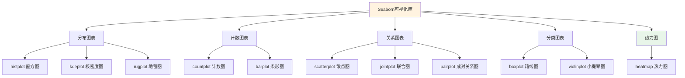
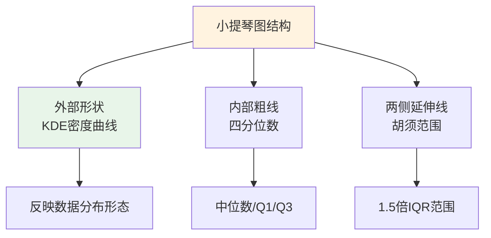
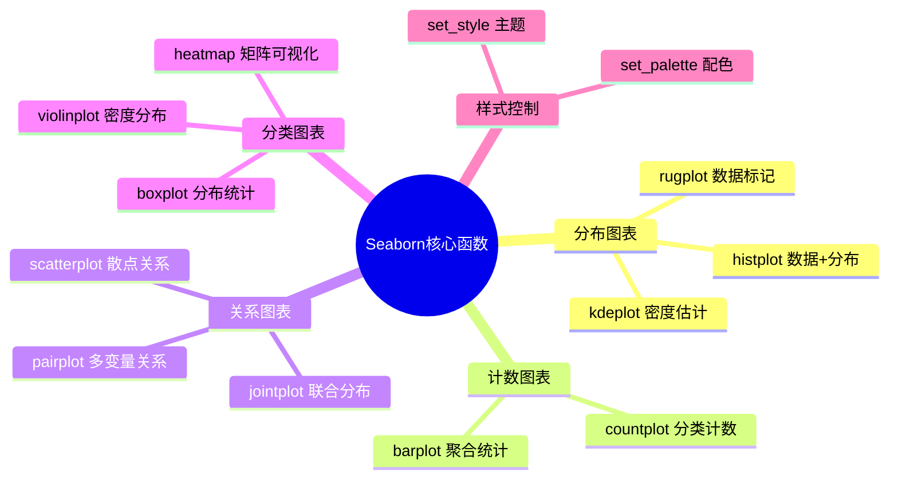

# Seaborn 数据可视化

Seaborn是基于Matplotlib的高级统计数据可视化库，它提供了更简洁的API和更美观的默认样式。在实际的数据分析工作中，我们通常先使用Pandas进行数据处理和探索，然后借助Seaborn快速生成各种统计图表。



Seaborn与Matplotlib的关系密不可分：底层仍然调用Matplotlib的绘图函数，但在其基础上封装了大量便捷功能，使得创建复杂图表变得轻而易举。

## 6.1 工具介绍

### 导入方式

```python
import pandas as pd          # 数据处理
import seaborn as sns         # 可视化库，约定俗成用sns
import matplotlib.pyplot as plt  # 绑图底层支持
import numpy as np           # 数值计算
```

**常用配置：**

```python
# 设置中文字体支持
plt.rcParams["font.sans-serif"] = ["SimHei", "STHeiti", "Arial Unicode MS"]
plt.rcParams["axes.unicode_minus"] = False

# 设置默认图表风格
sns.set_theme()  # 恢复默认主题
sns.set_style("whitegrid")  # 设置主题：white, dark, whitegrid, darkgrid
sns.set_palette("Set2")     # 设置配色方案
```

### 样式与配色函数

| 函数 | 说明 |
|------|------|
| `sns.set_theme()` | 重置为默认主题 |
| `sns.set_style(style)` | 设置图表风格 |
| `sns.set_palette(palette)` | 设置默认调色板 |
| `sns.despine()` | 移除上方和右侧边框 |

**可用主题（set_style）：**
- `white`：白色背景（默认）
- `dark`：深色背景
- `whitegrid`：白色背景+网格线
- `darkgrid`：深色背景+网格线

**可用调色板（set_palette）：**
- `deep`, `muted`, `pastel`, `bright`, `dark`, `colorblind` - 完整调色板
- `Set1`, `Set2`, `Set3` - 离散分类
- `husl` - 均匀色调
- 自定义：`["#FF6B6B", "#4ECDC4", "#45B7D1"]`

## 6.2 数据集介绍

### 企鹅数据集

本教程使用企鹅数据集（penguins.csv）进行实战演示，该数据集包含了三种企鹅的测量数据。

```python
# 加载企鹅数据集
penguins = pd.read_csv("data/penguins.csv")
penguins.dropna(inplace=True)
print(f"数据集形状: {penguins.shape}")
print(f"\n数据集前5行:")
print(penguins.head())
```

**数据集字段说明：**

| 字段 | 类型 | 说明 |
|------|------|------|
| species | 类别型 | 企鹅物种（Adelie、Chinstrap、Gentoo） |
| island | 类别型 | 栖息岛屿 |
| bill_length_mm | 数值型 | 喙长（毫米） |
| bill_depth_mm | 数值型 | 喙深（毫米） |
| flipper_length_mm | 数值型 | 脚蹼长度（毫米） |
| body_mass_g | 数值型 | 体重（克） |
| sex | 类别型 | 性别 |

## 6.3 分布图表

### histplot() - 直方图

直方图是展示数值型变量分布最常用的方式之一。

```python
sns.histplot(data=None, x=None, y=None, hue=None, bins=None, 
             stat='count', kde=False, **kwargs)
```

**参数说明：**

| 参数 | 类型 | 说明 |
|------|------|------|
| data | DataFrame | 数据源 |
| x | str | x轴绑定字段 |
| y | str | y轴绑定字段（用于2D直方图） |
| hue | str | 分组字段 |
| bins | int | 分箱数量 |
| stat | str | 统计类型：'count', 'density', 'frequency', 'percent', 'probability' |
| kde | bool | 是否显示核密度曲线 |
| element | str | 'bars', 'step', 'poly' |
| multiple | str | 分组堆叠方式：'layer', 'dodge', 'stack', 'fill' |
| shrink | float | 柱子宽度缩放 |
| common_bins | bool | 是否使用公共分箱 |
| palette | str | 配色方案 |

```python
# 基本直方图
plt.figure(figsize=(8, 5))
sns.histplot(data=penguins, x="species", hue="species", palette="Set2")
plt.title("企鹅物种分布直方图")
plt.xlabel("物种")
plt.ylabel("数量")
plt.show()

# 带核密度估计的直方图
plt.figure(figsize=(10, 5))
sns.histplot(data=penguins, x="bill_length_mm", kde=True, color="steelblue")
plt.title("企鹅喙长度分布（含密度曲线）")
plt.xlabel("喙长度 (mm)")
plt.ylabel("计数")
plt.show()
```

### kdeplot() - 核密度估计图

核密度估计（Kernel Density Estimate）是一种非参数化的概率密度估计方法。

```python
sns.kdeplot(data=None, x=None, y=None, hue=None, 
            weight=None, palette=None, fill=False, **kwargs)
```

**参数说明：**

| 参数 | 类型 | 说明 |
|------|------|------|
| data | DataFrame | 数据源 |
| x | str | x轴字段 |
| y | str | y轴字段（用于2D KDE） |
| hue | str | 分组字段 |
| weight | str | 权重字段 |
| palette | str | 配色方案 |
| fill | bool | 是否填充区域 |
| alpha | float | 透明度 |
| linewidth | float | 线条宽度 |
| linestyle | str | 线型 |
| cumulative | bool | 是否绘制累积密度 |
| bw_method | str | 带宽方法 |
| bw_adjust | float | 带宽调整系数 |

```python
# 基本 KDE 图
plt.figure(figsize=(10, 5))
sns.kdeplot(data=penguins, x="bill_length_mm", fill=True, color="coral")
plt.title("企鹅喙长度核密度估计")
plt.xlabel("喙长度 (mm)")
plt.ylabel("密度")
plt.show()

# 按物种分组的 KDE 图
plt.figure(figsize=(10, 5))
sns.kdeplot(data=penguins, x="bill_length_mm", hue="species", fill=True, alpha=0.3)
plt.title("不同物种喙长度分布对比")
plt.xlabel("喙长度 (mm)")
plt.ylabel("密度")
plt.show()
```

### rugplot() - 地毯图

地毯图是一种简单的辅助图表，用于在坐标轴上标记每个数据点的位置。

```python
sns.rugplot(data=None, x=None, y=None, hue=None, 
            height=0.05, expand_margins=True, **kwargs)
```

**参数说明：**

| 参数 | 类型 | 默认值 | 说明 |
|------|------|--------|------|
| data | DataFrame | None | 数据源 |
| x | str | None | x轴字段 |
| y | str | None | y轴字段 |
| hue | str | None | 分组字段 |
| height | float | 0.05 | 地毯线高度（相对于轴） |
| expand_margins | bool | True | 是否扩展边距 |
| linewidth | float | None | 线宽 |
| color | str | None | 颜色 |

```python
# KDE 图配合地毯图使用
plt.figure(figsize=(10, 5))
sns.kdeplot(data=penguins, x="bill_length_mm", fill=True, color="teal")
sns.rugplot(data=penguins, x="bill_length_mm", color="darkred", height=0.1)
plt.title("KDE 图配合地毯图展示数据分布")
plt.xlabel("喙长度 (mm)")
plt.show()
```

## 6.4 计数图表

### countplot() - 计数图

计数图用于展示分类变量的各水平（类别）对应的样本数量。

```python
sns.countplot(data=None, x=None, y=None, hue=None, 
              order=None, hue_order=None, **kwargs)
```

**参数说明：**

| 参数 | 类型 | 说明 |
|------|------|------|
| data | DataFrame | 数据源 |
| x, y | str | 轴绑定字段 |
| hue | str | 分组字段 |
| order | list | x轴类别顺序 |
| hue_order | list | hue分组顺序 |
| color | str | 统一颜色 |
| palette | str | 配色方案 |
| saturation | float | 颜色饱和度 |

```python
# 基本计数图：各岛屿企鹅数量
plt.figure(figsize=(8, 5))
sns.countplot(data=penguins, x="island", palette="muted")
plt.title("各岛屿企鹅数量统计")
plt.xlabel("岛屿")
plt.ylabel("数量")
plt.show()

# 按性别分组的计数图
plt.figure(figsize=(8, 5))
sns.countplot(data=penguins, x="island", hue="sex", palette="Set2")
plt.title("各岛屿企鹅数量（按性别分组）")
plt.xlabel("岛屿")
plt.ylabel("数量")
plt.legend(title="性别")
plt.show()
```

### barplot() - 条形图

条形图与计数图类似，但它的纵轴可以是任意聚合统计量（均值、中位数等）。

```python
sns.barplot(data=None, x=None, y=None, hue=None, 
           order=None, hue_order=None, estimator='mean', **kwargs)
```

**参数说明：**

| 参数 | 类型 | 默认值 | 说明 |
|------|------|--------|------|
| data | DataFrame | None | 数据源 |
| x, y | str | None | 轴绑定字段 |
| hue | str | None | 分组字段 |
| order, hue_order | list | None | 类别顺序 |
| estimator | callable | 'mean' | 聚合函数：'mean', 'median', 'std', 'count' |
| errorbar | str/tuple | ('ci', 95) | 误差棒类型：'ci', 'se', 'sd', None |
| ci | int | 95 | 置信区间宽度 |
| n_boot | int | 10000 | Bootstrap迭代次数 |
| orient | str | None | 'v'或'h'，方向 |
| palette | str | None | 配色方案 |
| capsize | float | 0 | 误差棒顶端宽度 |

```python
# 条形图：各物种平均喙长度
plt.figure(figsize=(8, 5))
sns.barplot(data=penguins, x="species", y="bill_length_mm", 
            estimator="mean", errorbar=None, palette="Set3")
plt.title("各物种平均喙长度")
plt.xlabel("物种")
plt.ylabel("平均喙长度 (mm)")
plt.show()

# 带误差棒的条形图（显示95%置信区间）
plt.figure(figsize=(8, 5))
sns.barplot(data=penguins, x="species", y="bill_length_mm", 
            estimator="mean", palette="viridis", errorbar=('ci', 95))
plt.title("各物种平均喙长度（含95%置信区间）")
plt.xlabel("物种")
plt.ylabel("平均喙长度 (mm)")
plt.show()
```

## 6.5 关系图表

### scatterplot() - 散点图

散点图是展示两个连续变量之间关系的经典方式。

```python
sns.scatterplot(data=None, x=None, y=None, hue=None, 
                size=None, style=None, palette=None, **kwargs)
```

**参数说明：**

| 参数 | 类型 | 说明 |
|------|------|------|
| data | DataFrame | 数据源 |
| x, y | str | 轴绑定字段 |
| hue | str | 颜色分组字段 |
| size | str | 点大小字段 |
| style | str | 点样式字段 |
| palette | str | 配色方案 |
| sizes | dict | 大小范围，如{'small': 50, 'large': 200} |
| markers | bool | 是否使用不同标记 |
| alpha | float | 透明度 |
| legend | str | 'full', 'brief', 'auto', 'False' |

```python
# 基本散点图：体重与脚蹼长度的关系
plt.figure(figsize=(10, 6))
sns.scatterplot(data=penguins, x="body_mass_g", y="flipper_length_mm",
                hue="species", style="sex", palette="Set1")
plt.title("企鹅体重与脚蹼长度关系")
plt.xlabel("体重 (g)")
plt.ylabel("脚蹼长度 (mm)")
plt.legend(title="物种", loc="upper left")
plt.show()
```

### jointplot() - 联合图

联合图是散点图与边缘分布图的组合。

```python
sns.jointplot(data=None, x=None, y=None, hue=None, kind='scatter', **kwargs)
```

**参数说明：**

| 参数 | 类型 | 默认值 | 说明 |
|------|------|--------|------|
| data | DataFrame | None | 数据源 |
| x, y | str | None | 轴绑定字段 |
| hue | str | None | 分组字段 |
| kind | str | 'scatter' | 中心图类型：'scatter', 'hist', 'hex', 'kde', 'reg' |
| height | float | 6 | 图表高度（英寸） |
| ratio | float | 5 | 中心图与边缘图比例 |
| space | float | 0.2 | 子图间距 |
| xlim, ylim | tuple | None | 轴范围 |
| marginal_ticks | bool | False | 边缘图刻度 |

**kind参数详解：**
- `scatter`：散点图（默认）
- `hist`：二维直方图
- `hex`：六边形密度图（适合大数据）
- `kde`：二维核密度图
- `reg`：带回归线的散点图

```python
# 六边形联合图：适合大数据量的密度展示
sns.jointplot(data=penguins, x="body_mass_g", y="flipper_length_mm", 
              kind="hex", cmap="YlOrRd")
plt.suptitle("体重与脚蹼长度联合分布（六边形图）", y=1.02)
plt.show()

# 带回归线的联合图
sns.jointplot(data=penguins, x="body_mass_g", y="flipper_length_mm", 
              kind="reg", color="purple")
plt.suptitle("体重与脚蹼长度关系（带回归线）", y=1.02)
plt.show()
```

### pairplot() - 成对关系图

成对关系图用于展示数据集中多个变量之间的两两关系。

```python
sns.pairplot(data, hue=None, vars=None, kind='scatter', 
             diag_kind='auto', **kwargs)
```

**参数说明：**

| 参数 | 类型 | 说明 |
|------|------|------|
| data | DataFrame | 数据源 |
| hue | str | 分组字段 |
| vars | list | 绑定的变量列表 |
| kind | str | 非对角线图表类型：'scatter', 'hist', 'reg', 'kde' |
| diag_kind | str | 对角线图表类型：'auto', 'hist', 'kde' |
| height | float | 每个子图高度 |
| aspect | float | 宽高比 |
| corner | bool | True时只显示下三角 |
| dropna | bool | 是否删除缺失值 |

```python
# 选择部分数值变量进行成对关系展示
num_cols = ["bill_length_mm", "bill_depth_mm", "flipper_length_mm", "body_mass_g"]
plt.figure(figsize=(10, 8))
sns.pairplot(data=penguins[num_cols], palette="husl")
plt.suptitle("数值变量成对关系图", y=1.02)
plt.show()

# 按物种着色的成对关系图
plt.figure(figsize=(10, 8))
sns.pairplot(data=penguins, hue="species", vars=num_cols, palette="Set2")
plt.suptitle("按物种分组的成对关系图", y=1.02)
plt.show()
```

## 6.6 二维核密度估计图

### kdeplot() 二维形式

二维核密度估计图用于展示两个连续变量联合概率密度分布。

```python
sns.kdeplot(data=None, x=None, y=None, hue=None, **kwargs)
```

**二维专用参数：**

| 参数 | 类型 | 说明 |
|------|------|------|
| fill | bool | 是否填充等高线 |
| levels | int | 等高线数量 |
| thresh | float | 最小等高线阈值（0-1） |
| cmap | str | 颜色映射 |
| cbar | bool | 是否显示颜色条 |
| cbar_ax | Axes | 颜色条位置 |

```python
# 基本二维 KDE 图
plt.figure(figsize=(10, 7))
sns.kdeplot(data=penguins, x="body_mass_g", y="flipper_length_mm")
plt.title("体重与脚蹼长度二维核密度估计")
plt.xlabel("体重 (g)")
plt.ylabel("脚蹼长度 (mm)")
plt.show()

# 填充式二维 KDE 图（带颜色条）
plt.figure(figsize=(10, 7))
sns.kdeplot(data=penguins, x="body_mass_g", y="flipper_length_mm", 
            fill=True, cbar=True, cmap="coolwarm")
plt.title("体重与脚蹼长度二维核密度估计（填充式）")
plt.xlabel("体重 (g)")
plt.ylabel("脚蹼长度 (mm)")
plt.show()

# 按物种分组且填充的二维 KDE
plt.figure(figsize=(10, 7))
sns.kdeplot(data=penguins, x="body_mass_g", y="flipper_length_mm", 
            hue="species", fill=True, alpha=0.4)
plt.title("不同物种体重与脚蹼长度分布对比")
plt.xlabel("体重 (g)")
plt.ylabel("脚蹼长度 (mm)")
plt.show()
```

## 6.7 分类图表

### boxplot() - 箱线图

箱线图是一种用来展示数据分布特征的经典图表。

```python
sns.boxplot(data=None, x=None, y=None, hue=None, 
            order=None, hue_order=None, **kwargs)
```

**参数说明：**

| 参数 | 类型 | 说明 |
|------|------|------|
| data | DataFrame | 数据源 |
| x, y | str | 轴绑定字段 |
| hue | str | 分组字段 |
| order, hue_order | list | 类别顺序 |
| orient | str | 'v'或'h'，方向 |
| color | str | 统一颜色 |
| palette | str | 配色方案 |
| width | float | 箱子宽度 |
| linewidth | float | 边框线宽 |
| whis | float | 胡须范围倍数（默认1.5） |
| showfliers | bool | 是否显示异常值 |

```python
# 基本箱线图：各物种喙长度分布
plt.figure(figsize=(10, 6))
sns.boxplot(data=penguins, x="species", y="bill_length_mm", palette="Set3")
plt.title("各物种喙长度箱线图")
plt.xlabel("物种")
plt.ylabel("喙长度 (mm)")
plt.show()

# 按性别分组的箱线图
plt.figure(figsize=(10, 6))
sns.boxplot(data=penguins, x="species", y="bill_length_mm", hue="sex", palette="muted")
plt.title("各物种喙长度箱线图（按性别分组）")
plt.xlabel("物种")
plt.ylabel("喙长度 (mm)")
plt.legend(title="性别")
plt.show()
```

### violinplot() - 小提琴图

小提琴图是箱线图与核密度估计图的结合体。

```python
sns.violinplot(data=None, x=None, y=None, hue=None, 
               order=None, hue_order=None, **kwargs)
```

**参数说明：**

| 参数 | 类型 | 说明 |
|------|------|------|
| data | DataFrame | 数据源 |
| x, y | str | 轴绑定字段 |
| hue | str | 分组字段 |
| order, hue_order | list | 类别顺序 |
| orient | str | 'v'或'h'，方向 |
| split | bool | True时左右分开显示不同hue |
| inner | str | 内部显示：'box', 'quartile', 'point', 'stick' |
| scale | str | 宽度缩放：'area', 'count', 'width' |
| palette | str | 配色方案 |
| bw_method | str | 带宽方法 |
| cut | float | 密度延伸距离 |

**inner参数详解：**
- `box`：显示小型箱线图
- `quartile`：显示四分位线
- `point`：显示数据点
- `stick`：显示数据竖线



```python
# 基本小提琴图
plt.figure(figsize=(10, 6))
sns.violinplot(data=penguins, x="species", y="bill_length_mm", palette="Set2")
plt.title("各物种喙长度小提琴图")
plt.xlabel("物种")
plt.ylabel("喙长度 (mm)")
plt.show()

# 按性别分组的小提琴图
plt.figure(figsize=(12, 6))
sns.violinplot(data=penguins, x="species", y="bill_length_mm", 
               hue="sex", split=True, palette="Set1")
plt.title("各物种喙长度小提琴图（按性别拆分）")
plt.xlabel("物种")
plt.ylabel("喙长度 (mm)")
plt.legend(title="性别")
plt.show()
```

## 6.8 热力图

### heatmap() - 热力图

热力图通过颜色深浅来表示数据矩阵中数值的大小。

```python
sns.heatmap(data, annot=None, fmt='.2f', cmap='coolwarm', 
            center=None, square=False, linewidths=0, **kwargs)
```

**参数说明：**

| 参数 | 类型 | 说明 |
|------|------|------|
| data | array/DataFrame | 数据矩阵 |
| annot | bool/array | 是否显示数值 |
| fmt | str | 数值格式，如'.2f', 'd' |
| cmap | str | 颜色映射：'coolwarm', 'RdBu_r', 'viridis', 'YlOrRd' |
| center | float | 颜色映射中心值 |
| vmin, vmax | float | 颜色映射范围 |
| square | bool | True时单元格为正方形 |
| linewidths | float | 单元格边框宽度 |
| linecolor | str | 边框颜色 |
| cbar | bool | 是否显示颜色条 |
| cbar_ax | Axes | 颜色条位置 |
| mask | bool/array | 遮罩数组 |
| xticklabels | bool/list | x轴刻度标签 |
| yticklabels | bool/list | y轴刻度标签 |

**常用颜色映射：**
- `coolwarm`：蓝红渐变，适合有正负值的数据
- `RdBu_r`：红蓝反转（红色在两端，蓝色在中间）
- `viridis`：黄绿蓝渐变，适合正值数据
- `YlOrRd`：黄橙红渐变
- `Blues`：蓝色渐变

```python
# 计算数值变量的相关系数矩阵
num_cols = ["bill_length_mm", "bill_depth_mm", "flipper_length_mm", "body_mass_g"]
corr_matrix = penguins[num_cols].corr()

# 绘制热力图
plt.figure(figsize=(8, 6))
sns.heatmap(corr_matrix, annot=True, fmt=".2f", cmap="RdBu_r", 
            center=0, square=True, linewidths=0.5)
plt.title("企鹅身体指标相关系数热力图")
plt.show()

# 使用不同颜色方案的带掩码热力图（上三角遮罩）
plt.figure(figsize=(8, 6))
mask = np.triu(np.ones_like(corr_matrix, dtype=bool))
sns.heatmap(corr_matrix, mask=mask, annot=True, fmt=".2f", 
            cmap="viridis", square=True)
plt.title("下三角相关系数热力图")
plt.show()
```

## 6.9 样式与配色

Seaborn提供了多种内置主题和配色方案。

```python
# 演示不同主题风格
styles = ["white", "dark", "whitegrid", "darkgrid"]
fig, axes = plt.subplots(2, 2, figsize=(14, 10))
axes = axes.flatten()

for i, style in enumerate(styles):
    sns.set_style(style)
    title_color = 'white' if style in ['dark', 'darkgrid'] else 'black'
    sns.scatterplot(data=penguins, x="bill_length_mm", y="bill_depth_mm",
                    hue="species", ax=axes[i], palette="Set2")
    axes[i].set_title(f"风格: {style}", color=title_color)
    axes[i].set_xlabel("喙长度 (mm)", color=title_color)
    axes[i].set_ylabel("喙深度 (mm)", color=title_color)

plt.tight_layout()
plt.show()

# 演示不同配色方案
palettes = ["Set1", "Set2", "Set3", "husl", "muted", "deep"]
fig, axes = plt.subplots(2, 3, figsize=(15, 10))
axes = axes.flatten()

for i, palette in enumerate(palettes):
    sns.barplot(data=penguins, x="species", y="body_mass_g", estimator="mean",
                errorbar=None, ax=axes[i], palette=palette)
    axes[i].set_title(f"配色方案: {palette}")
    axes[i].set_xlabel("物种")
    axes[i].set_ylabel("平均体重 (g)")

plt.tight_layout()
plt.show()

# 恢复默认样式
sns.set_theme()
```

## 6.10 综合案例：企鹅数据全面分析

### 综合分析图1：物种身体指标对比

```python
# 综合分析图 1：物种身体指标对比
fig, axes = plt.subplots(2, 2, figsize=(14, 12))

# 1.1 各物种体重分布小提琴图
sns.violinplot(data=penguins, x="species", y="body_mass_g", hue="sex", split=True,
               ax=axes[0, 0], palette="Set2")
axes[0, 0].set_title("各物种体重分布对比（小提琴图）")
axes[0, 0].set_xlabel("物种")
axes[0, 0].set_ylabel("体重 (g)")

# 1.2 各物种脚蹼长度箱线图
sns.boxplot(data=penguins, x="species", y="flipper_length_mm", ax=axes[0, 1], palette="Set3")
axes[0, 1].set_title("各物种脚蹼长度分布（箱线图）")
axes[0, 1].set_xlabel("物种")
axes[0, 1].set_ylabel("脚蹼长度 (mm)")

# 1.3 喙长度与喙深度关系散点图（带气泡大小）
sns.scatterplot(data=penguins, x="bill_length_mm", y="bill_depth_mm",
                hue="species", size="body_mass_g", ax=axes[1, 0], palette="Set1", alpha=0.7)
axes[1, 0].set_title("喙长度与喙深度关系（气泡图）")
axes[1, 0].set_xlabel("喙长度 (mm)")
axes[1, 0].set_ylabel("喙深度 (mm)")

# 1.4 各岛屿企鹅数量堆叠条形图
island_species = penguins.groupby(["island", "species"]).size().unstack()
island_species.plot(kind="bar", stacked=True, ax=axes[1, 1], colormap="Set2")
axes[1, 1].set_title("各岛屿企鹅物种分布")
axes[1, 1].set_xlabel("岛屿")
axes[1, 1].set_ylabel("数量")
axes[1, 1].legend(title="物种")

plt.tight_layout()
plt.show()
```

### 综合分析图2：相关性分析与分布特征

```python
# 综合分析图 2：相关性分析与分布特征
fig, axes = plt.subplots(2, 2, figsize=(14, 12))

# 2.1 身体指标相关系数热力图
num_cols = ["bill_length_mm", "bill_depth_mm", "flipper_length_mm", "body_mass_g"]
corr_matrix = penguins[num_cols].corr()
sns.heatmap(corr_matrix, annot=True, fmt=".2f", cmap="coolwarm", 
            ax=axes[0, 0], square=True, center=0)
axes[0, 0].set_title("身体指标相关系数矩阵")

# 2.2 各指标按物种分组的核密度估计
for species in penguins["species"].unique():
    subset = penguins[penguins["species"] == species]
    sns.kdeplot(data=subset, x="flipper_length_mm", ax=axes[0, 1], 
                label=species, fill=True, alpha=0.3)
axes[0, 1].set_title("各物种脚蹼长度分布对比")
axes[0, 1].set_xlabel("脚蹼长度 (mm)")
axes[0, 1].set_ylabel("密度")
axes[0, 1].legend(title="物种")

# 2.3 成对关系图（选取关键变量）
key_vars = ["bill_length_mm", "body_mass_g", "flipper_length_mm"]
g = sns.pairplot(data=penguins, vars=key_vars, hue="species", 
                 palette="Set2", diag_kind="kde")
g.fig.suptitle("关键身体指标成对关系图", y=1.02)

# 2.4 各岛屿和物种的喙长度均值条形图
sns.barplot(data=penguins, x="island", y="bill_length_mm", hue="species",
            estimator="mean", errorbar=None, ax=axes[1, 1], palette="Set3")
axes[1, 1].set_title("各岛屿不同物种平均喙长度")
axes[1, 1].set_xlabel("岛屿")
axes[1, 1].set_ylabel("平均喙长度 (mm)")
axes[1, 1].legend(title="物种")

plt.tight_layout()
plt.show()
```

## 6.11 核心函数速查表



| 函数 | 用途 | 关键参数 |
|------|------|---------|
| `histplot()` | 直方图+密度 | data, x, bins, kde, hue |
| `kdeplot()` | 核密度图 | data, x/y, fill, hue |
| `rugplot()` | 地毯图 | data, x, height |
| `countplot()` | 计数图 | data, x, hue |
| `barplot()` | 条形图 | data, x, y, estimator |
| `scatterplot()` | 散点图 | data, x, y, hue, size |
| `jointplot()` | 联合图 | data, x, y, kind |
| `pairplot()` | 成对关系图 | data, hue, vars |
| `boxplot()` | 箱线图 | data, x, y, hue |
| `violinplot()` | 小提琴图 | data, x, y, hue, split |
| `heatmap()` | 热力图 | data, annot, cmap |

建议多加练习，将可视化应用到实际数据分析中。