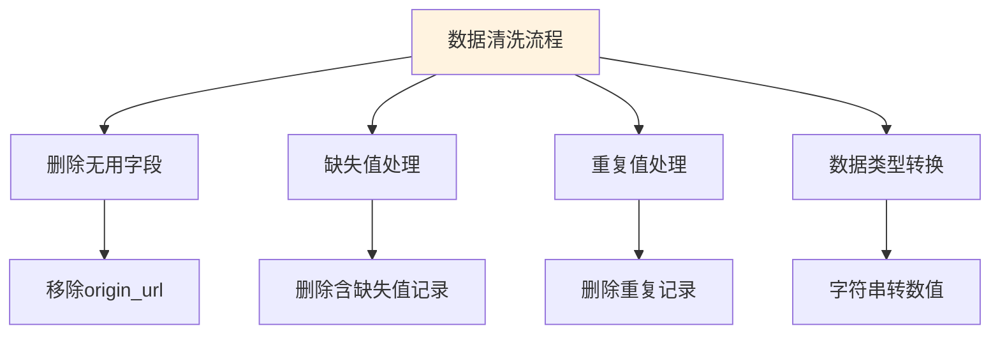
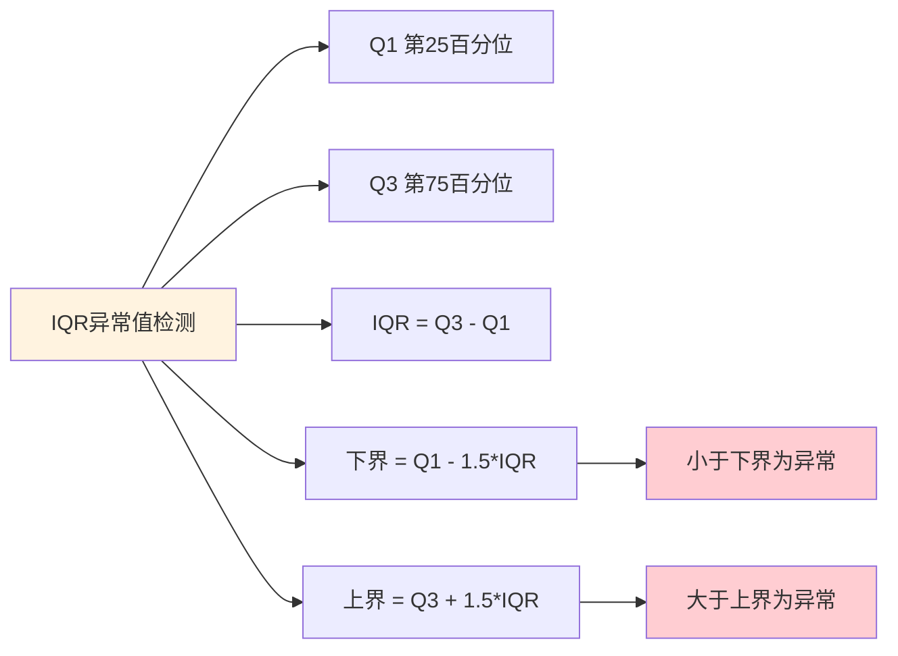
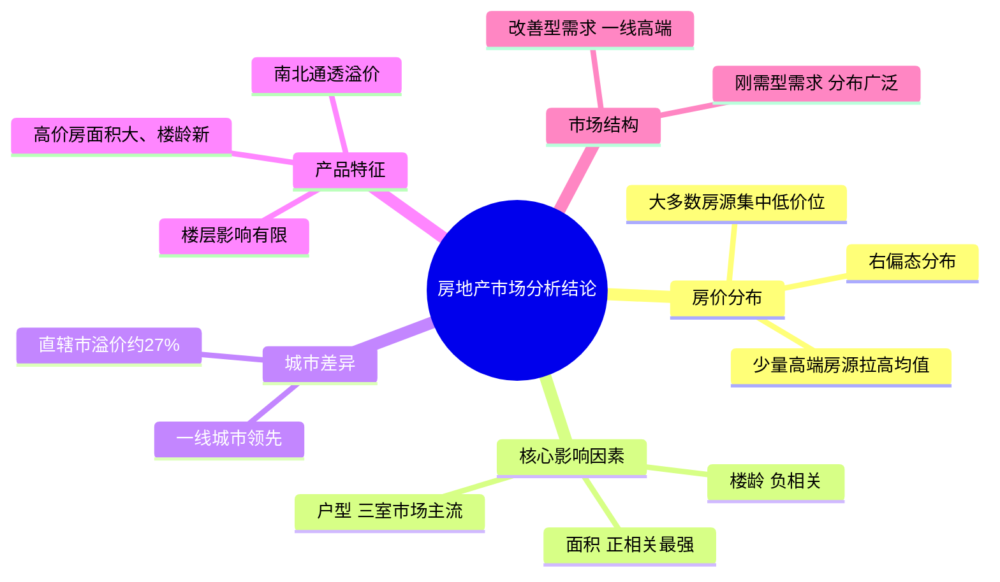

# 房地产市场数据分析报告

本报告对房地产市场的房源数据进行全面分析，旨在揭示房价的影响因素、市场分布特征以及不同维度下的价格差异。分析过程涵盖数据清洗、特征工程、描述性统计、相关性分析等多个环节，为理解房地产市场提供数据支撑。

## 7.1 工具介绍

本分析报告主要使用以下Python库进行数据处理和可视化：

### 7.1.1 NumPy

NumPy（Numerical Python）是Python数值计算的基础库，提供了高性能的多维数组对象及相关的数学函数。

```python
import numpy as np
```

**常用功能：**
- `np.mean()` - 计算数组均值
- `np.median()` - 计算中位数
- `np.std()` - 计算标准差
- `np.quantile()` - 计算分位数
- `np.corrcoef()` - 计算相关系数矩阵

### 7.1.2 Pandas

Pandas是强大的数据处理和分析库，提供了DataFrame数据结构用于存储和操作表格数据。

```python
import pandas as pd
```

**常用功能：**
- `pd.read_csv()` - 读取CSV文件
- `pd.DataFrame()` - 创建数据框
- `df.groupby()` - 分组聚合
- `df.isna()` / `df.isnull()` - 检测缺失值
- `df.dropna()` - 删除缺失值
- `df.fillna()` - 填充缺失值
- `df.duplicated()` - 检测重复值
- `df.drop_duplicates()` - 删除重复值
- `pd.cut()` / `pd.qcut()` - 数据分箱

### 7.1.3 Matplotlib

Matplotlib是Python最流行的2D绘图库，通过`matplotlib.pyplot`模块提供类似MATLAB的绘图接口。

```python
import matplotlib.pyplot as plt
from matplotlib import rcParams
```

**全局配置参数（rcParams）：**

| 参数 | 类型 | 默认值 | 说明 |
|------|------|--------|------|
| font.sans-serif | list | ['DejaVu Sans'] | 无衬线字体系列 |
| axes.unicode_minus | bool | True | 是否使用Unicode负号 |
| figure.figsize | tuple | (6.4, 4.8) | 默认图形尺寸（英寸） |
| axes.titlesize | int | 10 | 标题字体大小 |
| axes.labelsize | int | 10 | 坐标轴标签字体大小 |

**常用图表函数：**

```python
# 折线图
plt.plot(x, y, format_string)

# 柱状图
plt.bar(x, height)  # 垂直柱状图
plt.barh(y, width)  # 水平柱状图

# 饼图
plt.pie(x, labels, autopct)

# 散点图
plt.scatter(x, y, s, c, marker)

# 直方图
plt.hist(x, bins, color)

# 子图
fig, axes = plt.subplots(nrows, ncols)  # 创建子图网格
fig.add_subplot()  # 添加子图
plt.subplot2grid()  # 使用网格布局添加子图

# 图形保存
plt.savefig(filename, dpi, bbox_inches)
```

### 7.1.4 Seaborn

Seaborn是基于Matplotlib的统计可视化库，提供了更高级的接口来绘制美观的统计图形。

```python
import seaborn as sns
```

**样式设置：**

```python
# 设置主题风格
sns.set_style(style)  # white, dark, whitegrid, darkgrid, ticks

# 设置调色板
sns.set_palette(palette)  # deep, muted, pastel, bright, dark, colorblind

# 设置上下文
sns.set_context(context)  # paper, notebook, talk, poster
```

**主要函数：**

```python
# 直方图 + 核密度估计
sns.histplot(data, x, bins, kde, color)

# 核密度估计图
sns.kdeplot(data, x, y, fill, color)

# 散点图
sns.scatterplot(data, x, y, hue, size, style, palette)

# 条形图
sns.barplot(data, x, y, estimator, palette)

# 箱线图
sns.boxplot(data, x, y, palette)

# 小提琴图
sns.violinplot(data, x, y, inner)

# 热力图
sns.heatmap(data, annot, cmap, center, fmt, square)

# 联合分布图
sns.jointplot(x, y, kind, color)

#  pairplot配对图
sns.pairplot(data, hue, palette)
```

**Seaborn函数参数详解：**

### histplot 直方图

```python
sns.histplot(data=None, x=None, y=None, bins=None, kde=False, color=None, **kwargs)
```

| 参数 | 类型 | 默认值 | 说明 |
|------|------|--------|------|
| data | DataFrame/array | None | 数据源 |
| x | str | None | x轴对应字段 |
| y | str | None | y轴对应字段 |
| bins | int/list | None | 直方箱数或边界 |
| kde | bool | False | 是否显示核密度曲线 |
| kde_kws | dict | {} | 核密度曲线样式参数 |
| color | str | None | 填充颜色 |
| stat | str | 'count' | 统计类型：count, frequency, probability, density |
| element | str | 'bars' | 图形元素：bars, step, poly |

### boxplot 箱线图

```python
sns.boxplot(data=None, x=None, y=None, hue=None, palette=None, **kwargs)
```

| 参数 | 类型 | 默认值 | 说明 |
|------|------|--------|------|
| data | DataFrame | None | 数据源 |
| x | str | None | x轴分类字段 |
| y | str | None | y轴数值字段 |
| hue | str | None | 分组字段 |
| palette | str | None | 调色板名称 |
| order | list | None | 分类顺序 |
| hue_order | list | None | 分组顺序 |
| showmeans | bool | False | 是否显示均值 |
| meanprops | dict | {} | 均值标记样式 |

### scatterplot 散点图

```python
sns.scatterplot(data=None, x=None, y=None, hue=None, size=None, style=None, palette=None, **kwargs)
```

| 参数 | 类型 | 默认值 | 说明 |
|------|------|--------|------|
| data | DataFrame | None | 数据源 |
| x | str | None | x轴字段 |
| y | str | None | y轴字段 |
| hue | str | None | 颜色分组字段 |
| size | str | None | 点大小字段 |
| style | str | None | 点形状分组字段 |
| palette | str | None | 调色板 |
| alpha | float | None | 透明度（0-1） |
| s | int | None | 点大小 |
| marker | str | 'o' | 点形状 |

### heatmap 热力图

```python
sns.heatmap(data, annot=None, cmap=None, center=None, fmt='.2f', square=False, **kwargs)
```

| 参数 | 类型 | 默认值 | 说明 |
|------|------|--------|------|
| data | DataFrame/2D数组 | 必填 | 绘制数据 |
| annot | bool | False | 是否显示数值 |
| cmap | str | 'viridis' | 颜色映射方案 |
| center | float | None | 色彩中心值 |
| fmt | str | '.2f' | 数值格式 |
| square | bool | False | 是否为正方形单元格 |
| linewidths | float | 0 | 单元格边框宽度 |
| cbar | bool | True | 是否显示颜色条 |

### barplot 条形图

```python
sns.barplot(data=None, x=None, y=None, hue=None, estimator='mean', palette=None, **kwargs)
```

| 参数 | 类型 | 默认值 | 说明 |
|------|------|--------|------|
| data | DataFrame | None | 数据源 |
| x | str | None | x轴分类字段 |
| y | str | None | y轴数值字段 |
| hue | str | None | 分组字段 |
| estimator | callable | np.mean | 聚合统计函数 |
| ci | int/float | 95 | 置信区间 |
| palette | str | None | 调色板 |
| errorbar | str/tuple | 'ci' | 误差棒类型 |

### violinplot 小提琴图

```python
sns.violinplot(data=None, x=None, y=None, hue=None, inner=None, **kwargs)
```

| 参数 | 类型 | 默认值 | 说明 |
|------|------|--------|------|
| data | DataFrame | None | 数据源 |
| x | str | None | x轴分类字段 |
| y | str | None | y轴数值字段 |
| hue | str | None | 分组字段 |
| inner | str | 'box' | 内部显示：box, quartile, point, stick, None |
| split | bool | False | 是否分离小提琴 |
| scale | str | 'area' | 宽度缩放：area, count, width |

## 7.2 数据加载与概览

本节首先导入分析所需的Python库，并加载房地产数据文件。

```python
import numpy as np
import pandas as pd
import matplotlib.pyplot as plt
import seaborn as sns
from matplotlib import rcParams

# 设置中文字体支持
rcParams['font.sans-serif'] = ['SimHei', 'STHeiti', 'Microsoft YaHei']
rcParams['axes.unicode_minus'] = False
plt.style.use('seaborn-v0_8-whitegrid')
```

### 数据规模

```python
# 加载房源销售数据
df = pd.read_csv('data/house_sales.csv')

print(f'数据集包含 {len(df)} 条记录，共 {len(df.columns)} 个字段')
print('\n数据字段列表:')
print(df.columns.tolist())
```

**数据集字段：**

| 字段 | 说明 |
|------|------|
| city | 城市 |
| address | 地址 |
| area | 面积 |
| floor | 楼层 |
| name | 小区名称 |
| price | 总价（万元） |
| province | 省份 |
| rooms | 户型 |
| toward | 朝向 |
| unit | 单价（元/㎡） |
| year | 建造年份 |
| origin_url | 数据来源URL |

## 7.2 数据清洗



### 删除无用字段

```python
# 删除无用的数据列
if 'origin_url' in df.columns:
    df.drop(columns='origin_url', inplace=True)
    print('已删除 origin_url 字段')
```

### 缺失值处理

```python
# 检查缺失值情况
missing = df.isna().sum()
print('各字段缺失值统计:')
print(missing[missing > 0] if missing.sum() > 0 else '无缺失值')

# 删除含有缺失值的记录
df.dropna(inplace=True)
print(f'\n处理后数据集包含 {len(df)} 条记录')
```

### 重复值处理

```python
# 检查重复值
duplicates = df.duplicated().sum()
print(f'发现 {duplicates} 条重复记录')

# 删除重复数据
df.drop_duplicates(inplace=True)
print(f'去重后数据集包含 {len(df)} 条记录')
```

### 数据类型转换

```python
# 面积数据类型转换（去除'㎡'单位后转为浮点数）
df['area'] = df['area'].str.replace('㎡', '').astype(float)

# 售价数据类型转换（去除'万'单位后转为浮点数）
df['price'] = df['price'].str.replace('万', '').astype(float)

# 单价数据类型转换（去除'元/㎡'单位后转为浮点数）
df['unit'] = df['unit'].str.replace('元/㎡', '').astype(float)

# 建造年份数据类型转换（去除'年建'后转为整数）
df['year'] = df['year'].str.replace('年建', '').astype(int)

# 朝向转换为分类类型
df['toward'] = df['toward'].astype('category')
```

## 7.3 异常值处理

异常值是指那些明显偏离数据总体分布的观测值。本节采用IQR（四分位距）方法识别和处理异常值。



### 房屋面积异常值处理

```python
# 房屋面积异常值处理
# 保留面积在20-600平方米之间的记录
area_before = len(df)
df = df[(df['area'] < 600) & (df['area'] > 20)]
area_after = len(df)
print(f'面积异常值处理: 移除 {area_before - area_after} 条记录，剩余 {area_after} 条')
```

### 房屋售价异常值处理（IQR方法）

```python
# 房屋售价异常值处理 - IQR方法
Q1 = df['price'].quantile(0.25)
Q3 = df['price'].quantile(0.75)
IQR = Q3 - Q1

# 计算异常值边界
lower_bound = Q1 - 1.5 * IQR
upper_bound = Q3 + 1.5 * IQR

print(f'房价IQR分析:')
print(f'  Q1 (第25百分位): {Q1:.2f} 万元')
print(f'  Q3 (第75百分位): {Q3:.2f} 万元')
print(f'  IQR: {IQR:.2f} 万元')
print(f'  异常值下界: {lower_bound:.2f} 万元')
print(f'  异常值上界: {upper_bound:.2f} 万元')

# 剔除异常值
price_before = len(df)
df = df[(df['price'] < upper_bound) & (df['price'] > lower_bound)]
price_after = len(df)
print(f'\n售价异常值处理: 移除 {price_before - price_after} 条记录，剩余 {price_after} 条')
```

## 7.4 特征工程

特征工程是数据分析中的关键环节，通过对原始数据进行转换和衍生，我们可以构造出更多有分析价值的特征变量。

### 地区特征提取

```python
# 从地址中提取地区信息
df['district'] = df['address'].str.split('-').str[0]
print(f'共提取 {df["district"].nunique()} 个不同地区')
print(df['district'].value_counts().head(10))
```

### 楼层类型特征

```python
# 提取楼层类型
df['floor_type'] = df['floor'].str.split('（').str[0].astype('category')

# 将楼层归类为低/中/高
def classify_floor(floor_str):
    if pd.isna(floor_str):
        return '未知'
    elif '低' in floor_str:
        return '低楼层'
    elif '中' in floor_str:
        return '中楼层'
    elif '高' in floor_str:
        return '高楼层'
    else:
        return '未知'

df['floor_type2'] = df['floor'].apply(classify_floor).astype('category')
print('楼层类型分布:')
print(df['floor_type2'].value_counts())
```

### 直辖市标识

```python
# 判断是否为直辖市
df['zxs'] = df['city'].apply(lambda x: 1 if x in ['北京', '上海', '天津', '重庆'] else 0)
print(f'直辖市房源数量: {df["zxs"].sum()}')
print(f'非直辖市房源数量: {len(df) - df["zxs"].sum()}')
```

### 户型特征提取

```python
# 提取卧室数量
df['bedrooms'] = df['rooms'].str.split('室').str[0].astype(int)

# 提取客厅数量
df['livingrooms'] = df['rooms'].str.extract(r'(\d+)厅').astype('int')

# 提取房间数量（用于后续分析）
df['room_count'] = df['rooms'].str.extract(r'(\d+)室').astype(float)

print('卧室数量分布:')
print(df['bedrooms'].value_counts().sort_index())
```

### 楼龄计算

```python
# 计算楼龄（假设当前年份为2025年）
df['building_age'] = 2025 - df['year']

print(f'楼龄统计:')
print(f'  最小楼龄: {df["building_age"].min()} 年')
print(f'  最大楼龄: {df["building_age"].max()} 年')
print(f'  平均楼龄: {df["building_age"].mean():.1f} 年')
```

### 价格分层标签

```python
# 根据房价分位数划分价格层级
df['price_labels'] = pd.cut(df['price'], bins=4, labels=['低价', '中价', '高价', '豪华'])

print('价格层级分布:')
print(df['price_labels'].value_counts().sort_index())
```

## 7.5 描述性统计

### 整体描述性统计

```python
# 核心指标的描述性统计
desc_stats = df[['price', 'area', 'unit', 'building_age']].describe()
print('核心指标描述性统计:')
print(desc_stats)
```

**房价分布特征：** 房价分布呈现右偏态特征，大多数房源集中在较低价位区间，少量高价房源拉高了整体平均值。

## 7.6 相关性分析

相关性分析用于研究变量之间的线性关系强度和方向。

```python
# 选择数值型特征进行相关性分析
features = ['price', 'area', 'unit', 'building_age', 'bedrooms', 'livingrooms']
corr_matrix = df[features].corr()

# 计算与房价的相关系数并排序
price_corr = corr_matrix['price'].sort_values(ascending=False)
print('各特征与房价的相关系数:')
print(price_corr)

# 绘制相关性热力图
plt.figure(figsize=(8, 6))
sns.heatmap(corr_matrix, annot=True, cmap='RdBu_r', center=0,
            fmt='.2f', square=True, linewidths=0.5)
plt.title('房屋特征相关性热力图', fontsize=14)
plt.tight_layout()
plt.show()
```

**主要发现：**
- 面积与房价呈现较强的正相关关系
- 房间数量和客厅数量与房价也存在正相关
- 楼龄与房价呈负相关，说明新房总体价格高于老房

## 7.7 城市对比分析

### 城市房价排名

```python
# 按城市统计房价
city_stats = df.groupby('city').agg({
    'price': ['mean', 'median', 'std', 'count'],
    'unit': ['mean', 'median']
}).round(2)

city_stats.columns = ['均价(万)', '中位价(万)', '标准差', '房源数', '单价均值', '单价中位数']
print('各城市房价统计（按单价均值排序）:')
print(city_stats.sort_values('单价均值', ascending=False).head(15))
```

### 直辖市与非直辖市对比

```python
# 直辖市与非直辖市对比
zxs_comparison = df.groupby('zxs').agg({
    'price': ['mean', 'median', 'count'],
    'unit': 'mean'
}).round(2)

zxs_comparison.index = ['非直辖市', '直辖市']
zxs_comparison.columns = ['均价(万)', '中位价(万)', '房源数', '单价均值']

print('直辖市 vs 非直辖市房价对比:')
print(zxs_comparison)

# 计算溢价率
premium = (zxs_comparison.loc['直辖市', '均价(万)'] / zxs_comparison.loc['非直辖市', '均价(万)'] - 1) * 100
print(f'\n直辖市相对非直辖市的均价溢价率: {premium:.1f}%')
```

**结论：** 直辖市相比非直辖市存在约27%的溢价率。

## 7.8 价格层级分析

### 各价格层级特征对比

```python
# 按价格层级分析特征
price_group_stats = df.groupby('price_labels').agg({
    'area': ['mean', 'median'],
    'building_age': 'mean',
    'unit': 'median',
    'zxs': 'mean',
    'bedrooms': 'mean'
}).round(2)

price_group_stats.columns = ['面积均值', '面积中位数', '平均楼龄', '单价中位数', '直辖市占比', '平均卧室数']
print('各价格层级特征对比:')
print(price_group_stats)
```

### 价格层级可视化

```python
# 可视化不同价格层级的特征差异
fig, axes = plt.subplots(1, 3, figsize=(16, 5))

# 各价格层级面积对比
sns.barplot(x='price_labels', y='area', data=df, estimator=np.median, ax=axes[0], palette='Blues_d')
axes[0].set_title('不同价格层级面积对比')
axes[0].set_xlabel('价格层级')
axes[0].set_ylabel('面积（平方米）')

# 各价格层级楼龄分布
sns.boxplot(x='price_labels', y='building_age', data=df, ax=axes[1], palette='Greens_d')
axes[1].set_title('不同价格层级楼龄分布')
axes[1].set_xlabel('价格层级')
axes[1].set_ylabel('楼龄（年）')

# 各价格层级单价对比
sns.barplot(x='price_labels', y='unit', data=df, estimator=np.median, ax=axes[2], palette='Oranges_d')
axes[2].set_title('不同价格层级单价对比')
axes[2].set_xlabel('价格层级')
axes[2].set_ylabel('单价（元/平方米）')

plt.tight_layout()
plt.show()
```

**结论：** 高价房源普遍面积更大、楼龄更新、直辖市占比更高。

## 7.9 户型分析

### 户型市场表现

```python
# 按户型统计市场表现
room_stats = df.groupby('room_count').agg({
    'price': ['mean', 'median', 'count'],
    'unit': 'median',
    'area': 'median'
}).round(2)

room_stats.columns = ['均价(万)', '中位价(万)', '房源数', '单价中位数', '面积中位数']
room_stats = room_stats.sort_index()
print('各户型市场表现统计:')
print(room_stats)

# 计算两室vs三室溢价
if 2.0 in room_stats.index and 3.0 in room_stats.index:
    premium_3v2 = (room_stats.loc[3.0, '均价(万)'] / room_stats.loc[2.0, '均价(万)'] - 1) * 100
    print(f'\n三室户型相比两室户型的溢价率: {premium_3v2:.1f}%')
```

### 户型可视化分析

```python
# 户型分析可视化
fig, axes = plt.subplots(1, 3, figsize=(16, 5))

# 不同户型总价分布
sns.boxplot(x='room_count', y='price', data=df, ax=axes[0], palette='Set2')
axes[0].set_title('不同户型总价分布')
axes[0].set_xlabel('卧室数量')
axes[0].set_ylabel('房价（万元）')

# 面积-价格关系（按户型着色）
sns.scatterplot(x='area', y='price', hue='room_count', data=df, palette='viridis', ax=axes[1], alpha=0.6)
axes[1].set_title('面积-价格-户型关系')
axes[1].set_xlabel('面积（平方米）')
axes[1].set_ylabel('房价（万元）')

# 不同户型单价对比
sns.barplot(x='room_count', y='unit', data=df, estimator=np.median, ax=axes[2], palette='Set3')
axes[2].set_title('不同户型单价对比')
axes[2].set_xlabel('卧室数量')
axes[2].set_ylabel('单价（元/平方米）')

plt.tight_layout()
plt.show()
```

**结论：** 三室户型是市场主流，三室相比两室存在约20%的溢价。

## 7.10 朝向分析

### 朝向分布与价格特征

```python
# 朝向分布统计
toward_counts = df['toward'].value_counts()
print('朝向分布:')
print(toward_counts)

# 不同朝向的价格统计
toward_stats = df.groupby('toward').agg({
    'price': ['mean', 'median', 'count'],
    'unit': 'median',
    'building_age': 'mean'
}).round(2)

toward_stats.columns = ['均价(万)', '中位价(万)', '房源数', '单价中位数', '平均楼龄']
toward_stats = toward_stats.sort_values('均价(万)', ascending=False)
print('\n不同朝向价格统计:')
print(toward_stats)
```

### 朝向价格分布可视化

```python
# 朝向价格分布箱线图
plt.figure(figsize=(14, 6))
sns.boxplot(x='toward', y='price', data=df, palette='husl')
plt.title('不同朝向房价分布对比', fontsize=14)
plt.xlabel('朝向', fontsize=12)
plt.ylabel('房价（万元）', fontsize=12)
plt.xticks(rotation=45)
plt.tight_layout()
plt.show()
```

**结论：** 南北通透朝向的房源均价最高，验证了"南北通透"在市场上的溢价效应。

## 7.11 综合分析仪表盘

```python
# 创建综合分析仪表盘
fig = plt.figure(figsize=(18, 14))

# 1. 房价分布直方图
ax1 = fig.add_subplot(3, 3, 1)
sns.histplot(df['price'], bins=25, kde=True, ax=ax1, color='steelblue')
ax1.set_title('房价整体分布', fontsize=12)
ax1.set_xlabel('房价（万元）')

# 2. 面积-价格散点图
ax2 = fig.add_subplot(3, 3, 2)
sns.scatterplot(x='area', y='price', data=df, alpha=0.3, ax=ax2, color='coral')
ax2.set_title('面积与价格关系', fontsize=12)
ax2.set_xlabel('面积（平方米）')
ax2.set_ylabel('房价（万元）')

# 3. 相关性热力图
ax3 = fig.add_subplot(3, 3, 3)
key_features = ['price', 'area', 'unit', 'building_age', 'bedrooms']
corr = df[key_features].corr()
sns.heatmap(corr, annot=True, cmap='coolwarm', center=0, ax=ax3, fmt='.2f')
ax3.set_title('核心特征相关性', fontsize=12)

# 4. 价格层级分布
ax4 = fig.add_subplot(3, 3, 4)
df['price_labels'].value_counts().sort_index().plot(kind='bar', ax=ax4, color=['#2ecc71', '#3498db', '#e74c3c', '#9b59b6'])
ax4.set_title('房源价格层级分布', fontsize=12)
ax4.set_xlabel('价格层级')
ax4.set_ylabel('房源数量')

# 5. TOP10城市箱线图
ax5 = fig.add_subplot(3, 3, 5)
top10_cities = df.groupby('city')['unit'].mean().sort_values(ascending=False).head(10).index
df[df['city'].isin(top10_cities)].boxplot(column='price', by='city', ax=ax5)
ax5.set_title('TOP10城市房价分布', fontsize=12)
ax5.set_xlabel('城市')
ax5.set_ylabel('房价（万元）')
plt.suptitle('')

# 6. 户型价格对比
ax6 = fig.add_subplot(3, 3, 6)
room_prices = df.groupby('room_count')['price'].median().sort_index()
room_prices.plot(kind='bar', ax=ax6, color='teal')
ax6.set_title('不同户型中位价格', fontsize=12)
ax6.set_xlabel('卧室数量')
ax6.set_ylabel('中位房价（万元）')

# 7. 楼层类型价格对比
ax7 = fig.add_subplot(3, 3, 7)
floor_prices = df.groupby('floor_type2')['price'].median().sort_values(ascending=False)
floor_prices.plot(kind='bar', ax=ax7, color='teal')
ax7.set_title('不同楼层类型中位价格', fontsize=12)
ax7.set_xlabel('楼层类型')
ax7.set_ylabel('中位房价（万元）')

# 8. 直辖市对比
ax8 = fig.add_subplot(3, 3, 8)
zxs_data = df.groupby('zxs')['price'].mean()
zxs_data.index = ['非直辖市', '直辖市']
zxs_data.plot(kind='bar', ax=ax8, color=['#95a5a6', '#e74c3c'])
ax8.set_title('直辖市vs非直辖市均价', fontsize=12)
ax8.set_xlabel('城市类型')
ax8.set_ylabel('均价（万元）')

# 9. 朝向分布
ax9 = fig.add_subplot(3, 3, 9)
toward_top = df['toward'].value_counts().head(6)
toward_top.plot(kind='pie', ax=ax9, autopct='%1.1f%%', startangle=90)
ax9.set_title('主要朝向分布', fontsize=12)
ax9.set_ylabel('')

plt.suptitle('房地产市场综合分析仪表盘', fontsize=16, y=1.02)
plt.tight_layout()
plt.show()
```

## 7.12 分析总结



**主要发现：**

1. **房价分布特征**：房价整体呈现右偏态分布，大多数房源集中在中低价位区间

2. **核心影响因素**：面积是影响房价最显著的因素，与房价呈较强正相关

3. **城市差异**：不同城市间房价差异明显，直辖市相比非直辖市存在约27%的溢价率

4. **产品特征差异**：高价房源普遍面积更大、楼龄更新、南北通透朝向存在溢价

5. **市场结构**：改善型需求集中在一线城市和高端市场，刚需型需求分布更为广泛