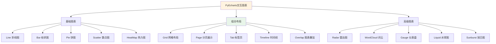
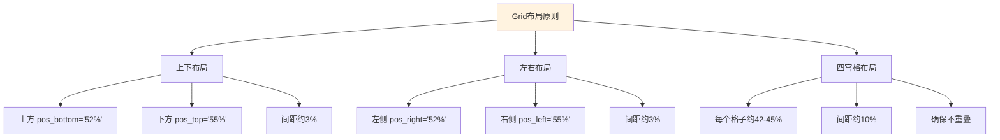
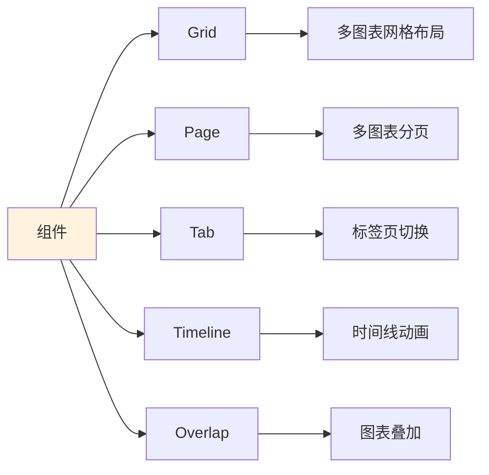
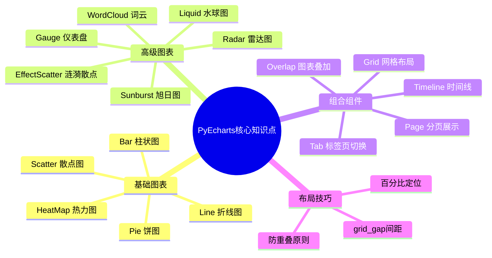

# PyEcharts 数据可视化

PyEcharts是ECharts的Python封装库，用于生成交互式图表。与Matplotlib的静态图不同，PyEcharts支持工具栏缩放、数据区域缩放、图表切换等丰富的交互功能。

## 8.1 工具介绍

### 8.1.1 PyEcharts概述

PyEcharts是Apache ECharts的Python接口，通过简洁的API封装，支持生成超过20种交互式图表类型。相比Matplotlib的静态输出，PyEcharts生成的图表支持鼠标悬停提示、数据区域缩放、图表切换等交互功能，非常适合在Jupyter Notebook和HTML报告中展示。

```python
# 基础导入
from pyecharts import options as opts
from pyecharts.charts import Line, Bar, Pie, Scatter, HeatMap, Grid, Page, Tab, Timeline

# 渲染方式
chart.render_notebook()  # 在Jupyter中渲染
chart.render("chart.html")  # 输出为HTML文件
```

### 8.1.2 核心概念

| 概念 | 说明 |
|------|------|
| InitOpts | 初始化配置，控制图表尺寸、主题、背景色等 |
| TitleOpts | 标题配置，设置图表主标题和副标题 |
| AxisOpts | 坐标轴配置，控制轴的名称、类型、标签样式等 |
| TooltipOpts | 提示框配置，控制鼠标悬停时的数据展示方式 |
| LegendOpts | 图例配置，控制多系列数据的图例显示 |
| GridOpts | 网格配置，控制多图表布局的位置和大小 |
| VisualMapOpts | 视觉映射配置，控制热力图等的颜色映射范围 |

### 8.1.3 InitOpts 初始化配置

```python
opts.InitOpts(
    width="800px",      # 图表宽度
    height="400px",     # 图表高度
    theme=ThemeType.LIGHT,  # 主题风格
    page_title="图表",  # HTML页面标题
    js_host="https://cdn.jsdelivr.net/npm/echarts@"  # JS文件CDN地址
)
```

### 8.1.4 TitleOpts 标题配置

```python
opts.TitleOpts(
    title="主标题",           # 图表主标题
    subtitle="副标题",        # 副标题
    pos_left="center",       # 标题位置：left/center/right 或百分比
    pos_top="10%",           # 标题距离顶部的位置
    title_textstyle_opts=opts.TextStyleOpts(color="#333", font_size=16)
)
```

| 参数 | 类型 | 默认值 | 说明 |
|------|------|--------|------|
| title | str | None | 主标题文本 |
| subtitle | str | None | 副标题文本 |
| pos_left | str | None | 左边距位置 |
| pos_right | str | None | 右边距位置 |
| pos_top | str | None | 上边距位置 |
| pos_bottom | str | None | 下边距位置 |

### 8.1.5 AxisOpts 坐标轴配置

```python
opts.AxisOpts(
    name="轴名称",              # 坐标轴名称
    type_="category",          # 轴类型：category/value/time/log
    data=None,                 # 分类数据（type_=category时使用）
    axislabel_opts=opts.LabelOpts(rotate=45),  # 标签旋转角度
    name_textstyle_opts=opts.TextStyleOpts(font_size=12)
)
```

| 参数 | 类型 | 默认值 | 说明 |
|------|------|--------|------|
| name | str | None | 坐标轴名称 |
| type_ | str | 'category' | 轴类型 |
| data | list | None | 分类数据 |
| name_location | str | 'end' | 名称位置：start/middle/end |
| axislabel_opts | LabelOpts | None | 刻度标签配置 |
| name_textstyle_opts | TextStyleOpts | None | 名称文本样式 |

### 8.1.6 TooltipOpts 提示框配置

```python
opts.TooltipOpts(
    trigger="item",            # 触发类型：item/axis/none
    trigger_on="mousemove",    # 触发时机：mousemove/click
    formatter=None,            # 格式化字符串或函数
    background_color="#fff",   # 背景色
    border_color="#333",       # 边框色
    text_style_opts=opts.TextStyleOpts(color="#333")
)
```

| 参数 | 类型 | 默认值 | 说明 |
|------|------|--------|------|
| trigger | str | 'item' | 触发类型：item(数据项), axis(坐标轴), none |
| trigger_on | str | 'mousemove' | 触发时机：mousemove/click |
| formatter | str/function | None | 提示框内容格式化 |
| background_color | str | '#fff' | 背景颜色 |
| border_width | int | 0 | 边框宽度 |
| text_style_opts | TextStyleOpts | None | 文本样式 |

## 8.2 基础图表函数详解

### 8.2.1 Line 折线图

```python
Line(init_opts=opts.InitOpts())
    .add_xaxis(xaxis_data)           # 添加X轴数据
    .add_yaxis(series_name, y_data,  # 添加Y轴数据系列
               markline_opts=None,   # 标记线配置
               markpoint_opts=None,  # 标记点配置
               linestyle_opts=None,  # 线条样式
               label_opts=None)      # 标签配置
    .set_global_opts(...)            # 设置全局配置
    .set_series_opts(...)           # 设置系列配置
```

**add_xaxis 参数：**

| 参数 | 类型 | 默认值 | 说明 |
|------|------|--------|------|
| xaxis_data | list | 必填 | X轴数据列表 |

**add_yaxis 参数：**

| 参数 | 类型 | 默认值 | 说明 |
|------|------|--------|------|
| series_name | str | 必填 | 系列名称（图例名称） |
| y_axis | list | 必填 | Y轴数据列表 |
| is_symbol_show | bool | True | 是否显示数据点标记 |
| symbol | str | 'circle' | 标记形状：circle/rect/roundRect/triangle/diamond |
| markpoint_opts | MarkPointOpts | None | 标记点配置 |
| markline_opts | MarkLineOpts | None | 标记线配置 |
| linestyle_opts | LineStyleOpts | None | 线条样式 |
| label_opts | LabelOpts | None | 标签配置 |

### 8.2.2 Bar 柱状图

```python
Bar(init_opts=opts.InitOpts())
    .add_xaxis(xaxis_data)
    .add_yaxis(series_name, y_data,
               category_gap="30%",     # 分类间距
               bar_max_width=None,     # 最大柱宽
               itemstyle_opts=None,    # 条形样式
               label_opts=None)
    .set_global_opts(...)
    .set_series_opts(...)
```

**add_yaxis 参数：**

| 参数 | 类型 | 默认值 | 说明 |
|------|------|--------|------|
| series_name | str | 必填 | 系列名称 |
| y_axis | list | 必填 | Y轴数据列表 |
| category_gap | str/int | '30%' | 分类间距 |
| bar_max_width | str | None | 最大柱宽度 |
| bar_min_width | str | None | 最小柱宽度 |
| itemstyle_opts | ItemStyleOpts | None | 条形样式 |
| label_opts | LabelOpts | None | 标签配置 |

### 8.2.3 Pie 饼图

```python
Pie(init_opts=opts.InitOpts())
    .add(
        series_name="",           # 系列名称
        data_pair=[["A", 100], ["B", 200]],  # 数据对
        radius=["30%", "70%"],   # 半径：[内径，外径]
        center=["50%", "50%"],   # 圆心位置
        rosetype="radius",        # 玫瑰图类型：radius/area
        label_opts=None)          # 标签配置
    .set_global_opts(...)
    .set_series_opts(...)
```

**add 参数：**

| 参数 | 类型 | 默认值 | 说明 |
|------|------|--------|------|
| series_name | str | '' | 系列名称 |
| data_pair | list | 必填 | 数据对列表 [[name, value], ...] |
| radius | list | None | 半径范围 [内半径%, 外半径%] |
| center | list | None | 圆心位置 [x%, y%] |
| rosetype | str | None | 玫瑰图类型：radius/area/none |
| label_opts | LabelOpts | None | 标签配置 |
| emphasis | dict | None | 高亮状态配置 |

### 8.2.4 Scatter 散点图

```python
Scatter(init_opts=opts.InitOpts())
    .add_xaxis(xaxis_data)
    .add_yaxis(series_name, y_data,
               symbol_size=10,         # 符号大小
               symbol=None,            # 符号形状
               label_opts=None)
    .set_global_opts(...)
    .set_series_opts(...)
```

| 参数 | 类型 | 默认值 | 说明 |
|------|------|--------|------|
| series_name | str | 必填 | 系列名称 |
| y_axis | list | 必填 | Y轴数据列表 |
| symbol_size | int | 10 | 符号大小（像素） |
| symbol | str | 'circle' | 符号形状 |
| label_opts | LabelOpts | None | 标签配置 |
| itemstyle_opts | ItemStyleOpts | None | 数据项样式 |

### 8.2.5 HeatMap 热力图

```python
HeatMap(init_opts=opts.InitOpts())
    .add_xaxis(xaxis_data)
    .add_yaxis(yaxis_data)
    .add_yaxis(series_name, data, value_min=None, value_max=None)
    .set_global_opts(
        visualmap_opts=opts.VisualMapOpts(min_=0, max_=1),
        tooltip_opts=opts.TooltipOpts(trigger="item"))
```

| 参数 | 类型 | 默认值 | 说明 |
|------|------|--------|------|
| series_name | str | '' | 系列名称 |
| data | list | 必填 | 二维数据 [[x, y, value], ...] |
| value_min | float | None | 视觉映射最小值 |
| value_max | float | None | 视觉映射最大值 |
| label_opts | LabelOpts | None | 标签配置 |

### 8.2.6 Radar 雷达图

```python
Radar(init_opts=opts.InitOpts())
    .add_schema(
        schema=[opts.RadarIndicatorItem(name, max_), ...],  # 指示器配置
        shape="polygon",       # 形状：polygon/circle
        split_number=5,        # 分隔区域数
        splitline_opt=None,    # 分割线样式
        splitarea_opt=None)    # 分隔区域样式
    .add(series_name, data, color=None)
    .set_global_opts(...)
```

| 参数 | 类型 | 默认值 | 说明 |
|------|------|--------|------|
| schema | list | 必填 | RadarIndicatorItem列表 |
| shape | str | 'polygon' | 形状：polygon/circle |
| split_number | int | 5 | 分隔区域数 |
| radius | str | '75%' | 半径 |

### 8.2.7 WordCloud 词云

```python
WordCloud(init_opts=opts.InitOpts())
    .add(series_name, data,
         word_size_range=[12, 60],  # 词云字体大小范围
         shape="circle",            # 形状：circle/cardio/diamond/star
         word_gap=20,              # 词间距
         text_style_opts=None)
    .set_global_opts(...)
```

| 参数 | 类型 | 默认值 | 说明 |
|------|------|--------|------|
| series_name | str | '' | 系列名称 |
| data | list | 必填 | 词频数据 [(word, value), ...] |
| word_size_range | list | [12, 60] | 字体大小范围 |
| shape | str | 'circle' | 形状：circle/radius/diamond/star |
| word_gap | int | 20 | 词间距（像素） |
| text_style_opts | TextStyleOpts | None | 文本样式 |

## 8.3 组合组件详解

### 8.3.1 Grid 网格布局

Grid用于在同一个坐标系中实现多图表的精确布局。

```python
Grid(init_opts=opts.InitOpts())
    .add(chart, grid_opts=opts.GridOpts(
        pos_top="10%", pos_bottom="50%",
        pos_left="5%", pos_right="5%",
        grid_gap=10))
    .add(chart2, grid_opts=opts.GridOpts(
        pos_top="55%", pos_bottom="5%",
        pos_left="5%", pos_right="5%"))
```

**GridOpts 参数：**

| 参数 | 类型 | 默认值 | 说明 |
|------|------|--------|------|
| pos_top | str | None | 上边距位置（百分比或像素） |
| pos_bottom | str | None | 下边距位置 |
| pos_left | str | None | 左边距位置 |
| pos_right | str | None | 右边距位置 |
| grid_gap | int | 0 | 网格间距 |
| is_control_axis_index | bool | False | 是否控制轴索引 |
| contain_label | bool | False | 是否包含标签 |

### 8.3.2 Page 分页展示

Page组件将多个图表添加到同一个HTML页面中。

```python
page = Page(layout=Page.SimplePageLayout)
page.add(chart1, chart2, chart3)
page.render("page.html")
```

| 参数 | 类型 | 默认值 | 说明 |
|------|------|--------|------|
| layout | PageLayout | SimplePageLayout | 页面布局方式 |
| page_title | str | 'Echarts' | 页面标题 |

### 8.3.3 Tab 标签页切换

Tab通过标签页形式展示多个图表。

```python
tab = Tab()
tab.add(chart1, "图表1标题")
tab.add(chart2, "图表2标题")
tab.render("tab.html")
```

| 参数 | 类型 | 默认值 | 说明 |
|------|------|--------|------|
| interval | int | 3000 | 切换时间间隔（毫秒） |

### 8.3.4 Timeline 时间线

Timeline按时间顺序展示数据变化，支持自动播放。

```python
tl = Timeline(init_opts=opts.InitOpts())
tl.add_schema(
    play_interval=2000,      # 播放间隔（毫秒）
    is_auto_play=True,       # 是否自动播放
    is_loop_play=True,       # 是否循环播放
    is_reverse=False,       # 是否反向播放
    orient="horizontal",    # 方向：horizontal/vertical
    symbol="emptyCircle",    # 时间点标记形状
    symbol_size=8)           # 标记大小
tl.add(chart, "时间标签")
```

**add_schema 参数：**

| 参数 | 类型 | 默认值 | 说明 |
|------|------|--------|------|
| play_interval | int | None | 播放间隔（毫秒） |
| is_auto_play | bool | False | 是否自动播放 |
| is_loop_play | bool | True | 是否循环 |
| is_reverse | bool | False | 是否反向 |
| orient | str | 'horizontal' | 方向：horizontal/vertical |
| symbol | str | 'emptyCircle' | 时间点标记形状 |
| symbol_size | int | 8 | 标记大小 |
| pos_left | str | '5%' | 左边距 |
| pos_right | str | '5%' | 右边距 |
| pos_top | str | None | 上边距 |
| pos_bottom | str | None | 下边距 |

## 8.4 高级图表函数详解

### 8.4.1 Gauge 仪表盘

```python
Gauge(init_opts=opts.InitOpts())
    .add(
        series_name="指标",        # 系列名称
        data_pair=[("指标名", 85)],  # 数据对
        split_number=10,           # 分隔段数
        itemstyle_opts=None)       # 样式配置
    .set_global_opts(...)
```

| 参数 | 类型 | 默认值 | 说明 |
|------|------|--------|------|
| series_name | str | '' | 系列名称 |
| data_pair | list | 必填 | 数据对 [(name, value), ...] |
| split_number | int | 10 | 分隔段数 |
| min_ | int | 0 | 最小值 |
| max_ | int | 100 | 最大值 |
| itemstyle_opts | ItemStyleOpts | None | 指针样式 |

### 8.4.2 Liquid 水球图

```python
Liquid(init_opts=opts.InitOpts())
    .add(
        series_name="进度",       # 系列名称
        data=[0.78],              # 数据（0-1之间）
        is_animation=True,        # 是否动画
        color=None)              # 颜色
    .set_global_opts(...)
```

| 参数 | 类型 | 默认值 | 说明 |
|------|------|--------|------|
| series_name | str | '' | 系列名称 |
| data | list | 必填 | 数据列表（0-1的浮点数） |
| is_animation | bool | True | 是否显示动画 |
| is_random_height | bool | True | 是否随机高度 |
| is_wave_animation | bool | True | 是否波浪动画 |
| color | list | None | 颜色列表 |

### 8.4.3 Sunburst 旭日图

```python
Sunburst(init_opts=opts.InitOpts())
    .add(
        series_name="",           # 系列名称
        data=data,                # 层级数据
        radius=["0%", "100%"],   # 半径范围
        levels=None)              # 层级配置
    .set_global_opts(...)
```

| 参数 | 类型 | 默认值 | 说明 |
|------|------|--------|------|
| series_name | str | '' | 系列名称 |
| data | list | 必填 | 树形结构数据 |
| radius | list | None | 半径范围 [内%, 外%] |
| levels | list | None | 层级配置列表 |

### 8.4.4 EffectScatter 涟漪散点图

```python
EffectScatter(init_opts=opts.InitOpts())
    .add_xaxis(xaxis_data)
    .add_yaxis(series_name, y_data,
               symbol=None, symbol_size=None)
    .set_series_opts(
        effect_opts=opts.EffectOpts(scale=3, period=2, color=None))
    .set_global_opts(...)
```

**EffectOpts 参数：**

| 参数 | 类型 | 默认值 | 说明 |
|------|------|--------|------|
| scale | int | 2.5 | 涟漪扩散大小 |
| period | int | 4 | 动画周期（秒） |
| color | str | None | 涟漪颜色 |

## 8.5 数据缩放组件

### 8.5.1 DataZoomOpts 数据区域缩放

```python
opts.DataZoomOpts(
    range_start=0,           # 起始位置（%）
    range_end=100,           # 结束位置（%）
    orient="horizontal",     # 方向
    pos_top="85%",           # 位置
    type_="slider")          # 类型：slider/inside
```

| 参数 | 类型 | 默认值 | 说明 |
|------|------|--------|------|
| range_start | int | 0 | 起始位置（0-100） |
| range_end | int | 100 | 结束位置（0-100） |
| orient | str | 'horizontal' | 方向：horizontal/vertical |
| type_ | str | 'slider' | 类型：slider/inside |
| pos_top | str | None | 顶部位置 |
| pos_bottom | str | None | 底部位置 |
| pos_left | str | None | 左边位置 |
| pos_right | str | None | 右边位置 |

## 8.6 样式配置详解

### 8.6.1 LabelOpts 标签配置

```python
opts.LabelOpts(
    is_show=True,           # 是否显示标签
    position="top",          # 位置：top/bottom/left/right/inside
    formatter=None,          # 格式化函数或字符串
    font_size=12,            # 字体大小
    font_style="normal",     # 字体样式：normal/italic/oblique
    font_weight="normal",    # 字体粗细：normal/bold/bolder/lighter
    color="#333")            # 字体颜色
```

### 8.6.2 ItemStyleOpts 数据项样式

```python
opts.ItemStyleOpts(
    color=None,              # 填充颜色
    color0=None,            # 备用颜色
    border_color=None,      # 边框颜色
    border_width=0,         # 边框宽度
    opacity=1)              # 透明度（0-1）
```

### 8.6.3 LineStyleOpts 线样式

```python
opts.LineStyleOpts(
    width=1,                # 线宽
    color=None,            # 颜色
    type_="solid",         # 类型：solid/dashed/dotted
    opacity=1)             # 透明度
```

## 8.7 主题配置

PyEcharts支持通过ThemeType指定内置主题。

```python
from pyecharts.globals import ThemeType

opts.InitOpts(theme=ThemeType.LIGHT)  # 明亮主题
opts.InitOpts(theme=ThemeType.DARK)   # 暗黑主题
opts.InitOpts(theme=ThemeType.MACARONS)  # 马卡龙主题
```

**可用主题列表：**

| 主题 | 说明 |
|------|------|
| LIGHT | 默认明亮主题 |
| DARK | 暗黑主题 |
| ESSOS | 简约灰白主题 |
| WALDEN | 户外主题 |
| CHALK | 粉笔主题 |
| INFOGRAPHIC | 信息图表主题 |
| MACARONS | 马卡龙主题 |
| PURPLE_PASSION | 紫色主题 |
| ROMANTIC | 浪漫主题 |



本教程涵盖基础图表、组合布局和主题配置，重点讲解如何使用Grid组件实现多图表的合理布局。

## 8.8 基础图表

PyEcharts提供了丰富的基础图表类型。

### 折线图（Line）

折线图用于展示数据随时间或其他连续变量变化的趋势。

```python
from pyecharts.charts import Line
from pyecharts import options as opts

# 折线图：2015年月平均气温趋势
line = (
    Line(init_opts=opts.InitOpts(width="800px", height="400px"))
    .add_xaxis(monthly_temp.index.tolist())
    .add_yaxis("最高气温", monthly_temp['temp_max'].round(1).tolist(), 
               markpoint_opts=opts.MarkPointOpts(data=[opts.MarkPointItem(type_="max")]))
    .add_yaxis("最低气温", monthly_temp['temp_min'].round(1).tolist(), 
               markpoint_opts=opts.MarkPointOpts(data=[opts.MarkPointItem(type_="min")]))
    .set_global_opts(
        title_opts=opts.TitleOpts(title="2015年月平均气温趋势", subtitle="单位：摄氏度"),
        xaxis_opts=opts.AxisOpts(name="月份"),
        yaxis_opts=opts.AxisOpts(name="气温 (°C)"),
        tooltip_opts=opts.TooltipOpts(trigger="axis")
    )
)
line.render_notebook()
```

### 柱状图（Bar）

柱状图适合展示分类数据之间的对比关系。

```python
from pyecharts.charts import Bar

# 柱状图：各岛屿企鹅数量
bar = (
    Bar(init_opts=opts.InitOpts(width="700px", height="400px"))
    .add_xaxis(island_counts.index.tolist())
    .add_yaxis("数量", island_counts.values.tolist())
    .set_global_opts(
        title_opts=opts.TitleOpts(title="各岛屿企鹅数量"),
        xaxis_opts=opts.AxisOpts(axislabel_opts=opts.LabelOpts(rotate=0)),
        yaxis_opts=opts.AxisOpts(name="数量"),
        tooltip_opts=opts.TooltipOpts(trigger="axis")
    )
    .set_series_opts(
        label_opts=opts.LabelOpts(position="top"),
        itemstyle_opts=opts.ItemStyleOpts(color="#4ECDC4")
    )
)
bar.render_notebook()
```

### 饼图（Pie）

饼图适合展示各分类占总体的比例关系。

```python
from pyecharts.charts import Pie

# 饼图：天气类型分布
pie = (
    Pie(init_opts=opts.InitOpts(width="600px", height="400px"))
    .add(
        "",
        [list(z) for z in zip(weather_counts.index.tolist(), [int(x) for x in weather_counts.values.tolist()])],
        radius=["30%", "70%"],
        label_opts=opts.LabelOpts(formatter="{b}: {d}%")
    )
    .set_global_opts(
        title_opts=opts.TitleOpts(title="天气类型分布", pos_left="center"),
        legend_opts=opts.LegendOpts(orient="vertical", pos_left="left", pos_top="middle")
    )
)
pie.render_notebook()
```

### 散点图（Scatter）

散点图用于展示两个连续变量之间的关系。

```python
from pyecharts.charts import Scatter

# 散点图：企鹅喙长与喙深关系
scatter_adelie = (
    Scatter()
    .add_xaxis([float(x) for x in penguins[penguins['species']=='Adelie']['bill_length_mm'].tolist()])
    .add_yaxis('Adelie', [float(y) for y in penguins[penguins['species']=='Adelie']['bill_depth_mm'].tolist()])
    .set_series_opts(label_opts=opts.LabelOpts(is_show=False))
)

scatter_chinstrap = (
    Scatter()
    .add_xaxis([float(x) for x in penguins[penguins['species']=='Chinstrap']['bill_length_mm'].tolist()])
    .add_yaxis('Chinstrap', [float(y) for y in penguins[penguins['species']=='Chinstrap']['bill_depth_mm'].tolist()])
    .set_series_opts(label_opts=opts.LabelOpts(is_show=False))
)

scatter_gentoo = (
    Scatter()
    .add_xaxis([float(x) for x in penguins[penguins['species']=='Gentoo']['bill_length_mm'].tolist()])
    .add_yaxis('Gentoo', [float(y) for y in penguins[penguins['species']=='Gentoo']['bill_depth_mm'].tolist()])
    .set_series_opts(label_opts=opts.LabelOpts(is_show=False))
)

# 叠加所有系列
scatter_chart = scatter_adelie
for s in [scatter_chinstrap, scatter_gentoo]:
    scatter_chart = scatter_chart.overlap(s)

scatter_chart.set_global_opts(
    title_opts=opts.TitleOpts(title="企鹅喙长与喙深关系"),
    xaxis_opts=opts.AxisOpts(name="喙长 (mm)"),
    yaxis_opts=opts.AxisOpts(name="喙深 (mm)"),
    legend_opts=opts.LegendOpts(pos_left="right"),
    tooltip_opts=opts.TooltipOpts(trigger="item")
)
scatter_chart.render_notebook()
```

## 8.9 使用真实数据的图表

### 城市房价对比

```python
# 处理房价数据：各城市平均单价
house_clean = house.dropna(subset=['unit'])
house_clean = house_clean[house_clean['unit'].str.contains('元')]
house_clean['price_num'] = house_clean['unit'].str.extract(r'(\d+)').astype(float)
city_price = house_clean.groupby('province')['price_num'].mean().sort_values(ascending=True).tail(10)

bar2 = (
    Bar(init_opts=opts.InitOpts(width="850px", height="450px"))
    .add_xaxis(city_price.index.tolist())
    .add_yaxis("平均单价", [round(x, 0) for x in city_price.values.tolist()], category_gap="50%")
    .set_global_opts(
        title_opts=opts.TitleOpts(title="各省份房产均价对比 (TOP 10)"),
        xaxis_opts=opts.AxisOpts(name="省份", axislabel_opts=opts.LabelOpts(rotate=30)),
        yaxis_opts=opts.AxisOpts(name="单价 (元/㎡)"),
        tooltip_opts=opts.TooltipOpts(trigger="axis")
    )
    .set_series_opts(
        label_opts=opts.LabelOpts(position="top"),
        itemstyle_opts=opts.ItemStyleOpts(color="#FF6B6B")
    )
)
bar2.render_notebook()
```

### 热力图

```python
from pyecharts.charts import HeatMap

# 热力图：企鹅身体指标相关性
num_cols = ["bill_length_mm", "bill_depth_mm", "flipper_length_mm", "body_mass_g"]
corr = penguins[num_cols].corr()

hm = (
    HeatMap(init_opts=opts.InitOpts(width="700px", height="500px"))
    .add_xaxis(corr.columns.tolist())
    .add_yaxis(
        "",
        corr.index.tolist(),
        [[i, j, round(corr.iloc[i, j], 2)] for i in range(len(corr)) for j in range(len(corr))]
    )
    .set_global_opts(
        title_opts=opts.TitleOpts(title="企鹅身体指标相关性热力图"),
        visualmap_opts=opts.VisualMapOpts(min_=-1, max_=1, is_calculable=True),
        tooltip_opts=opts.TooltipOpts(trigger="item")
    )
)
hm.render_notebook()
```

## 8.10 Grid组合布局

**重要**: Grid组件是实现多图表合理布局的核心工具。通过设置pos_top、pos_bottom、pos_left、pos_right等参数（使用百分比），可以精确控制每个图表在容器中的位置，避免元素重叠。



### Grid上下布局

```python
from pyecharts.charts import Line, Bar, Grid

# Grid 上下布局
line_g = (
    Line(init_opts=opts.InitOpts(width="850px", height="300px"))
    .add_xaxis(["1月", "2月", "3月", "4月", "5月", "6月"])
    .add_yaxis("蒸发量", [50, 70, 90, 120, 150, 180])
    .add_yaxis("降水量", [60, 80, 100, 130, 160, 200])
    .set_global_opts(
        title_opts=opts.TitleOpts(title="气象数据对比", subtitle="2015年月度统计", pos_left="center", pos_top="0%"),
        tooltip_opts=opts.TooltipOpts(trigger="axis")
    )
)

bar_g = (
    Bar(init_opts=opts.InitOpts(width="850px", height="280px"))
    .add_xaxis(["1月", "2月", "3月", "4月", "5月", "6月"])
    .add_yaxis("蒸发量", [50, 70, 90, 120, 150, 180])
    .add_yaxis("降水量", [60, 80, 100, 130, 160, 200])
    .set_series_opts(
        label_opts=opts.LabelOpts(position="top"),
        itemstyle_opts=opts.ItemStyleOpts(color="#45B7D1")
    )
)

grid = (
    Grid(init_opts=opts.InitOpts(width="900px", height="800px"))
    .add(line_g, grid_opts=opts.GridOpts(pos_top="10%", pos_bottom="52%", pos_left="5%", pos_right="5%"))
    .add(bar_g, grid_opts=opts.GridOpts(pos_top="55%", pos_bottom="10%", pos_left="5%", pos_right="5%"))
)
grid.render_notebook()
```

### Grid左右布局

```python
from pyecharts.charts import Scatter, Bar, Grid

# 左侧散点图
scatter_left = (
    Scatter()
    .add_xaxis([10, 20, 30, 40, 50])
    .add_yaxis("A组", [20, 30, 40, 50, 60], xaxis_index=0, yaxis_index=0)
    .add_yaxis("B组", [30, 40, 50, 60, 70], xaxis_index=0, yaxis_index=0)
    .set_global_opts(
        title_opts=opts.TitleOpts(title="分组对比", pos_left="10%"),
        xaxis_opts=opts.AxisOpts(type_="value", name="指标"),
        yaxis_opts=opts.AxisOpts(type_="value", name="数值")
    )
)

# 右侧柱状图
bar_right = (
    Bar()
    .add_xaxis(["A组", "B组", "C组"])
    .add_yaxis("数值", [45, 55, 48], xaxis_index=1, yaxis_index=1)
    .set_series_opts(label_opts=opts.LabelOpts(position="top"))
    .set_global_opts(
        title_opts=opts.TitleOpts(title="分组统计", pos_left="62%"),
        xaxis_opts=opts.AxisOpts(type_="category"),
        yaxis_opts=opts.AxisOpts(name="数值")
    )
)

# Grid 布局
grid_lr = (
    Grid(init_opts=opts.InitOpts(width="980px", height="500px"))
    .add(
        scatter_left,
        grid_opts=opts.GridOpts(pos_left="8%", pos_right="55%", pos_top="18%", pos_bottom="14%"),
        is_control_axis_index=True
    )
    .add(
        bar_right,
        grid_opts=opts.GridOpts(pos_left="60%", pos_right="8%", pos_top="18%", pos_bottom="14%"),
        is_control_axis_index=True
    )
)
grid_lr.render_notebook()
```

### Grid四宫格仪表盘

```python
from pyecharts.charts import Bar, Line, Scatter, Pie, Grid

# 左上：柱状图
bar1 = (
    Bar()
    .add_xaxis(["衬衫", "毛衣", "裙子", "裤子", "风衣"])
    .add_yaxis("数量", [20, 30, 40, 35, 25], xaxis_index=0, yaxis_index=0)
    .add_yaxis("库存", [50, 40, 30, 45, 55], xaxis_index=0, yaxis_index=0)
    .set_series_opts(label_opts=opts.LabelOpts(is_show=False))
    .set_global_opts(
        title_opts=opts.TitleOpts(title="服装销量", pos_left="8%", pos_top="3%"),
        xaxis_opts=opts.AxisOpts(type_="category"),
        yaxis_opts=opts.AxisOpts(type_="value")
    )
)

# 右上：折线图
line1 = (
    Line()
    .add_xaxis(["周一", "周二", "周三", "周四", "周五"])
    .add_yaxis("销量", [120, 200, 150, 80, 70], xaxis_index=1, yaxis_index=1)
    .add_yaxis("访问量", [300, 350, 280, 400, 380], xaxis_index=1, yaxis_index=1)
    .set_series_opts(label_opts=opts.LabelOpts(is_show=False))
    .set_global_opts(
        title_opts=opts.TitleOpts(title="访问趋势", pos_left="58%", pos_top="3%"),
        xaxis_opts=opts.AxisOpts(type_="category"),
        yaxis_opts=opts.AxisOpts(type_="value")
    )
)

# 左下：散点图
scatter1 = (
    Scatter()
    .add_xaxis(["A", "B", "C", "D", "E"])
    .add_yaxis("数据", [50, 60, 70, 80, 90], xaxis_index=2, yaxis_index=2)
    .set_series_opts(symbol_size=14)
    .set_global_opts(
        title_opts=opts.TitleOpts(title="数据分布", pos_left="8%", pos_top="53%"),
        xaxis_opts=opts.AxisOpts(type_="category"),
        yaxis_opts=opts.AxisOpts(type_="value")
    )
)

# 右下：饼图
pie1 = (
    Pie()
    .add(
        "",
        [["北京", 45], ["上海", 35], ["广州", 20]],
        center=["75%", "74%"],
        radius=["12%", "22%"]
    )
    .set_series_opts(label_opts=opts.LabelOpts(formatter="{b}: {c}"))
    .set_global_opts(title_opts=opts.TitleOpts(title="城市占比", pos_left="58%", pos_top="53%"))
)

grid4 = (
    Grid(init_opts=opts.InitOpts(width="1000px", height="800px"))
    .add(bar1, grid_opts=opts.GridOpts(pos_left="8%", pos_right="56%", pos_top="12%", pos_bottom="56%"), is_control_axis_index=True)
    .add(line1, grid_opts=opts.GridOpts(pos_left="58%", pos_right="8%", pos_top="12%", pos_bottom="56%"), is_control_axis_index=True)
    .add(scatter1, grid_opts=opts.GridOpts(pos_left="8%", pos_right="56%", pos_top="62%", pos_bottom="10%"), is_control_axis_index=True)
    .add(pie1, grid_opts=opts.GridOpts(pos_left="58%", pos_right="8%", pos_top="62%", pos_bottom="10%"))
)
grid4.render_notebook()
```

### 叠加图表：折线+柱状混合

```python
from pyecharts.charts import Line, Bar

overlap_base = (
    Bar(init_opts=opts.InitOpts(width="800px", height="450px"))
    .add_xaxis(["周一", "周二", "周三", "周四", "周五", "周六", "周日"])
    .add_yaxis("咖啡销量", [120, 150, 90, 180, 200, 250, 280])
    .add_yaxis("茶销量", [80, 60, 100, 70, 90, 120, 110])
    .set_series_opts(label_opts=opts.LabelOpts(position="top"))
)

line_overlay = (
    Line()
    .add_xaxis(["周一", "周二", "周三", "周四", "周五", "周六", "周日"])
    .add_yaxis("总利润", [200, 210, 190, 250, 290, 370, 390])
    .set_series_opts(
        linestyle_opts=opts.LineStyleOpts(width=3, color="#FF6B6B"),
        label_opts=opts.LabelOpts(is_show=True, position="top")
    )
)

overlap_chart = overlap_base.overlap(line_overlay)
overlap_chart.set_global_opts(
    title_opts=opts.TitleOpts(title="饮品销量与利润对比"),
    tooltip_opts=opts.TooltipOpts(trigger="axis")
)
overlap_chart.render_notebook()
```

## 8.11 组合组件

### Page - 多图表分页

Page组件允许将多个图表放在同一个页面中。

```python
from pyecharts.charts import Page

page = Page(layout=Page.SimplePageLayout)

line_p = (
    Line()
    .add_xaxis(["1月", "2月", "3月", "4月"])
    .add_yaxis("产品A", [100, 120, 130, 150])
    .add_yaxis("产品B", [80, 90, 100, 110])
    .set_global_opts(title_opts=opts.TitleOpts(title="产品销售趋势"))
)

bar_p = (
    Bar()
    .add_xaxis(["手机", "电脑", "平板", "耳机"])
    .add_yaxis("销量", [300, 450, 200, 150])
    .add_yaxis("库存", [100, 200, 300, 250])
    .set_global_opts(title_opts=opts.TitleOpts(title="电子产品销售统计"))
)

pie_p = (
    Pie()
    .add("", [["已完成", 60], ["进行中", 30], ["未开始", 10]], radius=["40%", "70%"])
    .set_global_opts(title_opts=opts.TitleOpts(title="项目进度"))
)

page.add(line_p, bar_p, pie_p)
page.render_notebook()
```

### Tab - 标签页切换

Tab组件通过标签页的形式展示多个图表。

```python
from pyecharts.charts import Tab

tab = Tab()

line_tab = (
    Line()
    .add_xaxis(["周一", "周二", "周三", "周四", "周五"])
    .add_yaxis("本周", [120, 140, 150, 170, 190])
    .add_yaxis("上周", [100, 110, 120, 130, 140])
    .set_global_opts(title_opts=opts.TitleOpts(title="销售趋势对比"))
)

bar_tab = (
    Bar()
    .add_xaxis(["北京", "上海", "广州", "深圳"])
    .add_yaxis("销售额", [5000, 6000, 4500, 5500])
    .add_yaxis("利润", [1500, 1800, 1200, 1600])
    .set_global_opts(title_opts=opts.TitleOpts(title="城市销售对比"))
)

pie_tab = (
    Pie()
    .add("", [["已完成", 60], ["进行中", 30], ["未开始", 10]], radius=["40%", "70%"])
    .set_global_opts(title_opts=opts.TitleOpts(title="项目进度"))
)

tab.add(line_tab, "趋势图")
tab.add(bar_tab, "对比图")
tab.add(pie_tab, "进度图")
tab.render_notebook()
```

### Timeline - 时间线动画

Timeline组件允许按时间顺序展示数据的变化。

```python
from pyecharts.charts import Timeline

tl = Timeline(init_opts=opts.InitOpts(width="800px", height="400px"))
tl.add_schema(
    play_interval=2000,  # 播放间隔 2 秒
    is_auto_play=True,   # 自动播放
    is_loop_play=True    # 循环播放
)

for year in [2013, 2014, 2015]:
    line_t = (
        Line()
        .add_xaxis(["1月", "2月", "3月", "4月"])
        .add_yaxis("销量", [100 + year * 10, 120 + year * 10, 130 + year * 10, 150 + year * 10])
        .add_yaxis("利润", [80 + year * 8, 90 + year * 8, 100 + year * 8, 120 + year * 8])
        .set_global_opts(title_opts=opts.TitleOpts(title=f"{year}年销售数据", pos_left="center"))
    )
    tl.add(line_t, f"{year}年")

tl.render_notebook()
```

## 8.12 高级图表

### 雷达图（Radar）

雷达图适合展示多维度数据的综合对比。

```python
from pyecharts.charts import Radar

radar = (
    Radar(init_opts=opts.InitOpts(width="700px", height="500px"))
    .add_schema(
        schema=[
            opts.RadarIndicatorItem(name="经济", max_=100),
            opts.RadarIndicatorItem(name="交通", max_=100),
            opts.RadarIndicatorItem(name="环境", max_=100),
            opts.RadarIndicatorItem(name="教育", max_=100),
            opts.RadarIndicatorItem(name="医疗", max_=100)
        ],
        splitline_opt=opts.SplitLineOpts(is_show=True),
        splitarea_opt=opts.SplitAreaOpts(is_show=True)
    )
    .add("北京", [[85, 90, 80, 75, 88]], color="#1f77b4")
    .add("上海", [[90, 85, 85, 80, 86]], color="#ff7f0e")
    .set_global_opts(title_opts=opts.TitleOpts(title="城市发展雷达图"))
)
radar.render_notebook()
```

### 词云（WordCloud）

词云适合展示文本数据中高频关键词的可视化。

```python
from pyecharts.charts import WordCloud

words = [
    ("Python", 10000), ("数据分析", 8000), ("机器学习", 7500),
    ("可视化", 6000), ("Pandas", 5500), ("PyEcharts", 5000),
    ("NumPy", 4500), ("Scikit-learn", 4000), ("深度学习", 3500),
    ("TensorFlow", 3000), ("PyTorch", 2800), ("NLP", 2600)
]

wordcloud = (
    WordCloud(init_opts=opts.InitOpts(width="800px", height="500px"))
    .add("", words, word_size_range=[20, 80], shape="diamond")
    .set_global_opts(title_opts=opts.TitleOpts(title="技术关键词词云"))
)
wordcloud.render_notebook()
```

### 涟漪散点图（EffectScatter）

涟漪散点图带有动态涟漪效果，适合突出显示重点数据。

```python
from pyecharts.charts import EffectScatter
from pyecharts.globals import SymbolType

escatter = (
    EffectScatter(init_opts=opts.InitOpts(width="700px", height="400px"))
    .add_xaxis(["北京", "上海", "广州", "深圳", "成都", "杭州"])
    .add_yaxis("GDP排名", [1, 2, 3, 4, 5, 6], symbol=SymbolType.DIAMOND, symbol_size=20)
    .set_series_opts(
        label_opts=opts.LabelOpts(is_show=True, position="top"),
        effect_opts=opts.EffectOpts(scale=3, period=2, color="#FF6B6B")
    )
    .set_global_opts(
        title_opts=opts.TitleOpts(title="城市GDP排名（涟漪效果）"),
        yaxis_opts=opts.AxisOpts(is_inverse=True)
    )
)
escatter.render_notebook()
```

### 水球图（Liquid）

水球图适合展示百分比或进度类的数据。

```python
from pyecharts.charts import Liquid

liquid = (
    Liquid(init_opts=opts.InitOpts(width="400px", height="400px"))
    .add("完成率", [0.78], is_animation=True, color=["#4ECDC4"])
    .set_global_opts(title_opts=opts.TitleOpts(title="项目完成率", pos_left="center"))
)
liquid.render_notebook()
```

### 仪表盘（Gauge）

仪表盘适合展示单一指标的当前值与目标范围的关系。

```python
from pyecharts.charts import Gauge

gauge = (
    Gauge(init_opts=opts.InitOpts(width="500px", height="400px"))
    .add("满意度", [("评分", 85)], split_number=10)
    .set_global_opts(title_opts=opts.TitleOpts(title="用户满意度评分", pos_left="center"))
)
gauge.render_notebook()
```

### 旭日图（Sunburst）

旭日图是一种高级饼图，可以展示具有层级关系的数据。

```python
from pyecharts.charts import Sunburst

data = [
    {"name": "企鹅", "children": [
        {"name": "Adelie", "value": 150},
        {"name": "Gentoo", "value": 120},
        {"name": "Chinstrap", "value": 68}
    ]},
    {"name": "栖息地", "children": [
        {"name": "Torgersen", "value": 50},
        {"name": "Biscoe", "value": 100},
        {"name": "Dream", "value": 88}
    ]}
]

sunburst = (
    Sunburst(init_opts=opts.InitOpts(width="600px", height="500px"))
    .add("", data)
    .set_global_opts(title_opts=opts.TitleOpts(title="企鹅分类旭日图", pos_left="center"))
)
sunburst.render_notebook()
```

## 8.13 主题与样式

PyEcharts支持多种内置主题。

```python
from pyecharts.globals import ThemeType

# 不同主题的折线图示例
themes = [ThemeType.LIGHT, ThemeType.DARK, ThemeType.MACARONS]
for theme in themes:
    line_theme = (
        Line(init_opts=opts.InitOpts(theme=theme, width="600px", height="300px"))
        .add_xaxis(["周一", "周二", "周三", "周四", "周五"])
        .add_yaxis("销量", [120, 150, 90, 180, 200])
        .add_yaxis("利润", [80, 100, 60, 120, 140])
        .set_global_opts(title_opts=opts.TitleOpts(title=f"主题演示: {theme}"))
    )
    line_theme.render_notebook()
```

**可用主题：** LIGHT, DARK, ESSOS, WALDEN, CHALK, INFOGRAPHIC, MACARONS, PURPLE_PASSION等

## 8.14 DataZoom数据区域缩放

DataZoom组件允许用户通过拖拽或滑块来缩放数据区域。

```python
# 数据区域缩放
dates = [f"2024-{i//28+1:02d}-{i%28+1:02d}" for i in range(360)]
values = [100 + i * 0.5 + random.randint(-20, 20) for i in range(360)]

line_zoom = (
    Line(init_opts=opts.InitOpts(width="900px", height="400px"))
    .add_xaxis(dates)
    .add_yaxis("访问量", values)
    .set_global_opts(
        title_opts=opts.TitleOpts(title="日访问量趋势（可缩放）"),
        xaxis_opts=opts.AxisOpts(axislabel_opts=opts.LabelOpts(rotate=45)),
        datazoom_opts=opts.DataZoomOpts(
            range_start=0,
            range_end=30,
            orient="horizontal",
            pos_top="85%"
        ),
        tooltip_opts=opts.TooltipOpts(trigger="axis")
    )
)
line_zoom.render_notebook()
```

## 8.15 核心组件速查



| 组件 | 用途 |
|------|------|
| Grid | 多图表网格布局，支持精确定位 |
| Page | 多图表分页展示 |
| Tab | 多图表标签页切换 |
| Timeline | 时间线动画展示 |
| Overlap | 图表叠加（折线+柱状混合） |

## 8.16 Grid防重叠要点

1. **上下布局**：上方图表设置`pos_bottom="52%"`，下方图表设置`pos_top="55%"`
2. **左右布局**：左侧图表设置`pos_right="52%"`，右侧图表设置`pos_left="55%"`
3. **四宫格**：每个格子约42-45%，间距约10%，确保`pos_top + pos_bottom < 100%`
4. **使用grid_gap**：增加格子之间的间距

## 8.17 小结



**核心要点回顾：**

- PyEcharts是ECharts的Python封装，支持丰富的交互功能
- **基础图表**：Line、Bar、Pie、Scatter、HeatMap
- **组合布局**：Grid实现多图表精确定位，避免重叠
- **组合组件**：Page、Tab、Timeline增强展示效果
- **高级图表**：Radar、WordCloud、Gauge、Liquid、Sunburst等
- **主题**：支持LIGHT、DARK、MACARONS等多种内置主题

**推荐学习资源：**
- PyEcharts官方文档：https://pyecharts.org
- ECharts官方示例：https://echarts.apache.org/examples/

建议多加练习，将交互式可视化应用到数据分析报告中，制作出更加专业的图表。